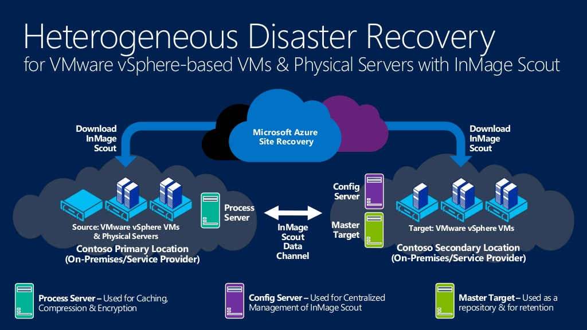
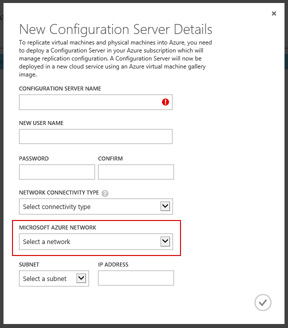
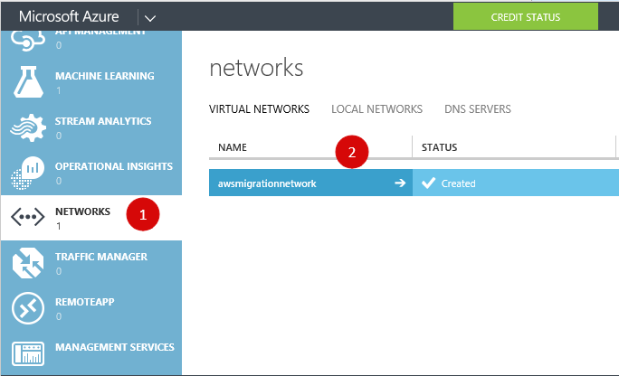
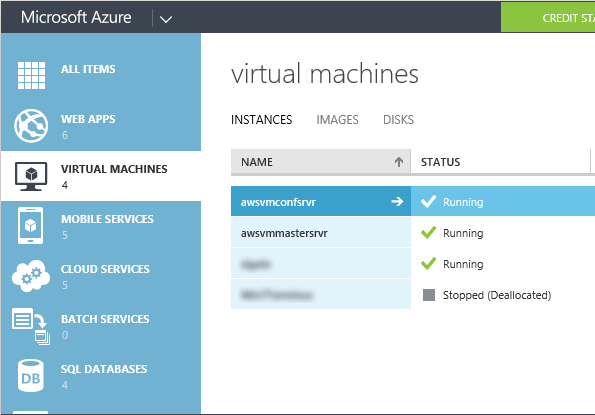
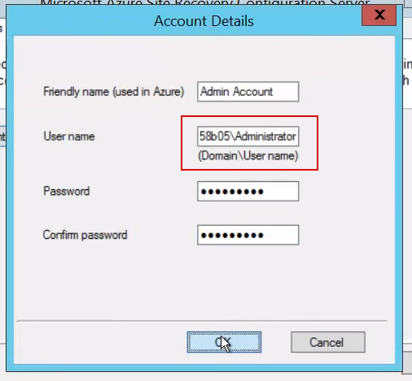
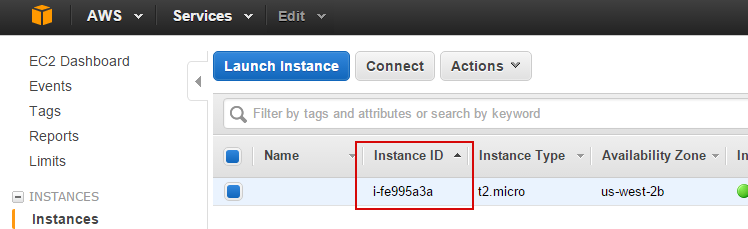
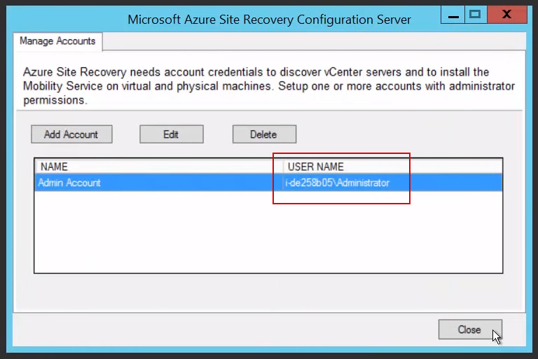
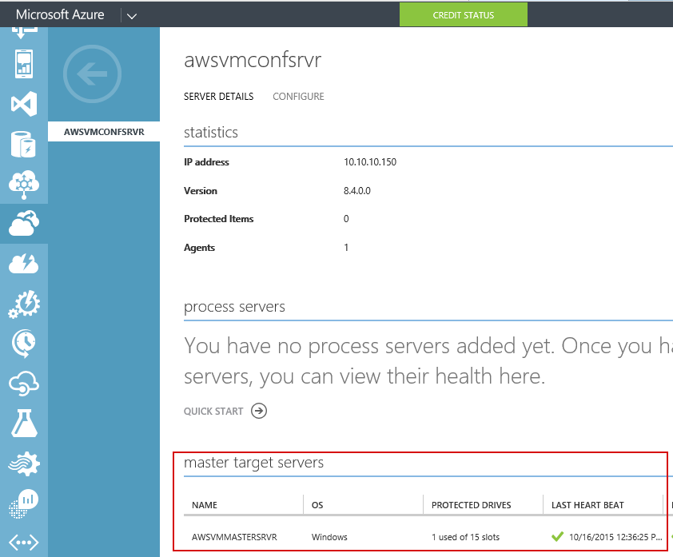
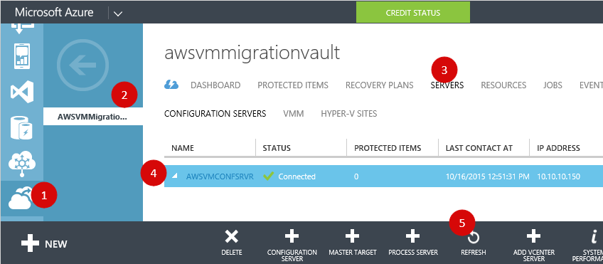
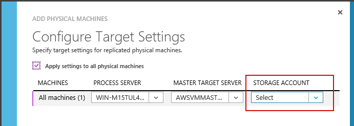

**\
**AWS Virtual Machine to Azure Virtual Machine Migration

December 2015

OVERVIEW

This article describes how to migrate a Windows or Linux driven Virtual
Machine from Amazon Web Services (AWS) to Azure Cloud Services. We
describe the two most popular migration flows: the first requires quite
a bit of manual work while the second is the latest method which uses
the latest features of the Azure Cloud Services.

Migration via the VHD
file export-conversion-import

This is a standard migration flow using export/import of the machine
image. AWS allows you to download a VM from their service. The
downloaded image can be converted to format-ready for Hyper-V use and
uploaded to Azure, however, this would involve a lengthy down time of
the service during the download, conversion, and upload. Also the
process involves utilizing a **Disk2VHD** tool which is available for
Windows only. For Linux you will have to use an alternative tool (**dd**
or other).

Migration using the
Azure site recovery service

Another way is to use the [*free Microsoft Migration
Accelerator*](https://azure.microsoft.com/en-us/blog/introducing-microsoft-migration-accelerator/),
which uses the same technology as [*Azure Site
Recovery*](https://azure.microsoft.com/en-us/services/site-recovery/)
and is based on the [*InMage
Scout*](http://windowsitpro.com/azure/inmage-scout) technology.

PREREQUISITES

As a starting point, you need to have the Virtual Machine on AWS.

GOALS

Migrate the existing VM instance from AWS to Azure.

MIGRATION VIA THE VHD
FILE EXPORT-CONVERSION-IMPORT

Keith Mayer has published a great video series about the Migration
Windows driven Virtual Machine from AWS to Azure. You can find the
entire series on Channel 9
[*here*](https://channel9.msdn.com/Series/Migrating-Virtual-Machines-from-Amazon-AWS-to-Microsoft-Azure)
(including an episode named "Why Migrate from Amazon AWS to Azure?") or
[*here*](https://channel9.msdn.com/Shows/TechNet+Radio/TechNet-Radio-How-to-Migrate-Your-Virtual-Machines-from-Amazon-Web-Services-to-Windows-Azure)
as one video file.

MIGRATIONS USING THE AZURE SITE RECOVERY SERVICE

{width="3.236111111111111in"
height="1.8185837707786527in"}

Migration of the Windows
Driven VM

Several good resources have been published, among our top
recommendations are:

-   A step by step guide in written form by Rayne Wiselman which can be
    found
    [*here*](https://azure.microsoft.com/en-us/documentation/articles/site-recovery-migrate-aws-to-azure/)

-   A PowerPoint presentation by Alexandre Verkinderen
    [*here*](http://www.slideshare.net/alexandreverkinderen/expertslive-azure-site-recovery)

-   A great video guide by Rajesh Goli about migration using Azure Site
    Recovery service which you can view
    [*here*](https://azure.microsoft.com/en-us/blog/seamlessly-migrate-your-application-from-aws-to-azure-in-4-simple-steps/).
    A few important notes and clarification on this video:

1.  During the Configuration Server setup Rajesh selects the related
    Microsoft Azure Network. So you have to configure the Azure Network
    before starting the Configuration Server creation, as shown below.

> {width="2.3402777777777777in"
> height="2.665317147856518in"}
>
> *Here is the sample of the created Azure Network:*
>
> {width="2.6597222222222223in"
> height="1.6197014435695538in"}

1.  If you don’t see created instances in the Virtual Machine list use
    the F5 button to reload the page.

    {width="3.5146423884514437in"
    height="2.451388888888889in"}

2.  During configuration of the Microsoft Azure Site Recovery
    Configuration Server, Rajesh has used a partially hidden User Name.

> {width="2.2916666666666665in"
> height="2.121563867016623in"}

1.  This User Name has been constructed from the AWS Instance ID +
    "Administrator" account name:

> {width="3.0972222222222223in"
> height="0.9463735783027122in"}

1.  And you will see it show up on the next screen in the video:

> {width="2.8958333333333335in"
> height="1.9305555555555556in"}

1.  During the Target Server configuration, the empty "master target
    server" list appears to be empty in the Azure Portal:

> {width="3.7751662292213473in"
> height="3.1180555555555554in"}

1.  To refresh the list, you have to refresh the Configuration Server as
    shown below:

> {width="4.708333333333333in"
> height="2.0624114173228345in"}

1.  Refreshing the Configuration Server is the same job as creating and
    could be tracked via the JOBS tab. After the job is done you can
    come back to the list and you should see the created Target Server
    in the list.

2.  During the step of adding the Physical Machines to the Protection
    Group you will be asked to select the Storage Account. Please create
    it before adding the Physical Machines.

> {width="4.680555555555555in"
> height="1.6701979440069992in"}

Migrating a Linux Driven
VM

We recommend using
[*this*](https://azure.microsoft.com/en-us/documentation/articles/site-recovery-migrate-aws-to-azure/)
guide by Rayne Wiselman, with a few recommended adjustments:

1.  Ensure that you have installed the latest Linux Integration
    Services (LIS) before you install the Master Target Server software.
    You can find the latest version of LIS along with instructions on
    how to install it
    [*here*](https://www.microsoft.com/en-us/download/details.aspx?id=46842).
    The PDF file ("Linux Integration Services v4-0-11.pdf") includes an
    installation guide.

2.  During install of the Additional Software for the Master Target
    Server use the following link:
    [*http://download.microsoft.com/download/7/E/D/7ED50614-1FE1-41F8-B4D2-25D73F623E9B/Microsoft-ASR\_UA\_8.4.0.0\_RHEL6-64\_GA\_28Jul2015\_release.tar.gz*](http://download.microsoft.com/download/7/E/D/7ED50614-1FE1-41F8-B4D2-25D73F623E9B/Microsoft-ASR_UA_8.4.0.0_RHEL6-64_GA_28Jul2015_release.tar.gz)

> To download via the widget instead of the original one use the
> following link:
>
> [*http://go.microsoft.com/fwlink/?LinkID=529757&clcid=0x409*](http://go.microsoft.com/fwlink/?LinkID=529757&clcid=0x409)
>
> Also don’t forget to create the directory and extract the archive as
> it contains the needed batch of files inside.

1.  Be sure to enable the password based SSH authentication on the
    machine, because AWS enables authentication by key by default.
