##Amazon CDN to Azure CDN Migration

This article illustrates the basics of how to migrate existing content delivery from Amazon CDN to Azure CDN. The article illustrates how to prepare a test environment and perform migration tasks on this environment. The migration can be a partial or a complete one. The partial migration means you keep an origin for CDN in Amazon untouched and use the Azure CDN as content delivery only. The complete migration means you copy the origin data into Azure Storage and Azure CDN uses this storage as its origin. Let’s have a look on both solutions.  
This article is also available in PDF format [here] (media/PDF-files/AWS VM to Azure VM migration.pdf).

If you have any feedback on the documentation please log the feedback via an [issue] (https://github.com/XynergiesLLC/Azure-IoT-demo/issues).

 
###PREREQUISITES 
==============
We need an active Amazon S3 account and Microsoft Azure subscription. Microsoft Windows 7-10 is required to execute PowerShell script. 

###CREATE A TEST ENVIRONMENT ON AMAZON AWS 
========================================

1\. Login to [https://console.aws.amazon.com.](https://console.aws.amazon.com/) To create a test Amazon S3 storage please click on Services and then on S3.

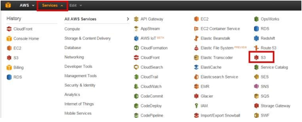

2\. Press on Create Bucket.

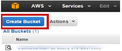

3\. Assign a unique bucket name and press Create.

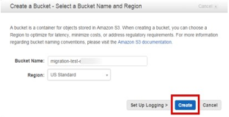

4\. Create folders and upload some files. (Below we created a folder named Images and uploaded a set of One Drive’s sample images).

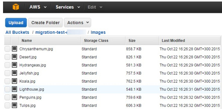

5\. Toggle on your folder(s), press on Actions and make the folder publicly available.
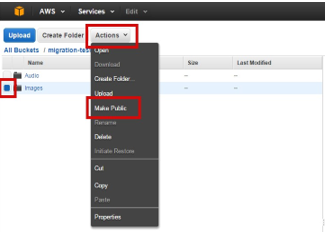

6\. Double-check the permissions and address of some of the files in your folder to ensure they are publically available on the properties page. Everyone should be able to open the hyperlink of this file. 

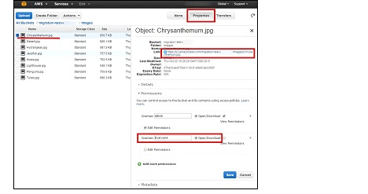

7\.  To create a test Amazon CDN please click on Services and then on CloudFront.

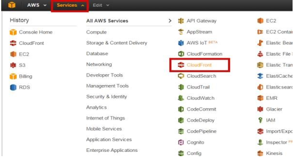

8\.  Click on Create Distribution.

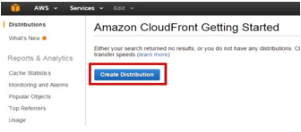

9\.  We need a web delivery method so click on Get Started.

10\. Click in the Origin Domain Name on the Create distribution page and
    select a bucket created during the previous steps.

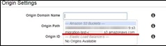

11\. Leave other options untouched and click on Create Distribution.

12\. Your distribution is being prepared while the status is
    ‘In Progress’.

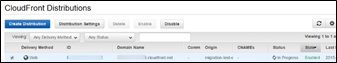

13\. Please wait for the Deployed status. You can now check that Amazon
    Bucket objects are available both directly and through the
    Amazon CDN.

PARTIAL MIGRATION - AZURE CDN WITH AMAZON S3 STORAGE 
=====================================================

1\. Login to https://manage.windowsazure.com. To create a new CDN endpoint please click on NEW --> APP SERVICES --> CDN --> QUICK CREATE. Select the ORIGIN TYPE as Custom Origin. Type a S3 bucket URL as ORIGIN URL. Press CREATE.

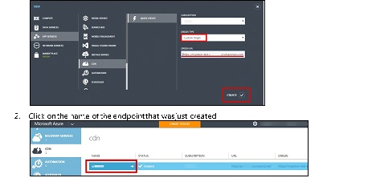

2\.  Click on name of the endpoint that was just created
3\.  Your CDN address is located at CDN ENDPOINT.

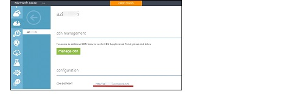

4\. Please wait some time while your CDN is preparing. You will get 404 error trying to load the resource by Azure CDN based address at this time. .

5\. After 1 hour (in our case) we checked the address and found the image to be available. So now, we have an Azure CDN endpoint using Amazon S3 bucket as an origin. 

COMPLETE MIGRATION - COPY DATA TO AZURE STORAGE AND USE IT AS AN ORIGIN FOR AZURE CDN 
======================================================================================

1\.  Login to [https://manage.windowsazure.com.](https://manage.windowsazure.com/) To create a new storage account, click on NEW > DATA SERVICES > STORAGE > QUICK CREATE. Assign a unique URL, select location and press on CREATE STORAGE ACCOUNT.

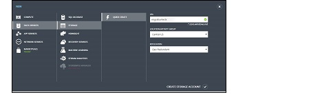

2\.  Click on the name of the account that was just created.

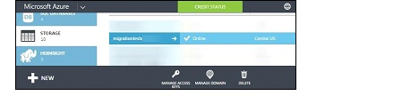

3\.  Select a CONTAINERS tab and press ADD to create a new container.

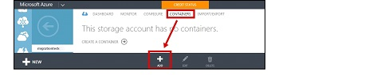

4\.  Type a NAME for a new container and select ACCESS as Public Container.

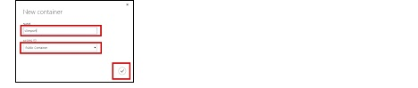

5\.  Remember the container’s URL. We will use it later on for the CDN endpoint step.

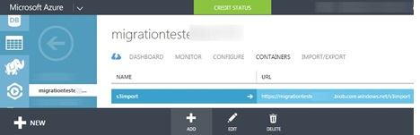

6\.  To copy data from Amazon S3 bucket to Azure Blob Storage I will use a PowerShell script. In order to use PowerShell script, your system should meet the requirements. You should have enough disk space on your user TEMP folder to copy the largest files of the stored ones in the S3 bucket you are going to copy. Prerequisites are AWS Tools for Windows PowerShell and Azure PowerShell.

7\.  Download and install AWS Tools for Windows PowerShell from [*http://aws.amazon.com/powershell/*](http://aws.amazon.com/powershell/)

8\.  Download and install Azure PowerShell as described here: [*https://azure.microsoft.com/enus/documentation/articles/powershell-install-configure/*](https://azure.microsoft.com/en-us/documentation/articles/powershell-install-configure/)

9\.  Please save a content of subsequent script as a CopyS3ToAzure.ps1 file.

        $accessKey = "YOUR_accessKey" 
        $secretKey = "YOUR_secretKey" 
        $bucketName = "YOUR_bucketName" 
        $keyPrefix = "/" # Use a root folder used for your CDN 
        $continueFromMarker = $null # Use $null to start from the first object. Object key to start from the subsequent object. 

        #Azure settings 
        $storageAccountName = "YOUR_storageAccountName" 
        $storageAccountKey = "YOUR_storageAccountKey" 
        $containerName = "YOUR_containerName" 

        [System.Reflection.Assembly]::LoadWithPartialName("System.Web") | Out-Null 
        $tempFile = [System.IO.Path]::GetTempFileName() 
        $blobContext = New-AzureStorageContext -StorageAccountName $storageAccountName -StorageAccountKey $storageAccountKey do { 
            $objects = Get-S3Object -BucketName $bucketName -KeyPrefix $keyPrefix -Marker $continueFromMarker -AccessKey $accessKey -SecretKey $secretKey      foreach($object in $objects) {         if ($object.Size -ne 0) {             "Copying: " + $object.Key 
                    try { 
                        $down = Copy-S3Object -BucketName $bucketName -Key $object.Key -LocalFile $tempFile -AccessKey $accessKey -SecretKey $secretKey 
                        $props = @{ 'ContentType' = [System.Web.MimeMapping]::GetMimeMapping($object.Key) } 
                        $up = Set-AzureStorageBlobContent -Properties $props -File $tempFile -Container $containerName -Blob $object.Key -Context $blobContext -Force 
                    }  
                    catch [system.exception] { 
                        write-host "`nTerminated. Failed to copy " + $object.Key + ". Change variable `$continueFromMarker = """ + $continueFromMarker + """ to retry and continue.`n" -foregroundcolor "magenta"                 throw 
                    }             finally { 
                        Remove-Item -Path $tempFile 
                    } 
                } 
                $continueFromMarker = $object.Key 
            }  
        } while ($objects) 

> 10\. Please replace YOUR_accessKey, YOUR_secretKey, YOUR_bucketName with S3 storage access keys and source bucket name. Replace YOUR_storageAccountName , YOUR_storageAccountKey, YOUR_containerName with Azure Storage credentials and container name. Open Microsoft Azure PowerShell from the Windows Start Menu. Type a path to your script and press Enter.  

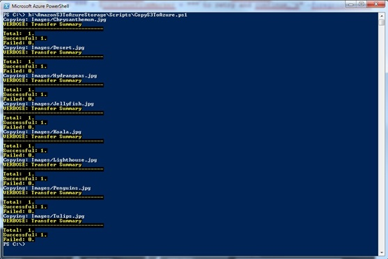

> **Please note the script is not intendent for huge amount of data and is not performance efficient for many small files.**

> 11\.	To create a new Azure CDN endpoint using Azure Storage blob container please click on NEW -> APP SERVICES -> CDN -> QUICK CREATE. Select the ORIGIN TYPE as Custom Origin. We will not be using a Storage Accounts origin type because we are going to use a concrete container as a CDN root instead of using all storage account containers. Enter a container URL with replaced https to http in the ORIGIN URL. 

> Press CREATE.
>
> 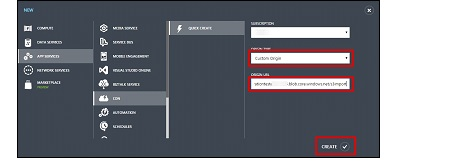

> 12\.	The new endpoint is here. Please wait approx. 1 hour for this step to complete, though time may vary so please be patient. 

> 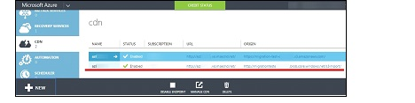
>
Once complete, we have a migrated Azure powered CDN with Azure storage, as origin. You can now check and see that Azure Blobs are available both directly and via Azure CDN. 
>
> 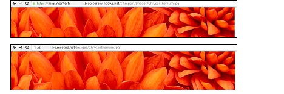
