##Abstract (May 2016)

This article illustrates how to use the Azure Notification Hub to deliver push notification messages to mobile applications on iOS, Android and Windows Phone platforms.

##INTRODUCTION

Azure Notification Hub provides an easy-to-use infrastructure that enables sending mobile push notifications from any backend (in the cloud or on-premises) to any mobile platform.

With Notification Hub you can easily send cross-platform, personalized push notifications, abstracting the details of the different platform notification systems (PNSs). With a single API call, you can target individual users or entire audience segments containing millions of users, across all their devices.

The detailed overview of Azure Notification Hub is available here: <https://msdn.microsoft.com/en-us/library/azure/jj891130.aspx>.

The idea of this sample is to give an Azure Web App visitor the ability to send a push notification to any registered mobile device, having installed mobile application from this sample.

Web Application displays a list of registered device. Users select a device from the list, then types in a free text message and sends it.

To cover more audiences this sample includes two Web Applications which are equivalent from functional prospective, but developed in two different technologies:

1.  Node.JS
2.  Latest Microsoft ASP.NET 5.0 + DNX.Core 5.0 (will be renamed to ASP.NET Core 1.0 and .NET Core 1.0 soon).

Node.JS is very popular in the startup world and .NET Core 1.0 is becoming the new wave of technology evolution from Microsoft. The Azure Notification Hub client library for DNX.Core 5.0 (.NET Core 1.0) has not been provided by Microsoft yet. This makes this sample extremely valuable, because it demonstrates how to use native REST API and this approach can be applied for ANY technology stack.

Mobile application allows users to describe themselves in simple string format and receive push notification messages sent to a device from Azure Notification Hub. This sample contains simple native applications for three major platforms: Windows Mobile, iOS and Android.

##Prerequisites

-   In order to complete this sample, you need to have an active Azure Subscription.

-   Azure Resource Manager Templates will be used to deploy an application. Detailed information on using ARM templates are available here: <https://azure.microsoft.com/en-us/documentation/articles/resource-group-authoring-templates/>.

-   In order to build a Windows Phone and .Net Web App Visual Studio 2015 is required. Android Studio (<http://developer.android.com/develop/index.html>) is required to build Android Mobile application and Xcode (<https://developer.apple.com/support/xcode>.) is required to build iOS application.

-   ASP.NET 5 and DNX execution environment are required to build ASP.NET 5 Web App. If you do not have it already installed, visit this guide: <http://docs.asp.net/en/latest/getting-started/installing-on-windows.html>

Use case scenario

We are considering two actors (Subscriber and Publisher) and three major use cases for push notifications. *Note: screenshots are done using Windows Phone, but Android and iOS versions are also available and you can find screens below in the section describing iOS and Android implementation details):*

-   *Subscriber*: Subscribes for notifications

-   *Subscriber* downloads and installs the application built from the sample. On the first application start subscriber enters a tag to identify the device (such as John Smith). This tag is just a free text string which will be used by the *Publisher* to identify the user's device.

-   *Publisher*: Sends notification to selected user (device)

-   *Publishe**r*** visits Azure Web App page and gets the list of registered devices (list of tags provided by *subscribers*):

-   User selects one of the devices which is target for notification, enters message and presses a send button. Selected device will display the following push notification message:

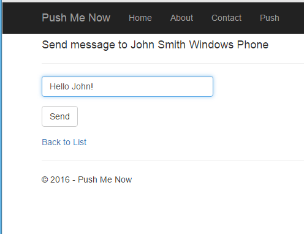

-   *Subscriber*: Receives notification and reads message

-   *Subscriber* receives push notification message in standard format for their specific mobile platform and can read the text message delivered.

COMPONENTS AND IMPLEMENTATION DETAILS

#Notification hub configuration
Notification hub configuration consists of common part and platform dependent configuration. The platform dependent settings guide is available at the official quick start guides for every type of client platform. An official Microsoft Azure Notification Hub documentation and set of Get Started Guides is located here <https://azure.microsoft.com/en-us/documentation/services/notification-hubs/>. In addition, you can find a corresponding link to guide in every client application description later in the document. Here is a common part of these official guides:

-   Log on to the [Azure Portal](https://portal.azure.com/), and then click +NEW at the top of the screen.

-   Click on Web + Mobile, then Notification Hub, and then Quick Create.

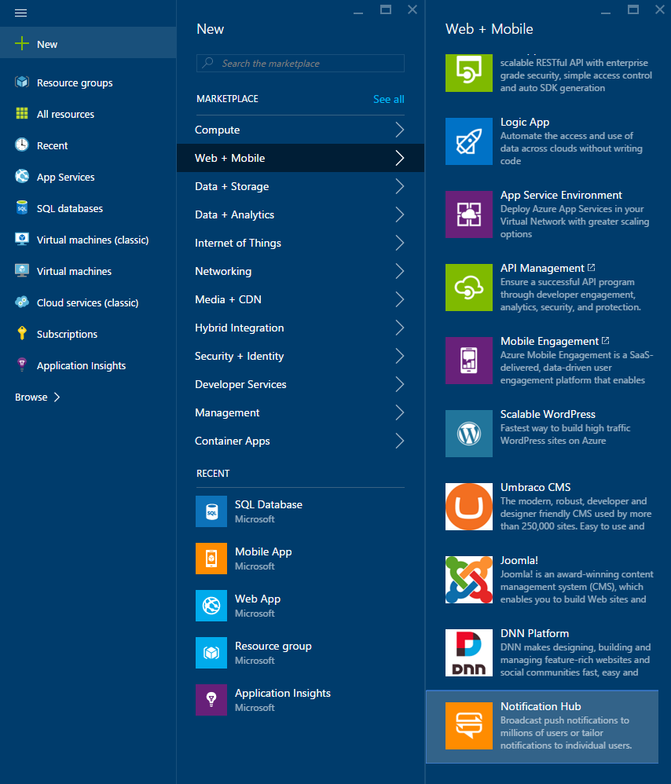

-   Make sure you specify a unique name in the Notification Hub field. Select your desired Region, Subscription and Resource Group (if you have one already).

-   If you already have a service bus namespace that you want to create the hub in, select it through the Select Existing option in the Namespace field. Otherwise, you can use the default name that will be created based on the hub name as long as the namespace name is available. Once ready, click Create.

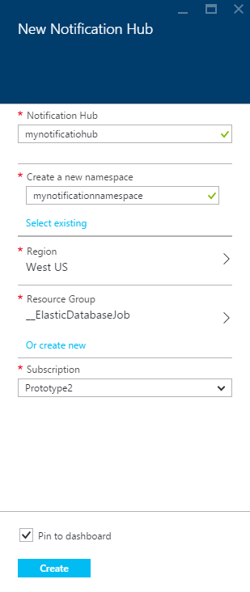

-   Once the namespace and notification hub is created, you will be taken to the respective portal page.

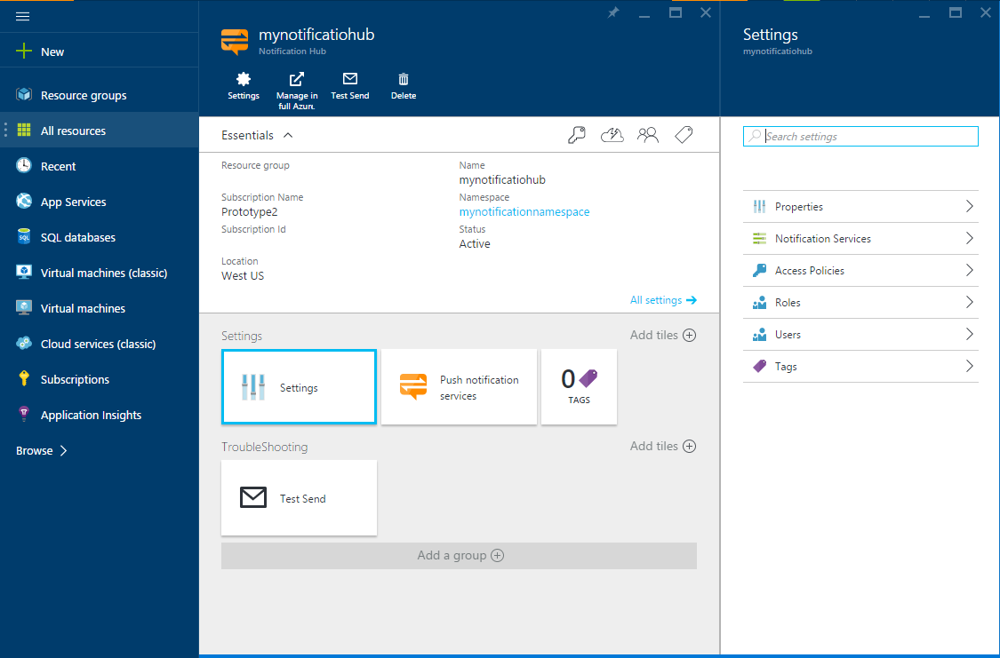

-   Click on Settings and then Access Policies - take note of the two connection strings that are made available to you, as you will need them to handle push notifications later.

User registration implementation

The system needs to have a list of registered devices; at the same time, we would like to keep this sample as simple as possible to demonstrate push notification technology. To do this, we will not introduce any database backend which will be common in more real life applications. We will place the user information into a tag which represents a registered device in the Azure Notification Hub. User information is a JSON object containing required information, some salt data to make a user with the same information have a unique tag. For this sample, user information will look like this: {"name":"*John Smith*","s":"54b9d84a32"} (assuming *Subscriber* entered John Smith during device registration).

The Notification Hub's notification registration tag can contain only alphanumeric symbols, so we will encode JSON as a base64 string increasing a salt field size to be an 8 or more to avoid an ending €˜=' symbols in the base64 string.

#ASP.NET 5.0 Web Application

Notes

Please note that ASP.NET 5.0 (new name will be ASP.NET Core 1.0) is in the release candidate RC1 state at the moment the sample is being created. In addition, there is no official notification hub client working with DNX,Core 5.0 (new name will be .NET Core 1.0). So a simple REST API client NotificationHubApiClient is implemented in this sample. It does have a minimum required notification hub client functionality, but limited error handling and does not covers all possible cases. Because of this it is strongly recommended to use an official client library in the production as soon as it will be available.

Please install ASP.NET 5 as well as DNX.Core 5.0 execution environment if you do not already have it installed. Refer to this guide: <http://docs.asp.net/en/latest/getting-started/installing-on-windows.html>. Please also download and install the latest Azure SDK from <https://go.microsoft.com/fwlink/?linkid=518003&clcid=0x409>

Creating a site

-   Create a new ASP.NET web application:

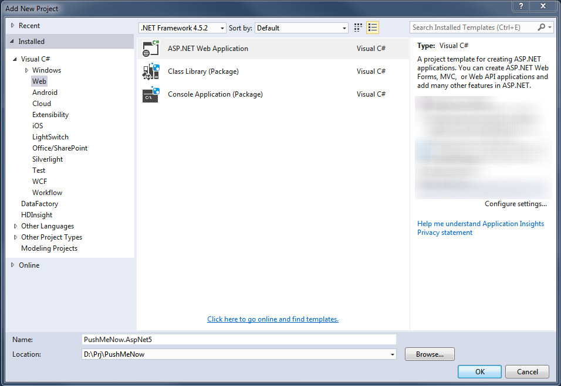

-   Select an ASP.NET 5 web application template and turn off authentication and keep Host in the Cloud selected (please note that Visual Studio is still using the unchanged name for the technology €“ ASP.NET 5.0, so please don't be confused).

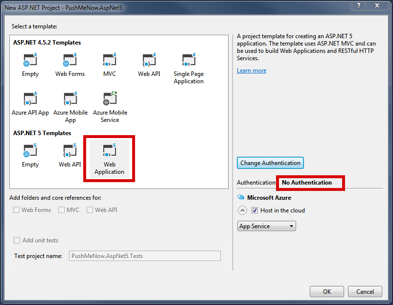

-   Setup an Azure deployment as a Web App:

-   Add System.Net.Http and Newtonsoft.Json Nuget packages.

-   Add a new project folder Models for models and create a new model class UserInfo:

> using System;
>
> using Newtonsoft.Json;
>
> namespace PushMeNow.AspNet5.Models
>
> {
>
> public class UserInfo
>
> {
>
> \[JsonProperty("name")\]
>
> public string Name { get; set; }
>
> }
>
> }

-   Add a model class Registration:

> using System;
>
> using System.Text;
>
> using Newtonsoft.Json;
>
> namespace PushMeNow.AspNet5.Models
>
> {
>
> enum RegistrationType
>
> {
>
> Windows,
>
> Apple,
>
> Gcm,
>
> }
>
> public class Registration
>
> {
>
> public Registration()
>
> { }
>
> public Registration(Registration other)
>
> {
>
> RegistrationType = other.RegistrationType;
>
> Tags = other.Tags;
>
> }
>
> \[JsonProperty("registration\_type")\]
>
> public string RegistrationType { get; set; }
>
> \[JsonProperty("tags")\]
>
> public string Tags { get; set; }
>
> public string Name
>
> {
>
> get
>
> {
>
> try
>
> {
>
> return
>
> JsonConvert.DeserializeObject&lt;UserInfo&gt;(Encoding.UTF8.GetString(Convert.FromBase64String(Tags)))
>
> .Name;
>
> }
>
> catch
>
> {
>
> return "Unknown";
>
> }
>
> }
>
> }
>
> }
>
> }
>
> 

-   Add a model class Message:

> using System;
>
> using System.Collections.Generic;
>
> using System.ComponentModel.DataAnnotations;
>
> using System.Linq;
>
> using System.Threading.Tasks;
>
> using Newtonsoft.Json;
>
> namespace PushMeNow.AspNet5.Models
>
> {
>
> public class Message : Registration
>
> {
>
> public Message()
>
> {
>
> }
>
> public Message(Registration registration)
>
> : base(registration)
>
> {
>
> }
>
> \[JsonProperty("text")\]
>
> \[Required\]
>
> public string Text { get; set; }
>
> }
>
> }

### 

-   Add a new controller PushController in the folder Controllers and modify it like this:

> using System.Collections.Generic;
>
> using System.Threading.Tasks;
>
> using Microsoft.AspNet.Mvc;
>
> using PushMeNow.AspNet5.Models;
>
> 
>
> // For more information on enabling MVC for empty projects, visit http://go.microsoft.com/fwlink/?LinkID=397860
>
> 
>
> namespace PushMeNow.AspNet5.Controllers
>
> {
>
>  public class PushController : Controller
>
>  {
>
>  public async Task&lt;IActionResult&gt; Index()
>
>  {
>
>  var registrations = await GetRegistrationsAsync();
>
>  return View(registrations);
>
>  }
>
> 
>
>  \[HttpGet\]
>
>  public IActionResult Send(\[Bind("Tags,RegistrationType")\] Registration registration)
>
>  {
>
>  return View(new Message(registration));
>
>  }
>
> 
>
>  \[HttpPost\]
>
>  \[ValidateAntiForgeryToken\]
>
>  public async Task&lt;IActionResult&gt; Send(\[Bind("Tags,Text,RegistrationType")\] Message message)
>
>  {
>
>  if (ModelState.IsValid)
>
>  {
>
>  NotificationHubApiClient notificationHubApiClient = GetClient();
>
>  await notificationHubApiClient.SendNotificationAsync(message);
>
>  return RedirectToAction("Index");
>
>  }
>
> 
>
>  return View(message);
>
>  }
>
> 
>
>  private async Task&lt;IEnumerable&lt;Registration&gt;&gt; GetRegistrationsAsync()
>
>  {
>
>  var notificationHubApiClient = GetClient();
>
>  var registrationTags = await notificationHubApiClient.GetRegistrationsAsync();
>
>  return registrationTags;
>
>  }
>
> 
>
>  private static NotificationHubApiClient GetClient()
>
>  {
>
>  string hubName = "&lt;HUB-NAME&gt;";
>
>  string fullConnectionString = "&lt;HUB-FULL-CONNECTION\_STRING&gt;";
>
>  return new NotificationHubApiClient(hubName, fullConnectionString);
>
>  }
>
>  }
>
> }

-   Add a new Views sub-folder Push and add a pair of views for registration selection and push message sending.

-   Index.cshtml like this:

> @using System.Threading.Tasks
>
> @using Newtonsoft.Json
>
> @using PushMeNow.AspNet5.Models
>
> @model IEnumerable&lt;Registration&gt;
>
> @{
>
> ViewData\["Title"\] = "Push Page";
>
> }
>
> &lt;div class="row"&gt;
>
> &lt;div class="col-md-12"&gt;
>
> &lt;h2&gt;Registrations&lt;/h2&gt;
>
> &lt;ul&gt;
>
> @foreach (var registration in Model)
>
> {
>
> &lt;li&gt;&lt;a asp-controller="Push" asp-action="Send" asp-route-tags="@registration.Tags" asp-route-registrationType="@registration.RegistrationType"&gt;@registration.Name&lt;/a&gt;&lt;/li&gt;
>
> }
>
> &lt;/ul&gt;
>
> &lt;/div&gt;
>
> &lt;/div&gt;

-   Send.cshtml like this:

> @using System.Threading.Tasks
>
> @using PushMeNow.AspNet5.Models
>
> @model Message
>
> 
>
> @{
>
>  ViewData\["Title"\] = "Send message to " + Model.Name;
>
> }
>
> 
>
> &lt;form asp-action="Send"&gt;
>
>  &lt;div class="form-horizontal"&gt;
>
>  &lt;h4&gt;@ViewData\["Title"\]&lt;/h4&gt;
>
>  &lt;hr /&gt;
>
>  &lt;div asp-validation-summary="ValidationSummary.ModelOnly" class="text-danger" /&gt;
>
>  &lt;input type="hidden" asp-for="Tags" /&gt;
>
>  &lt;input type="hidden" asp-for="RegistrationType" /&gt;
>
>  &lt;div class="form-group"&gt;
>
>  &lt;div class="col-md-12"&gt;
>
>  &lt;input asp-for="Text" class="form-control" /&gt;
>
>  &lt;span asp-validation-for="Text" class="text-danger" /&gt;
>
>  &lt;/div&gt;
>
>  &lt;/div&gt;
>
>  &lt;div class="form-group"&gt;
>
>  &lt;div class="col-md-12"&gt;
>
>  &lt;input type="submit" value="Send" class="btn btn-default" /&gt;
>
>  &lt;/div&gt;
>
>  &lt;/div&gt;
>
>  &lt;/div&gt;
>
> &lt;/form&gt;
>
> 
>
> &lt;div&gt;
>
>  &lt;a asp-action="Index"&gt;Back to List&lt;/a&gt;
>
> &lt;/div&gt;

### 

-   Edit a Shared/\_Layout.cshtml

-   Add a line to nav bar in the to

> &lt;li&gt;&lt;a asp-controller="Push" asp-action="Index"&gt;Push&lt;/a&gt;&lt;/li&gt;

-   Add script references in order to enable validation

> &lt;script src="~/lib/jquery-validation/dist/jquery.validate.js"&gt;&lt;/script&gt;
>
> &lt;script src="~/lib/jquery-validation-unobtrusive/jquery.validate.unobtrusive.js"&gt;&lt;/script&gt;

-   Add following lines for required additional dependencies in the section "dependencies" of project.json:

> "System.Net.Http": "4.0.1-beta-23516",
>
> "Newtonsoft.Json": "8.0.2"

-   Replace &lt;HUB-NAME&gt; and &lt;HUB-FULL-CONNECTION\_STRING&gt; with your settings.

-   Add a NotificationHub client. An official client is not ready at the moment so a class NotificationHubApiClient is used as a workaround. See sample sources to get more details about this class.

-   Build and run a web application

Note: Complete sources of the project are in the PushMeNow.AspNet5 sub-folder of sample sources.

##Node.JS Web App

# Create a Node.JS app and connect to the Notification Hub

-   First step is a creation Node.JS application. Express.JS framework v4.13.1 is used for this sample.

Note: The detailed step by step guide is available here: [*http://expressjs.com/en/starter/generator.html*](http://expressjs.com/en/starter/generator.html).

-   Next step is installation Azure npm package. It is done using the following command:

> npm install azure --save

-   Add the following string to the top of the app.js file of the application:

> var azure = require('azure');

-   In order to connect to the Notification Hub, the NotificationHubService object is used. It is created in app.js file:

> var notificationHubService = azure.createNotificationHubService('hubname','connectionstring');

### Create pages to display the list of registrations and send notification to different platforms

-   Create a push.js file in the routes folder and write the following code:

> var express = require('express');
>
> var router = express.Router();
>
> module.exports = router;

-   Add the following strings to the app.js file to configure routes and set up handlers:

> var push = require('./routes/push');
>
> app.use('/push', push);

-   Add the methods for displaying registration list in push.js:

> router.get('/', function(req, res, next) {
>
> // getting the registrations list
>
> notificationHubService.listRegistrations(null, function (error, response) {
>
> if (!error) {
>
> var regisrations = response.map(function (item) {
>
> return {
>
> name: getNameByRegistrationTags(item.Tags),
>
> tags: item.Tags,
>
> // identify registration type
>
> registrationType: item.\_.ContentRootElement.replace('RegistrationDescription', '')
>
> };
>
> });
>
> res.render('push', { title: 'Registrations', regisrations: regisrations });
>
> } else {
>
> throw new Error(error);
>
> }
>
> });
>
> });

-   Add function to get devices by Notification Hub's registration tags:

> function getNameByRegistrationTags(tags) {
>
> try {
>
> return JSON.parse(new Buffer(tags, 'base64').toString('utf8')).name;
>
> }
>
> catch (e) {}
>
> return tags;
>
> }

-   Add view to display the registration list. All views use the Jade engine. Create a push.jade file in views folder and add the following code to it:

> extends layout
>
> block content
>
> h2 \#{title}
>
> div
>
> div
>
> - each registration in regisrations
>
> li
>
>  a(href='/push/send?tags=\#{registration.tags}&registrationType=\#{registration.registrationType}') \#{registration.name}

-   Open http://localhost:&lt;port&gt;/push and check that you already can see the list of registrations.

-   Add the new route to send notification to a user in the push.js:

> // GET view for sending notification
>
> router.get('/send/', function(req, res, next) {
>
> var tags = req.query.tags;
>
> var name = getNameByRegistrationTags(tags);
>
> res.render('send', { title: 'Send message', name: name, tags: tags, registrationType: req.query.registrationType, message: '' });
>
> });

-   Create view sand.jade for displaying message control with the following code that extends layout

> block content
>
> h4 Send message to \#{name}
>
> form(role='form'
>
> method='post')
>
> input(type='hidden'
>
> name='tags'
>
> value='\#{tags}')
>
> input(type='hidden'
>
> name='registrationType'
>
> value='\#{registrationType}')
>
> input(class='form-control'
>
> type='text'
>
> name='text'
>
> id='text'
>
> value='\#{message}')
>
> input(type='submit'
>
> value='Send'
>
> style='margin: 15px 0 0 0')
>
> div
>
>  a(href='/push') Back to list:

-   Add handler for sending message request and place it in the push.js file:

> // POST send notification to use
>
> router.post('/send/', function(req, res, next) {
>
> var message = req.body.text;
>
> var tags = req.query.tags;
>
> var name = getNameByRegistrationTags(tags);
>
> var registrationType = req.query.registrationType;
>
> var payload;
>
> // callback method after finished sending notification
>
> var onSendingCallback = function(error) {
>
> if (!error) {
>
> res.redirect('/push');
>
> } else {
>
> res.render('send', { title: 'Send message', name: name, tags: tags, registrationType: req.query.registrationType, message: message });
>
> }
>
> };
>
> switch (registrationType) {
>
> // sending notification to the Windows platform
>
> case 'Windows':
>
> payload = '&lt;toast&gt;&lt;visual&gt;&lt;binding template="ToastText01"&gt;&lt;text id="1"&gt;' + message + '&lt;/text&gt;&lt;/binding&gt;&lt;/visual&gt;&lt;/toast&gt;';
>
> notificationHubService.wns.send(tags, payload, 'wns/toast', onSendingCallback);
>
> break;
>
> // sending notification to the Android platform
>
> case 'Gcm':
>
> payload = {
>
> data: {
>
> msg: message
>
> }
>
> };
>
> notificationHubService.gcm.send(tags, payload, onSendingCallback);
>
> break;
>
> // sending notification to the Apple platform
>
> case 'Apple':
>
> payload = {
>
> alert: message
>
> };
>
> notificationHubService.apns.send(null, payload, onSendingCallback);
>
> break;
>
> default:
>
> throw new Error('Unknowwn registration type');
>
> }
>
> });

#Creating Azure Web App and configuring the continuous deployment for Node.JS Web App

Please take the following steps below:

-   Sign in Azure portal <https://portal.azure.com/>

-   Click on the NEW button then click on the Web + Mobile and then click on the Web App.

-   Fill necessary fields and click on Create.

-   Select this web app and click on All Settings and then click on the Continues Deployment and configure settings by Local Git Repository

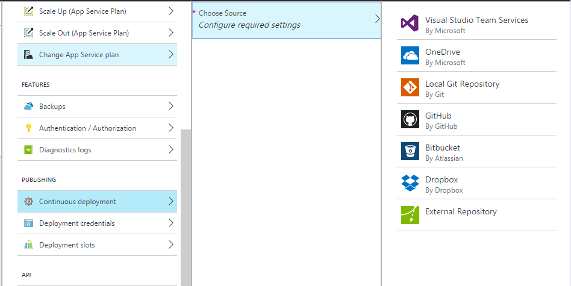

-   Click on the €œSetup Connection€� and create deployment account

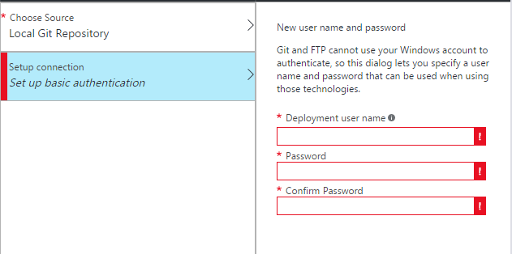

### Publish Node.JS application to Azure using Git

-   Use the command line change directory to the project directory and enter the following command to initialize the Git repository:

> git init

-   Add files to the repository:

> git add .
>
> git commit -m "initial commit"

-   To get URL for the remote repository, open all settings and click on the Properties and you can find €œGit URL€�

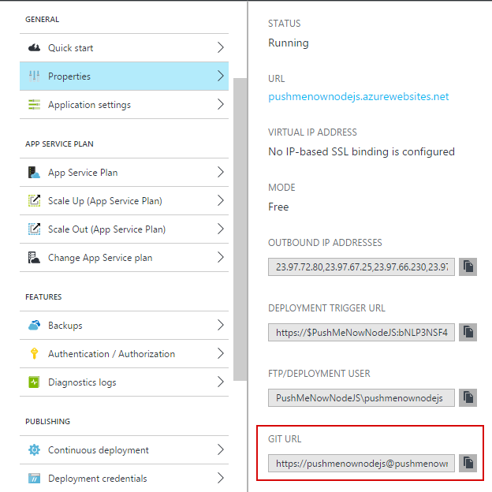

-   Add a Git remote for pushing updates to the web app that you created previously, by using the following command:

> git remote add azure \[URL for remote repository\]

-   Push your changes to Azure by following command:

> git push azure master

Windows Phone Client

There is a great starter guide available here: [*https://azure.microsoft.com/en-us/documentation/articles/notification-hubs-windows-store-dotnet-get-started/*](https://azure.microsoft.com/en-us/documentation/articles/notification-hubs-windows-store-dotnet-get-started/). We will follow this guide in the sample.

-   Create a new Windows Phone project. For Visual Studio 2015 use a template shown on the image below.

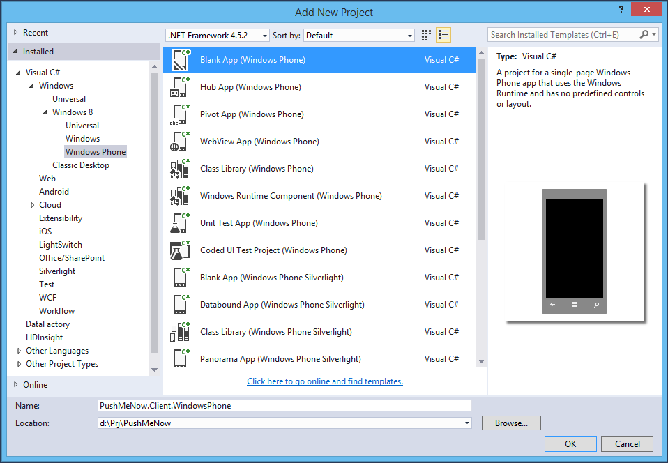

-   Register your application in the Store and tune notification hub settings as it is described in the article.

-   Add *WindowsAzure.Messaging.Managed* and *Newtonsoft.Json* Nuget packages.

-   Create a new folder Models and put a new class *UserInfo* like this:

> using Newtonsoft.Json;
>
> namespace PushMeNow.Client.WindowsPhone.Models
>
> {
>
> public class UserInfo
>
> {
>
> private string \_name;
>
> private string \_salt;
>
> \[JsonProperty("name")\]
>
> public string Name
>
> {
>
> get { return \_name; }
>
> set
>
> {
>
> \_name = value;
>
> int saltLength = 7;
>
> do
>
> {
>
> ++saltLength;
>
> \_salt = Guid.NewGuid().ToString("N").Substring(0, saltLength);
>
> } while (AsTag().Contains("="));
>
> }
>
> }
>
> \[JsonProperty("s")\]
>
> public string Salt
>
> {
>
> get { return \_salt; }
>
> }
>
> public string AsTag()
>
> {
>
> return Convert.ToBase64String(Encoding.UTF8.GetBytes(JsonConvert.SerializeObject(this)));
>
> }
>
> }
>
> }

Note. User information is stored into the tag content as a json containing required information. Some salt data is added to make a tag with the same user information unique. The notification registration tag should contain alphanumeric symbols only. So the json is encoded as a base64 string increasing a salt field size to be 8 or more to avoid an ending '=' symbols in the base64 string.

-   Open a MainPage.xml and add a stackpanel instead of grid. Put a minimum of required UI elements like these:

> &lt;StackPanel Margin="20"&gt;
>
>  &lt;TextBlock HorizontalAlignment="Left"
>
>  TextWrapping="Wrap"
>
>  Text="Register your device for Push Me Now"
>
>  VerticalAlignment="Top"
>
>  Style="{StaticResource HeaderTextBlockStyle}" /&gt;
>
>  &lt;TextBlock Margin="0,50,0,0"
>
>  HorizontalAlignment="Left"
>
>  TextWrapping="Wrap"
>
>  Text="User Name"
>
>  VerticalAlignment="Top"
>
>  Style="{StaticResource BaseTextBlockStyle}" /&gt;
>
>  &lt;TextBox x:Name="textBoxName"
>
>  HorizontalAlignment="Stretch"
>
>  TextWrapping="Wrap"
>
>  Text="" VerticalAlignment="Top" /&gt;
>
>  &lt;Button Margin="50"
>
>  x:Name="buttonRegister"
>
>  Content="Register"
>
>  HorizontalAlignment="Center"
>
>  VerticalAlignment="Bottom"
>
>  Click="buttonRegister\_Click" /&gt;
>
> &lt;/StackPanel&gt;

-   Open a MainPage.xaml.cs and a set of usings:

> using Microsoft.WindowsAzure.Messaging;
>
> using PushMeNow.Client.WindowsPhone.Models;
>
> using Windows.Networking.PushNotifications;
>
> using Windows.UI.Popups;

-   Create an event handler for a registration button:

> private async void buttonRegister\_Click(object sender, RoutedEventArgs e)
>
> {
>
>  string message;
>
>  try
>
>  {
>
>  IsEnabled = false;
>
>  var userInfo = new UserInfo { Name = textBoxName.Text.Trim() };
>
>  if (string.IsNullOrWhiteSpace(userInfo.Name))
>
>  {
>
>  throw new Exception("Please enter your name");
>
>  }
>
> 
>
>  string hubName = "&lt;HUB-NAME&gt;";
>
>  string listenConnectionString = "&lt;HUB-LISTEN-CONNECTION\_STRING&gt;";
>
> 
>
>  var channel = await PushNotificationChannelManager.CreatePushNotificationChannelForApplicationAsync();
>
>  var hub = new NotificationHub(hubName, listenConnectionString);
>
>  string tag = userInfo.AsTag();
>
>  var result = await hub.RegisterNativeAsync(channel.Uri, new\[\] { tag });
>
> 
>
>  if (result.RegistrationId == null)
>
>  {
>
>  throw new Exception("No registration id");
>
>  }
>
> 
>
>  message = "Registration successful: " + result.RegistrationId;
>
>  }
>
>  catch (Exception exception)
>
>  {
>
>  message = "Registration failed: " + exception.Message;
>
>  }
>
>  finally
>
>  {
>
>  IsEnabled = true;
>
>  }
>
> 
>
>  var dialog = new MessageDialog(message);
>
>  dialog.Commands.Add(new UICommand("OK"));
>
>  await dialog.ShowAsync();
>
> }

-   Replace &lt;HUB-NAME&gt; and &lt;HUB-LISTEN-CONNECTION\_STRING&gt; with settings for your notification hub.

-   Double check Toast capable is enabled in the appmanifest.

-   Build and run an application on the Device or the Windows Phone Emulator.

-   Now you can close your application. Open a Web Application and send a push message to just the registered user.

-   You will receive a push sent.

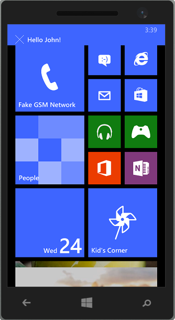

#Android Client

-   Official Notification Hub documentation for Android platform is available here: <https://azure.microsoft.com/en-us/documentation/articles/notification-hubs-android-get-started/>

-   Class *UserInfo* handles device registration data and very similar to the one described in the Windows Phone section. Device registration is performed in a body of AsyncTask:

> ***private void** registerPushNotification() {*
>
> ***private final** String SENDER\_ID = **"&lt;Your project number&gt;"**;*
>
> ***private final** String HubName = **"&lt;Your hub name&gt;"**;*
>
> ***private final** String HubListenConnectionString = **"&lt;Your default listenconnection sctring&gt;"**;*
>
> ***final** UserInfo userInfo = **new** UserInfo();*
>
> *userInfo.setName(\_nameEditText.getText().toString());*
>
> ***new** AsyncTask() {*
>
> *@Override*
>
> ***protected** Object doInBackground(Object... params) {*
>
> ***try** {*
>
> *GoogleCloudMessaging gcm = GoogleCloudMessaging.getInstance(MainActivity.**this**);*
>
> *String regid = gcm.register(SENDER\_ID);*
>
> *NotificationHub hub = **new** NotificationHub(HubName, HubListenConnectionString, MainActivity.**this**);*
>
> *String registrationId = hub.register(regid, userInfo.getAsTag()).getRegistrationId();*
>
> *ToastNotify(**"Registered Successfully - RegId : "** + registrationId);*
>
> *} **catch** (Exception e) {*
>
> *ToastNotify(**"Registration Exception Message - "** + e.getMessage());*
>
> ***return** e;*
>
> *}*
>
> ***return null**;*
>
> *}*
>
> *}.execute(**null**, **null**, **null**);*
>
> *}*

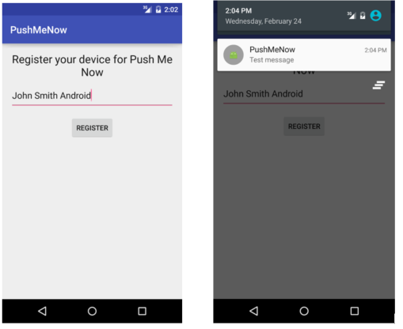

#iOS Client

Official Notification Hub documentation for Android platform is available here: <https://azure.microsoft.com/en-us/documentation/articles/notification-hubs-ios-get-started/>

Class *UserInfo* handles device registration data and is very similar to the one described in the Windows Phone section. Device registration is performed in class *AppDelegate*, because deviceToken is available only in the method *application:didRegisterForRemoteNotificationsWithDeviceToken:* of class *AppDelegate*

-   Register to receive remote notifications via Apple Push Notification service.

> -(void) registerPushNotificationForUser:(UserInfo\*) userInfo {
>
> self.userInfo = userInfo;
>
> UIUserNotificationSettings\* notificationSettings = \[UIUserNotificationSettings settingsForTypes:UIUserNotificationTypeAlert | UIUserNotificationTypeBadge | UIUserNotificationTypeSound categories:nil\];
>
> \[\[UIApplication sharedApplication\] registerUserNotificationSettings:notificationSettings\];
>
> \[\[UIApplication sharedApplication\] registerForRemoteNotifications\];
>
> }

-   This code connects to the notification hub. Then it sends the device token to the notification hub to register for notifications:

> - (void)application:(UIApplication \*)application didRegisterForRemoteNotificationsWithDeviceToken:(NSData \*) deviceToken {
>
> static NSString\* hubName = @"&lt;Your hub name&gt;";
>
> static NSString\* listenConnectionString = @""&lt;Your default listenconnection sctring&gt;";
>
> SBNotificationHub\* hub = \[\[SBNotificationHub alloc\] initWithConnectionString:listenConnectionString
>
> notificationHubPath:hubName\];
>
> NSSet\* tags = nil;
>
> if (self.userInfo) {
>
> tags = \[NSSet setWithObjects:self.userInfo.asTag, nil\];
>
> }
>
> \[hub registerNativeWithDeviceToken:deviceToken tags:tags completion:^(NSError\* error) {
>
> if (error != nil) {
>
> NSLog(@"Error registering for notifications: %@", error);
>
> }
>
> else {
>
> \[self MessageBox:@"Registration Status" message:@"Registered"\];
>
> }
>
> }\];
>
> }

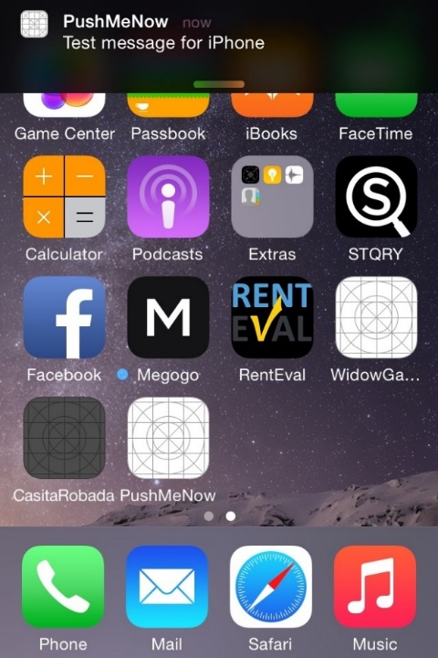

##SUMMARY

In the article we described how to get started with Azure Notification Hub to build your own push notification solution using Node.JS or .NET Core 1.0 for Android, iOS and Windows phone mobile applications

A startup can use this sample as a starting point and customize it into a specific application to match their business model and technical needs.
