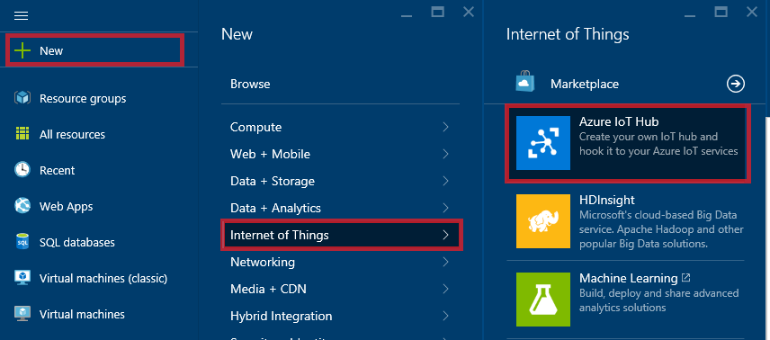
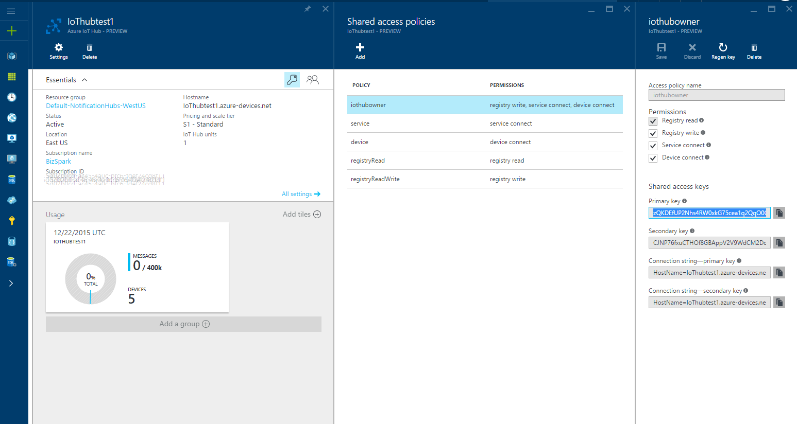
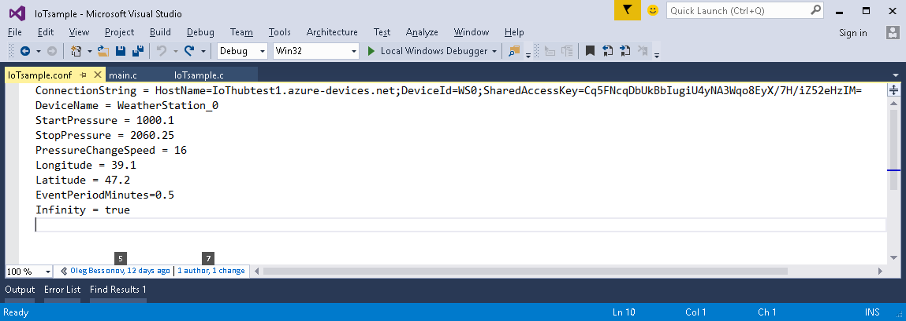
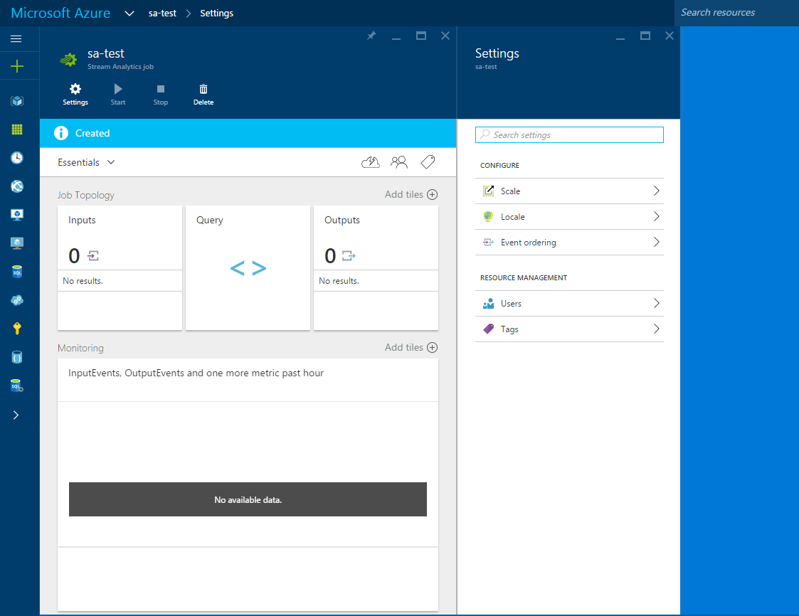
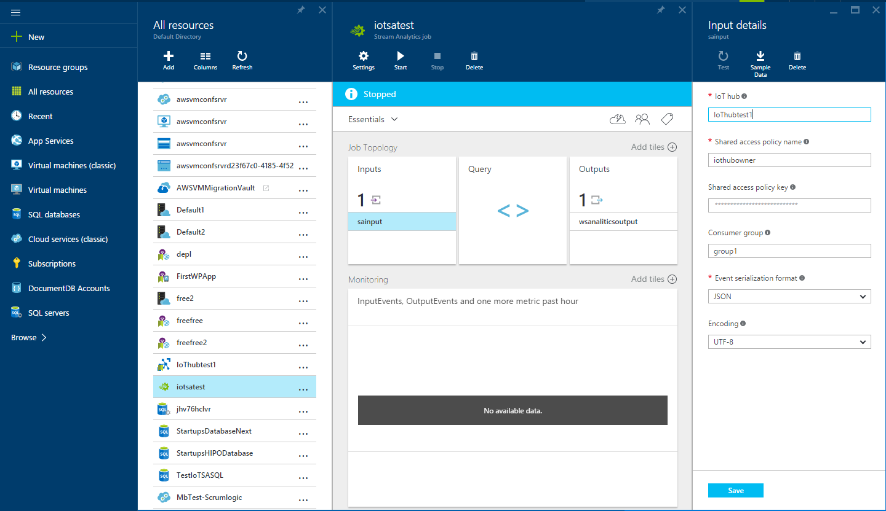
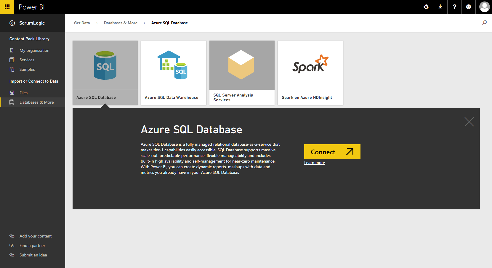
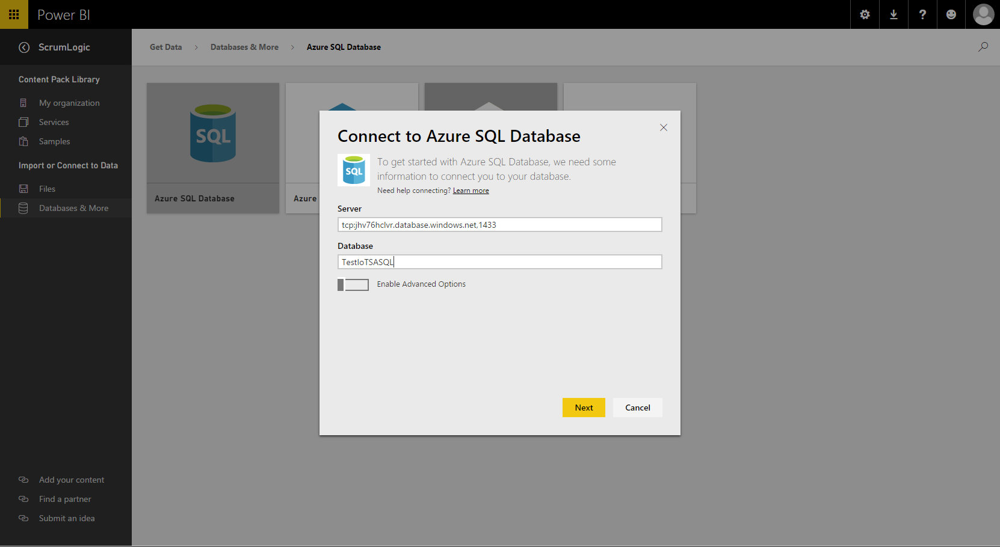

**
**Abstract (January 2016)

End to end demonstration of the IoT sample system on Azure which includes: IoT hub for communication with devices, Stream Analytic for data analysis and aggregation, Azure SQL database for storage of the aggregated information and Power BI for visualization.

INTRODUCTION

The “Internet of things” (IoT) is becoming an increasingly growing topic. It’s a concept that not only has the potential to impact how we live but also how we work. Broadband Internet is becoming more widely available, the cost of connecting is decreasing, more devices are being created with Internet connection capabilities and sensors built into them, technology costs are going down, and smart phone penetration is explosively growing. IoT is the concept of basically connecting any device with an on and off switch to the Cloud. This includes everything from cell phones, coffee makers, washing machines, headphones, lamps, wearable devices and almost anything else you can think of. It is predicted that by 2020 there will be over 26 billion connected devices…. Someday anything that can be connected, will be connected.

IoT opens endless opportunities in almost any business area, but at the same time brings a lot of challenges from a technical perspective. Having many devices transmitting data raises a lot of security concerns. The large number of the devices will produce a lot of traffic, which needs to be handled. Big Data received from devices needs to be analyzed and presented.

Whether you want to transform business by connecting, analyzing and acting on machine-generated data, or build new intelligent devices, from small gateways to powerful industry devices like robotics, you can rely on Microsoft to provide you with a comprehensive set of technologies:

Build or connect: Develop new secured IoT devices with ease. Connect both new and existing devices regardless of the operating systems or applications that they run.

Analyze and act: Capture, analyze and mine untapped data to create new insights and predict future outcomes.

Integrate and transform: Automate business processes to accelerate the speed of a company.

We will demonstrate how this technology can be used by an IoT focused startup. For the end to end demonstration we chose a simple real life example – data collection from a virtual weather station, analysis statistic on weather changes, storm, gale and hurricane warnings, and aggregated information including geographical position, warning type, etc.

The goal of this article is to show this end to end scenario implemented using Microsoft Azure technologies. We won’t go really deep in technical details for every specific component, but will provide a link to technical documentation which is a great starting point to a detailed guide.

I would like to briefly describe the model we are going to use in this sample application. The model is based on the simplest concept of monitoring atmosphere pressure changes. We are making the following assumptions in our model: If pressure is below 920 mbar it indicates category 5 hurricane warning, if pressure is between 920 and 945 mbar then we have category 3 Hurricane warning, if pressure is between 945 and 980 mbar then we have category 1 hurricane warning. Also we are taking into account the pressure change speed and assume that if it decreases faster than 4 mbar/hour it means storm warning and if pressure change speed is between -2 and -4 mbar/hour then we have gale warning.

The demo system (download here) consists of the following components:

1.  Weather station: We do not have any hardware locally or geographically distributed, so we developed a simple simulator based on Azure IoT cross-platform library and can be built for multiple platforms (it uses C as a programming language).

2.  Azure IoT hub: This is an endpoint for communication between devices and cloud.

3.  Azure stream analytic: This component reads data received by IoT hub from devices, analyzes the data, performs processing and aggregation, and stores aggregated information in an Azure SQL database.

4.  Azure SQL database: This is used for storing statistical information and becomes a data source for the visualization tool.

5.  Microsoft Power BI: This component is used to build a visual report basing on the statistic information that is collected.

COMPONENTS IN DETAILS

Azure IoT Hub

First of all, we need to create an IoT hub on Azure. The IoT hub will receive and handle messages from the devices, perform device authentication and become a data source for further processing. This can be done on a new Azure management portal as shown below:

After the configuration you will get the results that will be similar to what is displayed below:

Weather Station Simulator

Microsoft provides Azure IoT software development kits as an open source project with a set of samples which can be used as a template (and this is a recommended way) to build your own IoT solutions.

The SDK is available on the GitHub <https://github.com/Azure/azure-iot-sdks/> and the detailed description of the library, applicable platforms, samples and project structure is described in details in the read.me file: <https://github.com/Azure/azure-iot-sdks/blob/master/c/readme.md>

You will need to prepare the development environment and build the IoT Client library. The detailed step-by-step how to guide is available at <https://github.com/Azure/azure-iot-sdks/blob/master/c/doc/devbox_setup.md>.

Before any device can send information to the IoT hub it should be registered. In a real life scenario this is part of the production cycle and device provisioning. IoT hub provides API to register devices and IoT client library has a sample utility which is built on top of the API - Device Explorer. The documentation for this utility is available as a part of the SDK: <https://github.com/Azure/azure-iot-sdks/blob/master/tools/DeviceExplorer/doc/how_to_use_device_explorer.md>

Please pay attention on the shared access key highlighted on the previous screenshot. You will need to place the displayed value as a Key Value to register the device and receive a Shared Access Key, which should be configured on the device as a part of the connection string to IoT hub.

Once the device is registered – the connection string should be stored on the device. We implemented a simple configuration file for the weather station, which contains:

-   Connection string to IoT Hub

-   Start pressure in mbar

-   Stop pressure in mbar

-   Pressure change speed (just absolute value of the direction of pressure change is determined by start/stop pressure. The simulator supports only linear pressure change.)

-   Geo location as latitude and longitude

-   Delay between sending and monitoring data

-   Infinity – if set to true, then the emulator will cycle pressure changes

Now we can check samples from SDK and start using it as a template to create our simulator. As a template we choose the sample located in the code tree *azure-iot-sdks\\c\\serializer\\samples\\simplesample\_http\\windows*. To build it please download the archive with full source code (IoT\_SA\_BI.zip) and extract on your local hard drive. Open the solution file in Visual Studio 2015 and rebuild the solution.

We created several configuration files for different weather patterns in North Atlantic for the Caribbean, Bermuda, and Azores weather stations, etc. You can find the files side by side in the zipped folder.

Azure SQL database

We are going to use Azure SQL database as a storage for aggregated results, and source of information for data visualization. This is a well-known Azures service and its creation is described in details in the following article: <https://azure.microsoft.com/en-us/documentation/articles/sql-database-get-started/>. In order to connect to the database, we recommend to use SQL Server Management Studio. The following article provides comprehensive step by step guidance on how to connect and execute SQL queries in SSMS: <https://azure.microsoft.com/en-us/documentation/articles/sql-database-connect-query-ssms/>.

The database schema is supposed be very simple, consisting of a single table which can be created using the following script:

*CREATE TABLE \[dbo\].\[WeatherStationAnalytics\](*

> *\[Id\] \[int\] IDENTITY(1,1) NOT NULL,*
>
> *\[DeviceId\] \[nvarchar\](128) NOT NULL,*
>
> *\[DeviceName\] \[nvarchar\](128) NOT NULL,*
>
> *\[Max\_Pressure\] \[float\] NOT NULL,*
>
> *\[Min\_Pressure\] \[float\] NOT NULL,*
>
> *\[Longitude\] \[float\] NOT NULL,*
>
> *\[Latitude\] \[float\] NOT NULL,*
>
> *\[WarningType\] \[nvarchar\](128) NULL,*
>
> *\[PressureGradient\] \[float\] NOT NULL,*
>
> *\[Begin\_Pressure\] \[float\] NOT NULL,*
>
> *\[Timestamp\] \[datetime\] NOT NULL,*
>
> *CONSTRAINT \[PK\_WeatherStationAnalytics\] PRIMARY KEY CLUSTERED *
>
> *(*
>
> *\[Id\] ASC*
>
> *))
> *

Azure Stream Analytic

Stream analytic job on Azure will read row date from IoT hub, aggregate the information and store it into Azure SQL database. So we need to: Create Stream analytic on the Azure Management portal – please see the screens below:

Configure Input. Please refer to the article with step by step description: <https://azure.microsoft.com/en-us/documentation/articles/stream-analytics-define-inputs/>. Specifically to *Configure IoT Hub as a data stream input* section, please select the IoT hub you created as a source data stream.

Configure Output. Please refer to the article with step by step description: <https://azure.microsoft.com/en-us/documentation/articles/stream-analytics-define-outputs/>. Specifically, to the *Azure SQL database* section. Provide SQL database you have created before as output.

Once input and output is configured it will look like:

Create a stream analytic query

The query that creates weather alerts and saves information to the database looks like:

> *WITH FirstPressure AS*
>
> *(*
>
> *SELECT DeviceName*
>
> *, Pressure as BeginPressure*
>
> *FROM*
>
> *sainput TIMESTAMP BY EventEnqueuedUtcTime*
>
> *WHERE *
>
> *IsFirst(minute, 15) OVER (PARTITION BY DeviceName) = 1*
>
> *)*
>
> *SELECT *
>
> *sainput.IoTHub.ConnectionDeviceId as DeviceID*
>
> *, sainput.DeviceName*
>
> *, max(sainput.Pressure) as Max\_Pressure*
>
> *, Min(sainput.Pressure) as Min\_Pressure*
>
> *, max(sainput.Longitude) as Longitude*
>
> *, max(sainput.Latitude) as Latitude*
>
> *, CASE *
>
> *WHEN Min(sainput.Pressure) &lt; 920.0*
>
> *THEN 'Cat 5 Hurricane'*
>
> *ELSE *
>
> *CASE *
>
> *WHEN Min(sainput.Pressure) &lt; 945.0*
>
> *THEN 'Cat 3 Hurricane'*
>
> *ELSE *
>
> *CASE *
>
> *WHEN Min(sainput.Pressure) &lt; 980.0*
>
> *THEN 'Cat 1 Hurricane'*
>
> *ELSE *
>
> *CASE*
>
> *WHEN max(FirstPressure.BeginPressure) &gt; Min(sainput.Pressure)*
>
> *AND (Min(sainput.Pressure) - max(sainput.Pressure)) \* 3600.0 / *
>
> *CAST(DATEDIFF(second, min(sainput.EventEnqueuedUtcTime), *
>
> *max(sainput.EventEnqueuedUtcTime) ) as float) &lt; -4.0*
>
> *THEN 'Storm Warning'*
>
> *ELSE *
>
> *CASE*
>
> *WHEN max(FirstPressure.BeginPressure) &gt; Min(sainput.Pressure)*
>
> *AND (Min(sainput.Pressure) - max(sainput.Pressure)) \* 3600.0 / *
>
> *CAST(DATEDIFF(second, min(sainput.EventEnqueuedUtcTime), *
>
> *max(sainput.EventEnqueuedUtcTime) ) as float) &lt; -2.0*
>
> *THEN 'Gale Warning'*
>
> *ELSE NULL*
>
> *END *
>
> *END *
>
> *END*
>
> *END*
>
> *END AS WarningType*
>
> *, CASE*
>
> *WHEN max(FirstPressure.BeginPressure) &gt; Min(sainput.Pressure)*
>
> *THEN (Min(sainput.Pressure) - max(sainput.Pressure)) \* 3600.0 / *
>
> *CAST(DATEDIFF(second, min(sainput.EventEnqueuedUtcTime), max(sainput.EventEnqueuedUtcTime) ) as float)*
>
> *ELSE (max(sainput.Pressure) - Min(sainput.Pressure)) \* 3600.0 / *
>
> *CAST(DATEDIFF(second, min(sainput.EventEnqueuedUtcTime), max(sainput.EventEnqueuedUtcTime) ) as float)*
>
> *END AS PressureGradient *
>
> *, max(FirstPressure.BeginPressure) as Begin\_Pressure*
>
> *, System.TimeStamp as Timestamp*
>
> *INTO*
>
> *wsanaliticsoutput*
>
> *FROM*
>
> *sainput TIMESTAMP BY EventEnqueuedUtcTime*
>
> *inner join FirstPressure ON (sainput.DeviceName = FirstPressure.DeviceName*
>
> *AND DATEDIFF(minute, FirstPressure, sainput) BETWEEN 0 AND 14)*
>
> *GROUP BY sainput.IoTHub.ConnectionDeviceId*
>
> *, sainput.DeviceName*
>
> *, TumblingWindow(minute, 15) *
>
> *HAVING PressureGradient &lt;&gt; 0.0 *

Now that the creation of the Azure Stream analytic job is finished, it is a good time to start it by pressing the Start button.

Power BI Visualization

To visualize the statistic we will use Microsoft Power BI (<https://powerbi.microsoft.com/en-us/>).

Create the Power BI account and create data source connected to Azure SQL database, select the connection type first:

And then enter parameters for connection:

After creating data source in Power BI a report can be created:

In the *Fields section* you see the fields from SQL database and you can drag and drop them to appropriate position into the report visualization.

Another example of the report that can be built – atmosphere pressure changes by the station:

PowerBI reports can be shared and integrated in a web site as described on the PowerBI developer portal here:

<https://powerbi.microsoft.com/en-us/developers/>

Summary

In the article we described, how to get started with Azure IoT Hub and use Azure IoT library to build your own IoT solution, how to configure Azure Stream Analytic to aggregate data, and how to use Power BI to visualize results.

A startup can just take this sample as a starting point and customize to match a business model into a specific IoT application.
