##Abstract (May 2016)

In this tutorial we will demonstrate how to apply Azure Machine Learning technology to perform analysis of a dummy system in order to detect and alert about any anomaly or unusual behavior. We will build a Machine Learning model/experiment for the system which performs data transfer between different Azure datacenters. We will also build a watchdog to monitor data transfer response time.

##RESPONSE DURATION WATCHER SAMPLE

#Prerequisite

In order to complete this sample, you will need to have an active Azure Subscription and create a Machine Learning workspace. The following article provides step by step instructions and describes how to setup up a required environment: <https://azure.microsoft.com/en-us/trial/get-started-machine-learning/>.

In this sample Azure Resource Manager templates will be used to deploy an application. Detailed information on using ARM templates are available here: <https://azure.microsoft.com/en-us/documentation/articles/resource-group-authoring-templates/>.

In order to build the solution Visual Studio 2015 is required.

#Workflow proposal
The following high level flow is used for this sample:

-   Create storage account in *Western Europe* geo region (Account A)

-   Create storage account in *Southeast Asia* geo region (Account B)

-   Execute stat job, which measures the data transfer time:

-   Generate a file S with some random data of random X Mbytes size locally

-   Copy S to A

-   Copy A to B and measure the time required to complete the operation. Store the time to collect a statistic data using week day/hour and file size as a parameter (to simplify the sample we made an assumption that load causing traffic delays depends only on week day, time and file size. In real life the mode will be more complicated, but everything described in this article will be applicable as well).

-   Execute a scheduled retrain job, which retrains machine learning model using recently collected statistic:

-   If the statistical data exists we should retrain a model with current data

-   Execute a scheduled measure job:

-   Generate a file S with some random data of random X Mbytes locally

-   Copy S to A

-   Copy A to B and measure the time.

-   Compare the measured time with predicted time based on the week/hour and file size.

-   If the time difference between actual and predicted performance is greater than preconfigured value, then system rises alert vial provided HTTP GET callback URL.

#Preparing Microsoft Azure environment

-   Deploy required services using a deployment template

-   Open Microsoft Azure Portal at <https://portal.azure.com> and sign in to your subscription

-   Click on New, enter "Template Deployment" in the search box and click on found Template Deploymentand click template deployment icon button

-   Click Create to open a Custom deployment blade

-   Click Edit template and paste a content of *AzureResourceGroup/Templates/azuredeploy.json file.*

-   Click Save

-   Click Edit Parameters. There should be 8 parameters if the template is successfully parsed. Enter a CALLBACK\_URL you need to be called if the copy operation duration exceeds the preconfigured limit. It can be any web address supporting the HTTP GET request. This value can be left empty if you don't need notifications and can be changed later in the web app configuration. We propose to leave other values as is and click OK

-   Enter a new resource group name for ex. *MachineLearningSample* in the Resource group field.

-   Select a resource group location you prefer

-   Accept Legal terms

-   Click Create to start deployment

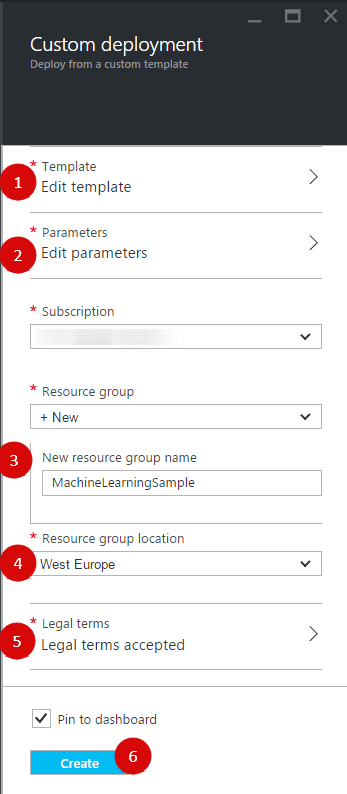

-   The resource group containing a job collection with 3 disabled scheduler tasks, two storage accounts in different geo regions, app service plan and a web app is created after deployment.

Some additional manual configuration is required:

-   Click on a web app resource and open its Application Settings

-   Copy content of *StorageAConnectionString* parameter and paste as a "*StorageAConnectionString*" parameter in *ResponseWatcher/WebApp/Web.config*

-   Copy content of *StorageBConnectionString* parameter and paste as a "*StorageBConnectionString*" parameter in *ResponseWatcher/WebApp/Web.config*

-   The Callback URL also can be changed in Application Settings as well

#Build and publish a Web App

-   Open ResponseWatcher.sln in the Visual Studio 2015

-   Open *WebApp/Web.config* and make sure *StorageAConnectionString* and *StorageBConnectionString* are configured properly according settings in your Azure Management portal. Leave settings with ML prefix empty

-   Build the solution and open a publish dialog for WebApp project and click on Microsoft Azure App Service:

-   Sign in to your Azure Subscription and select a Web App in the MachineLearningSample resource group:

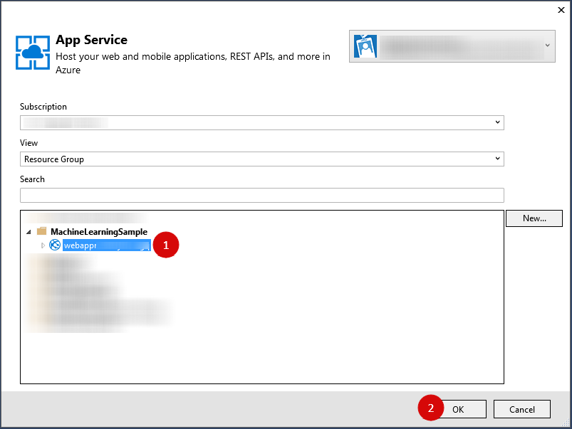

-   Click on Settings, select a Debug configuration and click Publish

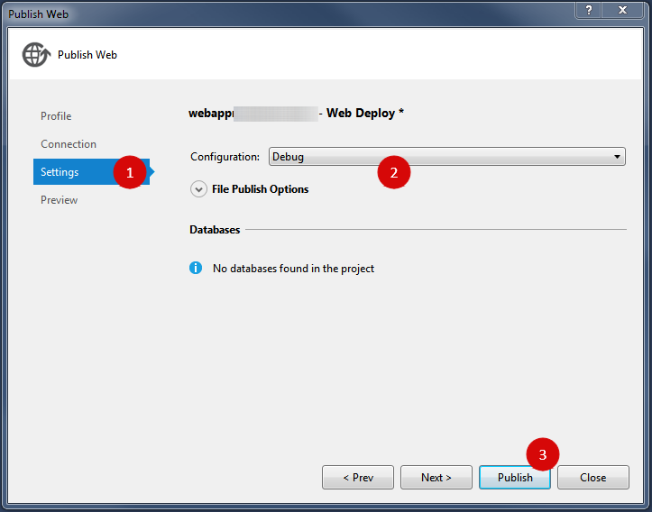

-   The deployed web service will be opened in a browser. Please add a */api/MachineLearning/Collect* to the opened URL and press enter several times to collect initial statistics for ML experiments which will be created later. Everything is ok if you receive something like this:

-   Open Azure Portal, then open the *MachineLearningSample* resource group, click on a storage account with name started with "*storagea*", click on Blobs, then click on container with name statistics, then click on blob named CopyDurations.csv and copy its URL. Copy this URL to use as default URL for Reader on the Machine Learning Training experiment in the next section.

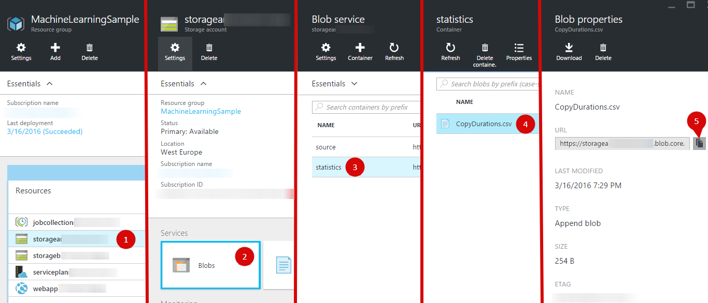

##Preparing Machine Learning environment

#Create training experiment

-   Open a Machine Learning studio at <https://studio.azureml.net> and sign in to your workspace

-   Create a new blank experiment by clicking + NEW at the bottom 

 

-   Rename the experiment as "*Duration*"

-   Search and add a Reader module to experiment.

-   Select a Reader module and set its properties:

-   Specify Data source type as "*Web URL via HTTP*"

-   URL with address of CopyDurations.csv blob you copied earlier

-   Set data format as "*CSV*"

-   Mark "*CSV or TSV has header row*" checkbox

-   Click Save

-   Search and add an Execute R Script module and replace a script with:

#### **dataset &lt;- maml.mapInputPort(1)**

#### **dataset$DaySeconds &lt;- dataset$UtcUnixTimeSeconds %% 86400**

#### **maml.mapOutputPort("dataset");
**

-   Connect modules and click Run

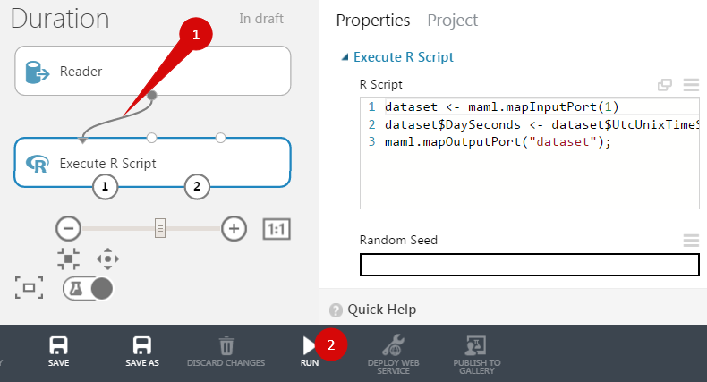

-   Search and add following modules to experiment:

-   Project Columns

-   Split Data

-   Linear Regression

-   Train Model

-   Score Model

-   Evaluate Model

-   Connect modules as it is on the screenshot:

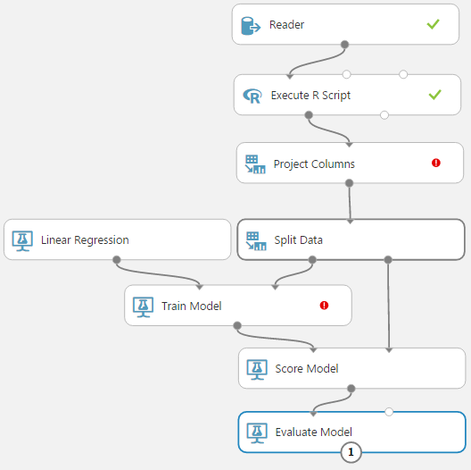

-   Select the Project Columns module and click "*Launch column selector*". Select WITH RULES, ALL COLUMNS, exclude column with name *UtcUnixTimeSecond*s and click check mark

-   Select the Train Model module and click "*Launch column selector*". Select WITH RULES, include column with name *DurationMs* and click check mark

-   Select the Split Data module and enter 0.9 in the "*Fraction of rows in the first output dataset*"

-   Click Save and then on Run and ensure you see green check marks on every module after the run.

#Create a predictive experiment and web service

-   Open a Duration experiment created earlier:

-   Run an experiment

-   Click "*Set up web service*" and then on "*Predictive Web Service*"

-   Wait for some time

-   Make sure your predictive experiment looks like this:

-   Copy a name of trained model (for our case it is a *Duration \[trained model\]*) and paste as a "*MLTrainedModelName*" parameter in *ResponseWatcher/WebApp/Web.config*

-   Add Project Columns module and connect it between Reader and Execute R Script modules.

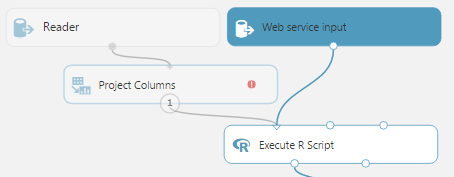

-   Select the Project Columns module and click on "*Launch column selector*". Select WITH RULES, ALL COLUMNS, exclude column named *DurationMs* and click on check mark.

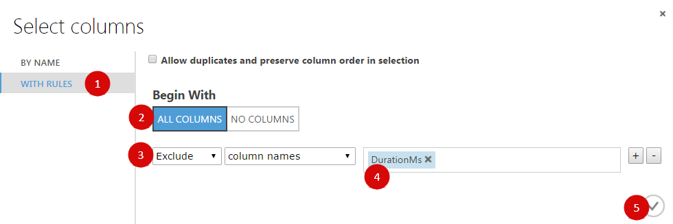

-   Click Run to execute an experiment

-   Add Project Columns module and connect it between Score Model and Web service output.

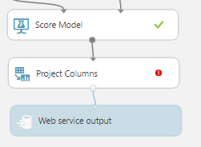

-   Select the Project Columns module and click on "*Launch column selector*". Select WITH RULES, NO COLUMNS, include column named Scored Labels and click on check mark.

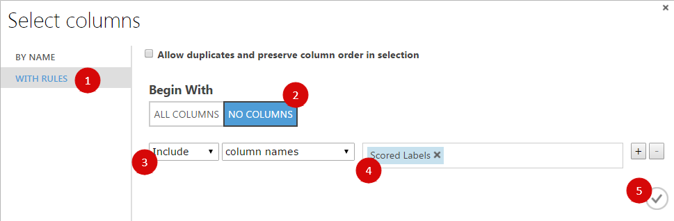

-   Click and Run to execute an experiment. Make sure there are green check marks on every module after the run

-   Click Deploy Web Service

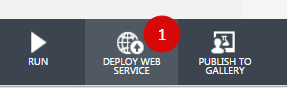

-   Now is a good time to test. Click Test to initiate a web service call

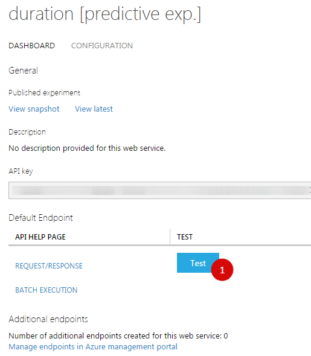

-   Enter some values and click check mark

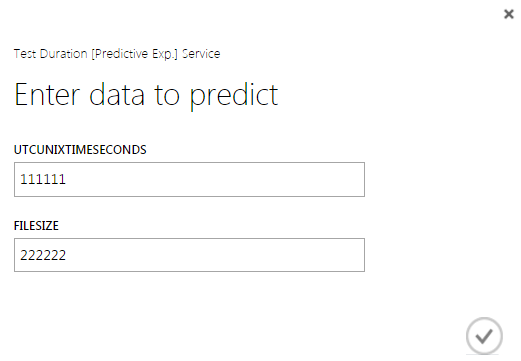

-   The result should look like this:

#Make a predictive web service re-trainable

In order to make a predictive experiment re-trainable we setup a web service for training experiment and create an additional endpoint for predictive web service. The training web service produces a new trained model, and the model is used to update a predictive web service.

#Add a secondary endpoint to predictive web service

-   Select WEB SERVICES an open a predictive web service Duration \[Predictive Exp.\]

-   Click "Manage endpoints in Azure management portal" on bottom of page

-   In the management portal click ADD ENDPOINT:

-   Enter endpoint name as "secondary", optionally enter a description and click check mark.

-   Open "secondary" endpoint page and scroll down. At the right bottom corner, you can find an API KEY. Copy this key and paste as a "*MLPredictiveSecondaryApiKey*" parameter in *ResponseWatcher/WebApp/Web.config*

-   Click "*Request/Response*"

-   Copy a Request URI and paste as "*MLPredictiveSecondaryRequestUrl*" parameter in *ResponseWatcher/WebApp/Web.config*. Do not forget to escape the ‘*&*' symbol as *&amp*;

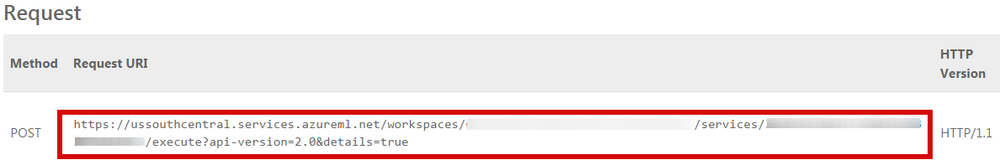

-   Go back on "*secondary*" endpoint page and click Update Resource

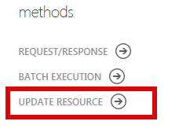

-   Copy a Request URI and paste as a "*MLPredictiveSecondaryUpdateUrl*" parameter in *ResponseWatcher/WebApp/Web.config*

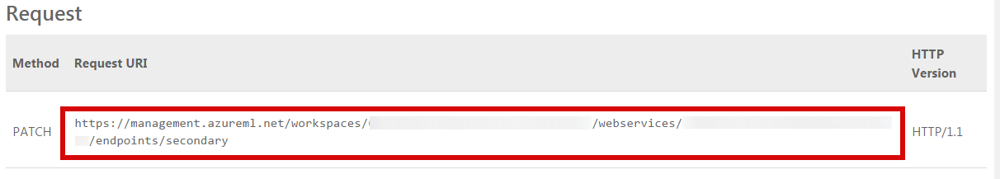

#Extend a training experiment with web service

-   Open a training experiment duration

-   Add a Web service output module, name it as "*trained*" and connect to the Train Model module output

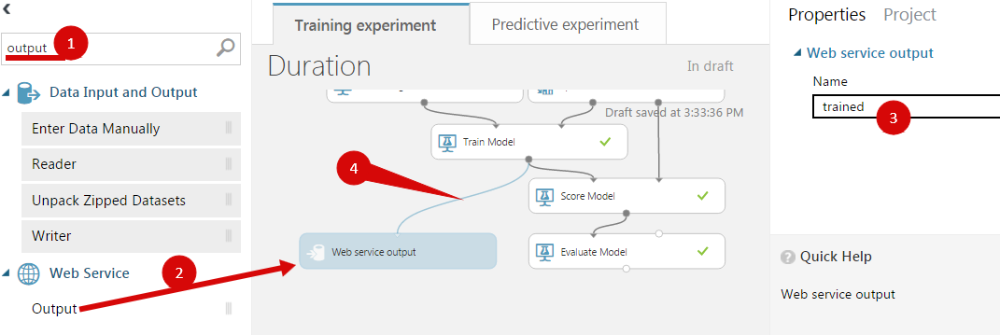

-   Add a Web service output module, name it as "evaluated" and connect to the Evaluate Model module output

-   Copy data from Enter Data Manually to file Dummy.csv and make it available online for example by sharing from OneDrive.

-   Select a Reader module, click on the above the URL property and click Set as web service parameter:

-   Click Run and make sure there is no errors: 

-   Click SETUP WEB SERVICE and then Deploy Web Service and then Yes**
**

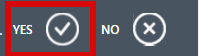

-   Copy API key and paste as the "*MLTrainingApiKey*" parameter in *ResponseWatcher/WebApp/Web.config*. Click BATCH EXECUTION.

-   Copy a Request URI and paste as the "MLTrainingBatchUrl" parameter in ResponseWatcher/WebApp/Web.config*

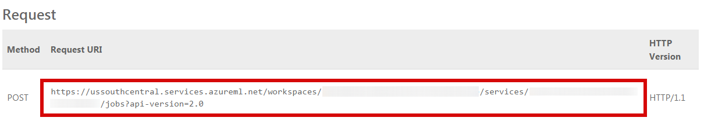

#Redeploying a completely configured WebApp

At the moment you should have ResponseWatcher/WebApp/Web.config with every ML-prefixed application setting configured. If not, please follow instructions provided above and make sure all steps are executed. Republish the WebApp in order to be able to execute Retrain and Compare API calls.

-   Open ResponseWatcher.sln in the Visual Studio 2015

-   Right click WebApp project, select the Publish… menu item, ensure a correct publish profile is selected and click Publish

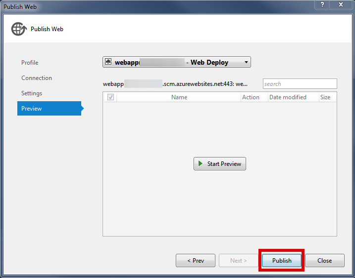

-   The deployed web service will be opened in the browser. Please ad*d /api/MachineLearning/Retrain* to the opened URL and press enter. If everything is ok, then you get something like this:

-   Please use */api/MachineLearning/Compare?fileSize=17000000&alarmLevel=2.0* in the URL and click enter. If everything is ok then you will get something like this:

#Enabling scheduler tasks

-   Open Azure Portal, open the *MachineLearningSample* resource group, click Scheduler Job Collection with a name beginning with "j*obcollection*", click Scheduler Jobs.

-   Enable a job with a name beginning with "*collectjob*". This job needs to be enabled for several days to collect enough statistics.

-   Enable a job with name started with "r*etrainjob*" in case you need regular retraining. It's ok if this job is executed just once after *collectjob* execution interruption.

-   The third job with name "*compare*" should be enabled after *collectjob* has collected enough statistics and "*retrainjob*" is executed at least once after *collectjob* execution interruption.
