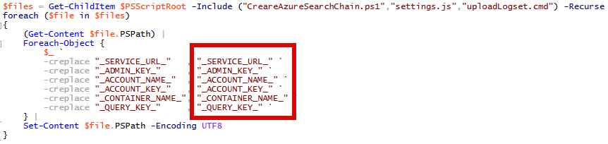
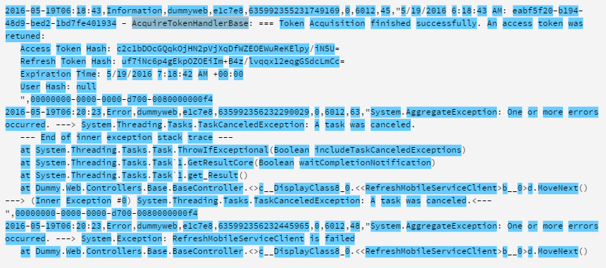
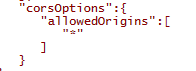
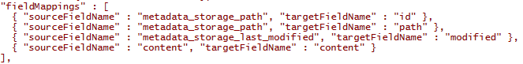
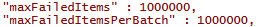

#Azure Service Fabric
##Video encoding using Azure Service Fabric end-to-end sample
Contact: Noga Tal nogat@microsoft.com

##**Abstract (July 2016)

Azure Search is a rich search-as-a-service. There is a preview feature available allowing to index and search a set of blob files 

###INTRODUCTION

This sample provides an end-to-end demo of how to conduct context searches of BLOB files using Azure Search indexing. This is a common scenario for large Azure Web app log files that are stored in BLOB file storage. You’ll create an Azure Search index for container content and a simple web client to search across this Azure Search index.

###Prerequisites

In order to complete this sample, you will need:

-   An active Microsoft Azure subscription

-   Azure Search Free tire is enough for this demo scenario if you use sample log files provided with the tutorial. Because Azure Search Free tire brings additional limitations (50k blobs, 50Mb index size and 3 indexes)

-   Windows PowerShell 3.0 or later. Follow instructions here: [*Installing Windows PowerShell*](https://msdn.microsoft.com/en-us/powershell/scripting/setup/installing-windows-powershell)

-   AzCopy Command-Line Utility. Please download and install here: [*AzCopy Command-Line Utility*](http://aka.ms/downloadazcopy)

-   Optional to open a sources solution: [*Visual Studio 2015*](https://www.visualstudio.com/en-us/downloads/download-visual-studio-vs.aspx) with “PowerShell Tools for Visual Studio 2015” and “Microsoft ASP.NET Web Frameworks and Tools 2015” extensions installed.

###Scenario Flow
Azure Web App supports logging to Azure Storage Blob container. The logging core splits logs each hour and places them in a corresponding folder structure in the container. Generally, the log contains a lot of records in many blobs. Sometimes we need to find specific information in logs and there is no trivial way or tool to do it. In this scenario we are building a tool which utilizes Azure Search which helps to perform this task. In this sample we are going to search in logs produced by Azure Web App, but this is not a limitation.

For information on how to create a dummy Azure Web App and configure Web App logging refer to the how-to instructions in the following article: [Enable diagnostics logging for web apps in Azure App Service](file://C:\Users\Shannon\AppData\Local\Microsoft\Windows\INetCache\Content.Outlook\RZI10184\Azure%20Web%20App%20supports%20logging%20to%20Azure%20Storage%20Blob%20container.%20The%20logging%20core%20splits%20logs%20each%20hour%20and%20places%20them%20in%20a%20corresponding%20folder%20structure%20in%20container.%20Generally%20log%20contains%20a%20lot%20of%20records%20in%20many%20blobs.%20Sometimes%20we%20need%20to%20find%20specific%20information%20in%20logs%20and%20there%20is%20no%20trivial%20way%20or%20tool%20to%20do%20it.%20%20In%20this%20scenario%20we%20are%20building%20a%20tool%20which%20utilizes%20Azure%20Search%20which%20helps%20to%20perform%20this%20task.%20In%20this%20sample%20we%20are%20going%20to%20search%20in%20logs%20produced%20by%20Azure%20Web%20App,%20but%20this%20is%20not%20a%20limitation.).

A sample set of log files is available in the source archive which can be used as is by uploading to Azure Storage container in case you do not have any Web App logs available. An Azure Search index for container content and a simple web client to search across this Azure Search index will be created in this sample.

The tutorial is based on features and documentation links of the Azure Search PREVIEW, so some limitations are applied. You can find more detailed information on the following web page: <https://azure.microsoft.com/en-us/documentation/articles/search-limits-quotas-capacity/>

###COMPONENTS

Azure Search Service

We will use the Azure Portal to create an Azure Search service.

-   Follow [Create an Azure Search service using the Azure Portal](https://azure.microsoft.com/en-us/documentation/articles/search-create-service-portal/).

-   Create a storage account if you don’t have one: [Create a storage account](https://azure.microsoft.com/en-us/documentation/articles/storage-create-storage-account/#create-a-storage-account)

-   Create a new blob container if you don’t have one. In order to download a blob as a file locally from a web client enable the public access policy for the container containing blobs at Azure Portal.

###Source Package Preparing

This article is packaged with a source code archive. Please note that the source code needs to be prepared before being used by extracting the source code to a folder and updating the credential placeholder in the following three files:: Variables.ps1, settings.js and uploadLogset.cmd. You can edit them manually or replace placeholders at once by using ReplaceCredentials.ps1 script.

-   Open ReplaceCredentials.ps1 script with Windows PowerShell ISE application and replace selected values with actual for you.

    

-   Replace \_SERVICE\_URL\_ , \_ADMIN\_KEY\_ and \_QUERY\_KEY\_ with values from Azure Portal Search Service blade for your Search Service

    

-   Replace \_ACCOUNT\_NAME\_ and \_ACCOUNT\_KEY\_ with values from corresponding Storage Account blade.

    

-   Replace \_CONTAINER\_NAME\_ with name of blob container with Web App logs you are going to search in.

-   Save changes.

-   Execute the script.

-   Double check Variables.ps1, settings.js and uploadLogset.cmd contains actual values.

###Upload Sample Log Data

If you don’t have any Web App blob logs available, then you are welcome to use the sample dummy log set provided in the source code archive folder. You will need to create a new container and upload sample files using AzCopy utility. Read more about AzCopy here: [Copy or move data to Storage with AzCopy](https://azure.microsoft.com/en-us/documentation/articles/storage-use-azcopy/).

-   Open DummyLogs folder

-   Execute uploadLogset.cmd

###Azure Search Index

At the moment, the REST API is the only management method available for Azure blob data source and indexer at preview mode. So the REST API for index creation is used as well to be consistent. Please read [Indexing Documents in Azure Blob Storage with Azure Search](https://azure.microsoft.com/en-us/documentation/articles/search-howto-indexing-azure-blob-storage/) for more details.

PowerShell scripts are used as a REST API client. Using PowerShell is a good way to illustrate API calls used. Also it gives an option to hardcode some necessary parameters directly in scripts.

-   Extract source package we provided with this article and locate PowerShellProject/CreareAzureSearchChain.ps1.

-   Open CreareAzureSearchChain.ps1 with Windows PowerShell ISE application

-   Ensure $searchServiceUrl, $searchAdminKey, $blobContainer, $storageAccountName and $storageAccountKey assigned with correct values

-   Save changes, if any.

-   Execute the script.

Please note the index requires some additional time to be built after the script is completed. Read the following section about script details and how to obtain current indexer execution status and index statistics.

###Status, statistics, update scripts

Three helper scripts make corresponding Azure search API calls:

-   GetIndexerStatus.ps1 - to get indexer status. You can check indexer run completeness or error existence with this script.

-   GetIndexStatistics.ps1 - to get index statistics. You can check how many documents are indexed with index and how many storage spaces it requires.

-   RunIndexer.ps1 - to force indexer rescan the container. You can execute this script if you have some changes in the indexed blob container and you don’t want to wait for auto start scanning by scheduler.

The returning results are in the indented JSON format and are quite readable.

####CreareAzureSearchChain.ps1 script details

Let’s briefly inspect script content. Every management call should contain the api-key header and api version parameter. We specially defined these variables in the included Variables.ps1:

Variables.ps1 is included in CreareAzureSearchChain.ps1:

In order to allow re-creation on the script re-run, delete the existing data source, index and indexer with the same names if ones already exist. Let’s just ignore any errors for simplicity.

###Data Source

The first step is a data source creation using data sources from Azure Search REST API endpoint. Script makes a POST request with json configuration of new data source.

Read [Create Data Source](https://azure.microsoft.com/en-us/documentation/articles/search-api-indexers-2015-02-28-preview/#create-data-source) for more details about data sources.

###Index

The second step is creating an index using indexes Azure Search REST API endpoint. The script creates an index containing 4 fields:

-   id - is a unique key created as a base64 encoded full URL of blob.

-   path - is a full URL of blob in plan form

-   content - is a string content of blob.

-   modified - is a last modification date of blob. We will order results by this field to show more recent items on top.

The major power of the Azure Search engine is in its customizability. You can customize methods on how the index processes your data to meet your business rules. Let’s have a look at the log content from the csv file produced by the Azure Web App logging engine:

In this sample we are interested in search by words and for simplicity just use the English alphabet . Task one is to split the words by bounds. In order to illustrate the custom splitter, we will use CustomAnalyzer with PatternTokenizer. The regular expression pattern (\[a-zA-Z0-9\]+) makes the following splitting:

.Net classes and methods are named in CamelCase notation due to naming rules. For example, we have a token TaskCanceledException. We’d like to find this as by multiword TaskCanceledException as by words Task, Canceled and Exception. So we need to split this token to parts in some way.

Azure search provides token filtering. Filters are able to get concrete token and create additional tokens replacing the base token, or even just add new ones keeping the original as well. We decided to use a PatternCaptureTokenFilter. The regular expression pattern (.+?((?&lt;!^)(?=\[A-Z\]\[a-z\])|$)) makes the following splitting:

Task two is to split the token TaskCanceledException into 3 parts and add new tokens: Task, Canceled, and Exception.

The complete analyzer definition looks like:

Please read more at [Customer analyzers in Azure Search - MSDN - Microsoft](https://msdn.microsoft.com/en-us/library/azure/mt605304.aspx).

Finally, we allowed CORS in order to be able to call search from AJAX requests.

Read [Create Index (Azure Search Service REST API) - MSDN - Microsoft](https://msdn.microsoft.com/en-us/library/azure/dn798941.aspx) for more details about index creation.

###Indexer

The third step is an indexer creation. Indexer performs scan data source to populate index with updated data.

-   Indexer is able to perform scan on schedule. We use one-hour schedule.

> 

-   The indexer contains a fieldMappings section allowing to map content or metadata to the concrete index field.

> 

-   Error handling is also partially customizable. We use big values of maxFailedItems and maxFailedItemsPerBatch in order to ignore errors instead of complete run interruption.

> 

Errors can be obtained by an indexer status API call later.

-   We limit blob file extensions used to scan

> 

###Search in Azure Search Index

A simple web client based on AngularJS is used to call the index created. This site can be called locally if just double clicking on index.html or hosted somewhere. Local file hosting has disadvantage - the settings are not stored in cookies. For any other HTTP hosting settings are stored in cookies.

-   Open BlobSearchWeb/index.html in browser

-   Change settings with appropriate values or press to Reset. The button Reset sets hard coded settings defined in the app/settings.js in method reset. You can change this file for your appropriate defaults at any time:

    

-   Close the settings page, enter a search phrase “Canceled” and click Search. Results looks similar to:

    

-   Read Query your [Azure Search index](https://azure.microsoft.com/en-us/documentation/articles/search-query-overview/) for more about querying

##CONCLUSION

In this scenario we covered the creation and usage of Azure Search indexes, configuring and query data by calling REST API endpoints via PowerShell scripts. We created custom tokenizers and filters and illustrated the flexible and customizable nature of Azure Search. We enabled calling the Azure Search API via AJAX requests and how to build a tiny Angular.JS web site which can be hosted anywhere starting from the local file system.
