##Abstract (July 2016)

In this sample we are going to present a typical flow to perform heavy computational tasks like video encoding using ffmpeg library based on Azure Service Fabric micro-services platform. We will describe how to build, deploy, scale and test your solution on Azure Service Fabric.

##INTRODUCTION

Let's imagine you are a .NET developer and need a Web API providing some kind of computation processing. You know about appropriate command line tool and command line parameters for an expected result. So you would like to use this tool, and get all the benefits of Web API. At the same time, you don't want to become a computation tool source code expert and do things like corresponding library integration. This approach raises several important questions:

-   How can you reuse your experience to convert command line tool into a Web API?

-   How to deploy?

-   How to call?

-   How to scale?

Azure Service Fabric is a distributed systems platform that makes it possible to package, deploy, and manage micro-services. Please read the [Overview of Service Fabric](https://azure.microsoft.com/en-us/documentation/articles/service-fabric-overview/) article to get more information about the concept of micro-services and details on Service Fabric.

The command line tool approach is very helpful if someone needs to get a result fast and wants to get rid of corresponding SDK and API. We are going to provide a simple end-to-end example demonstrating how Service Fabric can be helpful to host and call an existing application making some kind of computation and facade as a Web API.

#Components

The most common high load operation is a video encoding. There is a popular open source command line tool ffmpeg (<https://ffmpeg.org/>) to perform a lot of encoding tasks. There are a number of startups using it. As an encoding task we are going to apply the following logic to make a short video cut from a source video file. The encoder skips the first 30 seconds and then takes only 10 seconds. The cut is scaled to fixed resolution and encoded as mp4. At the final step the resulting video file is uploaded to Azure Blob Storage container.

The sample system is implemented as a Service Fabric Application. You can find more information about Service Fabric application model here: [Model an application in Service Fabric](https://azure.microsoft.com/en-us/documentation/articles/service-fabric-application-model/). This sample consists of:

-   Service Fabric Actor service. It executes the ffmpeg tool as a child process. Reliable Actor is a Service Fabric application framework. Read more at [Introduction to Service Fabric Reliable Actors](https://azure.microsoft.com/en-us/documentation/articles/service-fabric-reliable-actors-introduction/). An actor is an isolated, independent unit of compute and state with single-threaded execution. Because of this it is an ideal candidate to perform video encoder tasks.

-   Service Fabric Web API service. The API manages a Service Fabric cluster to schedule required Service Fabric Actors.

-   Web API client. This is a simple AngularJS web site. For simplicity this site is hosted side by side with Web API, but can even be local file system hosted because it does not have any server side code.

#User flow

User opens a sample web site in his browser. If this is a first time, then a unique id is generated for the user and stored in the browser cookie. The user is able to:

-   see a list of scheduled tasks

-   schedule a new task

-   delete results he doesn't need

-   change a user id the browser is currently working with

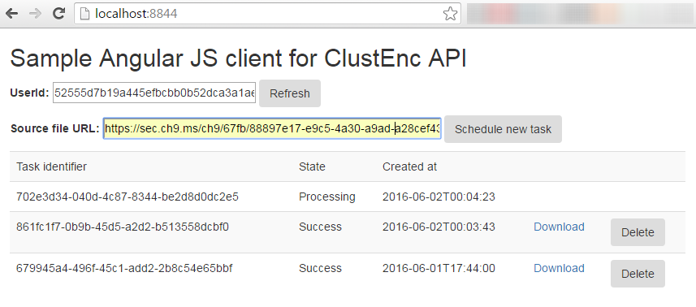

#Step-by-step how to development guide

The complete source code is already available at **TODO**, but we will walk you through the development from scratch.

#Prerequisites

-   Azure Subscription

-   Visual Studio 2015 is required to develop this sample.

-   Microsoft Azure SDK for .Net (VS 2015) 2.9.1 or later available [here](https://go.microsoft.com/fwlink/?linkid=518003&clcid=0x409) should be installed.

-   Service Fabric development environment should be set up as it is described here: [Prepare your development environment](https://azure.microsoft.com/en-us/documentation/articles/service-fabric-get-started/).

-   Ffmpeg static windows executable can be obtained [here](https://ffmpeg.zeranoe.com/builds/win64/static/ffmpeg-3.0.1-win64-static.7z).

-   An extractor for 7z archives is available at http://7-zip.org/.

#Create a solution skeleton

Let's create a new Service Fabric application with Service Fabric Actor Service.

-   Open Visual Studio 2015 and create a new project from Service Fabric Application template. Solution name ServiceFabric, application name ClustEncApplication. Click OK.

-   Select Actor Service and name it as ClustEncActor. Click OK.

-   Right click on ClustEncApplication project and add a new service:

-   Select a Stateless Web API and name it as ClustEncWebApi. Click OK.

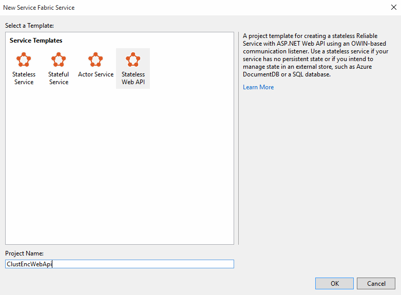

Warning. The Visual Studio Service Fabric tools may crash frequently with System.UnauthorizedAccessException at this step on Windows 7 and Windows 10 running computers. **As a result, Visual Studio may hang infinitely, the project ClustEncWebApi is not added to solution file and folder ClustEncWebApi is in inconsistent state after such hung**.

If this occurs, please remove ClustEncWebApi folder and if you are try again. **We don't see this occur when working on Windows 8.1**. The exception is thrown from Visual Studio Project system from the sfproj project support module. This issue should be fixed in the future releases Service Fabric SDK with Visual Studio Tools update.

##Service Fabric Actor interface

Service Fabric Actor consists of two projects - an interface project and an implementation project. In our case these are ClustEncActor.Interfaces and ClustEncActor projects. Let's get started with the required interface.

Here are the basic business requirements:

-   Should be able to create an encoder.

-   Should be able to activate encoding task,

-   Should be able to wait for competition and to analyze the encoding process result.

-   Encoder should be able to read and write intermediate files on local file system and store the result on some remotely available storage.

Let's go deeper on technical requirements:

-   There are at least 3 state values of encoding state: Processing, Success and Error. We aren't interested in idle encoders. Encoder task should be created on demand and released after completion.

-   The Azure Blob Storage is a good place to store the encoding result. The blob container permission can be modified to enable public access to blob by direct URL, but do not allow a container listing for an unauthorized user.

-   Encoder should provide task isolation and results grouped by user.

-   Every encoding task should have its own unique Id.

-   Task start timestamp is required in order to make some kind of auto cleanup (there are many ways to implement auto cleanup, and this is out of scope for this sample).

-   Interface looks like:

-   Schedule a new task (EncodeAsync).

-   Provide a list of both processing and finished tasks (GetEncoderResultsAsync)

-   Delete finished task (DeleteEncoderResultAsync).

We offer the interface providing all of required methods, parameters and data classes.

-   Replace the content of ClustEncActor.Interfaces\\IClustEncActor.cs with following content:

using System;

using System.Threading.Tasks;

using Microsoft.ServiceFabric.Actors;

using Newtonsoft.Json;

using Newtonsoft.Json.Converters;

namespace ClustEncActor.Interfaces

{

/// &lt;summary&gt;

/// This interface defines the methods exposed by an actor.

/// Clients use this interface to interact with the actor that implements it.

/// &lt;/summary&gt;

public interface IClustEncActor : IActor

{

/// &lt;summary&gt;

/// Executes an encoding process

/// &lt;/summary&gt;

/// &lt;param name="sourceUrl"&gt;URI from the source file will be downloaded&lt;/param&gt;

/// &lt;param name="storageAccount"&gt;Storage account name to store a results&lt;/param&gt;

/// &lt;param name="storageKey"&gt;Storage account access key&lt;/param&gt;

/// &lt;param name="containerName"&gt;Blob container name&lt;/param&gt;

/// &lt;param name="taskId"&gt;Unique id of encoding task&lt;/param&gt;

/// &lt;param name="createdAt"&gt;Task creation datetime&lt;/param&gt;

/// &lt;param name="userId"&gt;User identifier&lt;/param&gt;

/// &lt;param name="extension"&gt;Encoded file extension&lt;/param&gt;

/// &lt;param name="parameters"&gt;Encoder command line parameters&lt;/param&gt;

/// &lt;returns&gt;&lt;/returns&gt;

Task EncodeAsync(string sourceUrl, string storageAccount, string storageKey, string containerName, Guid taskId,

DateTime createdAt, string userId, string extension, string parameters);

/// &lt;summary&gt;

/// Returns encoding results information

/// &lt;/summary&gt;

/// &lt;param name="storageAccount"&gt;Storage account name to store a results&lt;/param&gt;

/// &lt;param name="storageKey"&gt;Storage account access key&lt;/param&gt;

/// &lt;param name="containerName"&gt;Blob container name&lt;/param&gt;

/// &lt;param name="userId"&gt;User identifier&lt;/param&gt;

/// &lt;returns&gt;&lt;/returns&gt;

Task&lt;EncoderResult\[\]&gt; GetEncoderResultsAsync(string storageAccount, string storageKey, string containerName,

string userId);

/// &lt;summary&gt;

/// Deletes encoding result by it's name

/// &lt;/summary&gt;

/// &lt;param name="storageAccount"&gt;Storage account name to store a results&lt;/param&gt;

/// &lt;param name="storageKey"&gt;Storage account access key&lt;/param&gt;

/// &lt;param name="containerName"&gt;Blob container name&lt;/param&gt;

/// &lt;param name="blobName"&gt;Name of result file&lt;/param&gt;

/// &lt;returns&gt;&lt;/returns&gt;

Task DeleteEncoderResultAsync(string storageAccount, string storageKey, string containerName, string blobName);

}

public class EncoderResult

{

public string BlobName;

public SampleFileName Details;

public Uri Uri;

}

public enum NamedState

{

Unknown,

Processing,

Success,

Error

}

public class SampleFileName

{

public DateTime CreatedAt;

\[JsonConverter(typeof(StringEnumConverter))\]

public NamedState State = NamedState.Unknown;

public Guid TaskId = Guid.NewGuid();

}

}

-   Open Package Manager Console (*In MS Visual Studio go to "Tools" menu item, choose "NuGet Package Manager", then choose "Package Manager Console*), select ClustEncActor.Interfaces as a Default project and install required package with command:

###### Install-Package Newtonsoft.Json 

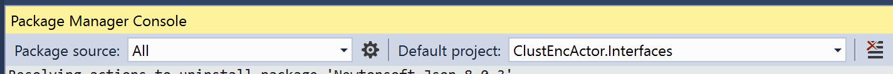

-   Build ClustEncActor.Interfaces project and ensure that build is completed without errors.

#Service Fabric Actor implementation

We are going to create a stateless actor. So StatePersistence attribute parameter under the class ClustEncActor will be later set to StatePersistence.None when you revise the class:

###### \[*StatePersistence*(*StatePersistence*.*None*)\]

###### internal class ClustEncActor : *Actor*, IClustEncActor

The statelessness of Actor does not mean we don't need the state at all. We will track the state manually and use a state based on file names. Our actor will create file names on external storage to indicate a current encoding progress state. Blob naming is performed with following pattern: UserId/TaskId\_NamedState\_CreatedAt.FileExtension.

Please add the following files with classes into ClustEncActor project:

-   SampleFfmpegEncoder.cs - SampleFfmpegEncoder class is the ffmpeg executable wrapper. For simplicity there are two possible results Success and Error only with no error details. The variable log will contain console output and can be used in extended error handling (out of scope for this sample). The file content is:

using System;

using System.Diagnostics;

using System.Threading.Tasks;

namespace ClustEncActor

{

public enum SampleEncoderResult

{

Success,

Error

}

public class SampleFfmpegEncoder

{

public async Task&lt;SampleEncoderResult&gt; EncodeAsync(string sourceUrl, string targetPath, string parameters)

{

ProcessStartInfo startInfo = new ProcessStartInfo

{

CreateNoWindow = false,

UseShellExecute = false,

FileName = "Ffmpeg/ffmpeg.exe",

WindowStyle = ProcessWindowStyle.Hidden,

RedirectStandardError = true,

Arguments = $"-i \\"{sourceUrl}\\" {parameters} {targetPath}"

};

try

{

int returnCode = -1;

using (Process exeProcess = Process.Start(startInfo))

{

if (exeProcess == null) throw new InvalidOperationException();

string log = "";

while (!exeProcess.HasExited)

{

log += exeProcess?.StandardError.ReadToEnd();

await Task.Delay(1000);

}

//TODO Use error output

returnCode = exeProcess.ExitCode;

}

return returnCode == 0 ? SampleEncoderResult.Success : SampleEncoderResult.Error;

}

catch (Exception)

{

// TODO Handle error.

}

return SampleEncoderResult.Error;

}

}

}

-   SamplePathHelper.cs - SamplePathHelper class is a file and paths naming helper implementing current sample naming convention. It is responsible for conversion of encoder state details into file names and parsing file names back to state details. The helper also used to calculate local and remote paths used for file storing. File content:

using System;

using System.IO;

using System.Text.RegularExpressions;

using ClustEncActor.Interfaces;

namespace ClustEncActor

{

public static class SamplePathHelper

{

public static string SampleFileNameToString(Guid taskId, DateTime createdAt, NamedState state)

{

var sampleFileName = new SampleFileName { TaskId = taskId, CreatedAt = createdAt, State = state };

var createdAtEpoch = (long)(sampleFileName.CreatedAt - new DateTime(1970, 1, 1)).TotalSeconds;

return $"{sampleFileName.TaskId.ToString("N")}\_{sampleFileName.State}\_{createdAtEpoch}";

}

public static SampleFileName ParseSampleFileName(string name)

{

var sampleFileName = new SampleFileName();

name = Regex.Replace(name, @".\*\\/", ""); // Remove path

name = Regex.Replace(name, @"\\.\[^\\.\]+$", ""); // Remove extension

var parts = name.Split('\_');

if (parts.Length == 3)

{

Guid.TryParseExact(parts\[0\], "N", out sampleFileName.TaskId);

Enum.TryParse(parts\[1\], out sampleFileName.State);

long createdAtEpoch;

Int64.TryParse(parts\[2\], out createdAtEpoch);

sampleFileName.CreatedAt = new DateTime(1970, 1, 1).AddSeconds(createdAtEpoch);

}

return sampleFileName;

}

public static string LocalPath(string fileName)

{

var dataDir = Directory.GetCurrentDirectory() + "/../temp";

return Cleanup(Path.Combine(dataDir, fileName));

}

public static string RemotePath(string fileName, string userId)

{

return Cleanup(Path.Combine(userId, fileName));

}

private static string Cleanup(string path)

{

return path.Replace("\\\\", "/").Replace("//", "/").TrimStart('/').TrimEnd('.');

}

}

}

-   StorageHelper.cs - An Azure Blob Storage Helper class providing minimum required blob and container management capabilities. File content:

using System;

using System.IO;

using System.Linq;

using System.Threading.Tasks;

using Microsoft.WindowsAzure.Storage;

using Microsoft.WindowsAzure.Storage.Auth;

using Microsoft.WindowsAzure.Storage.Blob;

namespace ClustEncActor

{

public class StorageHelper

{

private readonly CloudStorageAccount \_cloudStorageAccount;

private readonly string \_containerName;

public StorageHelper(string storageAccountName, string storageKey, string containerName)

{

\_containerName = containerName;

\_cloudStorageAccount = new CloudStorageAccount(new StorageCredentials(storageAccountName, storageKey), true);

}

public Task&lt;CloudBlobContainer&gt; GetCloudBlobContainerAsync()

{

return GetCloudBlobContainerAsync(\_cloudStorageAccount, \_containerName);

}

public static async Task&lt;CloudBlobContainer&gt; GetCloudBlobContainerAsync(CloudStorageAccount storageAccount,

string containerName)

{

if (storageAccount == null) throw new ArgumentNullException(nameof(storageAccount));

if (string.IsNullOrWhiteSpace(containerName))

throw new ArgumentException("Argument is null or whitespace", nameof(containerName));

var blobClient = storageAccount.CreateCloudBlobClient();

var container = blobClient.GetContainerReference(containerName);

await container.CreateIfNotExistsAsync();

container.SetPermissions(new BlobContainerPermissions {PublicAccess = BlobContainerPublicAccessType.Blob});

return container;

}

public async Task&lt;CloudBlockBlob&gt; GetBlobReferenceAsync(string targetPath)

{

return (await GetCloudBlobContainerAsync()).GetBlockBlobReference(targetPath);

}

public async Task UploadBlobAsync(string sourcePath, string targetPath)

{

var blockBlob = await GetBlobReferenceAsync(targetPath);

using (var fileStream = File.OpenRead(sourcePath))

{

await blockBlob.DeleteIfExistsAsync();

await blockBlob.UploadFromStreamAsync(fileStream);

}

}

public async Task CreateEmptyBlobAsync(string targetPath)

{

var blockBlob = await GetBlobReferenceAsync(targetPath);

await blockBlob.DeleteIfExistsAsync();

await blockBlob.UploadTextAsync("");

}

public async Task DeleteAsync(string targetPath)

{

await (await GetBlobReferenceAsync(targetPath)).DeleteIfExistsAsync();

}

public async Task&lt;CloudBlockBlob\[\]&gt; BlobsAsync(string directory)

{

var container = await GetCloudBlobContainerAsync();

var directoryReference = container.GetDirectoryReference(directory);

return directoryReference.ListBlobs().OfType&lt;CloudBlockBlob&gt;().ToArray();

}

}

}

In order to make a project buildable please:

-   Open Package Manager Console, select ClustEncActor as a Default project and install required package with command:

###### Install-Package WindowsAzure.Storage 

-   Open ClustEncActor.cs and replace its content with:

using System;

using System.Linq;

using System.Threading.Tasks;

using Microsoft.ServiceFabric.Actors.Runtime;

using ClustEncActor.Interfaces;

using System.IO;

namespace ClustEncActor

{

/// &lt;remarks&gt;

/// This class represents an actor.

/// Every ActorID maps to an instance of this class.

/// The StatePersistence attribute determines persistence and replication of actor state:

/// - Persisted: State is written to disk and replicated.

/// - Volatile: State is kept in memory only and replicated.

/// - None: State is kept in memory only and not replicated.

/// &lt;/remarks&gt;

\[StatePersistence(StatePersistence.None)\]

internal class ClustEncActor : Actor, IClustEncActor

{

public async Task DeleteEncoderResultAsync(string storageAccount, string storageKey, string containerName, string blobName)

{

var storageHelper = new StorageHelper(storageAccount, storageKey, containerName);

await storageHelper.DeleteAsync(blobName);

}

public async Task EncodeAsync(string sourceUrl, string storageAccount, string storageKey, string containerName, Guid taskId, DateTime createdAt, string userId, string extension, string parameters)

{

ActorEventSource.Current.ActorMessage(this, "EncodeAsync called.");

try

{

extension = "." + extension.TrimStart('.');

var storageHelper = new StorageHelper(storageAccount, storageKey, containerName);

var encoder = new SampleFfmpegEncoder();

var processingName = SamplePathHelper.SampleFileNameToString(taskId, createdAt, NamedState.Processing) +

extension;

var successName = SamplePathHelper.SampleFileNameToString(taskId, createdAt, NamedState.Success) +

extension;

var errorName = SamplePathHelper.SampleFileNameToString(taskId, createdAt, NamedState.Error) + extension;

// Create an in-progress marker as an empty blob with processing name in the user's sub folder

ActorEventSource.Current.ActorMessage(this, "Marking processing state...");

await storageHelper.CreateEmptyBlobAsync(SamplePathHelper.RemotePath(processingName, userId));

// Start encoding

ActorEventSource.Current.ActorMessage(this, "Encoding...");

var encoderResult =

await encoder.EncodeAsync(sourceUrl, SamplePathHelper.LocalPath(processingName), parameters);

if (encoderResult == SampleEncoderResult.Success)

{

ActorEventSource.Current.ActorMessage(this, "Encoding successful. Uploading...");

// Upload an encoded result with success name into the user's sub folder

await storageHelper.UploadBlobAsync(

SamplePathHelper.LocalPath(processingName),

SamplePathHelper.RemotePath(successName, userId));

}

else

{

ActorEventSource.Current.ActorMessage(this, "Encoding failed. Marking error state...");

// Create an error marker as an empty blob with error name in the user's sub folder

await

storageHelper.CreateEmptyBlobAsync(

SamplePathHelper.RemotePath(errorName, userId));

}

// Delete an an in-progress marker from user's sub folder

ActorEventSource.Current.ActorMessage(this, "Clearing processing state marker...");

await storageHelper.DeleteAsync(SamplePathHelper.RemotePath(processingName, userId));

// Cleanup

File.Delete(SamplePathHelper.LocalPath(processingName));

}

catch (Exception exception)

{

ActorEventSource.Current.ActorMessage(this, $"Exception: {exception.Message}");

}

ActorEventSource.Current.ActorMessage(this, "Finished.");

}

public async Task&lt;EncoderResult\[\]&gt; GetEncoderResultsAsync(string storageAccount, string storageKey, string containerName, string userId)

{

var storageHelper = new StorageHelper(storageAccount, storageKey, containerName);

var blobs = await storageHelper.BlobsAsync(userId);

return

blobs.Select(b =&gt;

{

var sampleFileName = SamplePathHelper.ParseSampleFileName(b.Name);

return

new EncoderResult

{

Details = sampleFileName,

Uri = sampleFileName.State != NamedState.Success ? null : b.Uri,

BlobName = sampleFileName.State == NamedState.Processing ? null : b.Name

};

})

.OrderByDescending(t =&gt; t.Details.CreatedAt)

.ToArray();

}

/// &lt;summary&gt;

/// This method is called whenever an actor is activated.

/// An actor is activated the first time any of its methods are invoked.

/// &lt;/summary&gt;

protected override Task OnActivateAsync()

{

ActorEventSource.Current.ActorMessage(this, "Actor activated.");

// The StateManager is this actor's private state store.

// Data stored in the StateManager will be replicated for high-availability for actors that use volatile or persisted state storage.

// Any serializable object can be saved in the StateManager.

// For more information, see http://aka.ms/servicefabricactorsstateserialization

return this.StateManager.TryAddStateAsync("count", 0);

}

}

}

-   Build ClustEncActor project and ensure that the build is successfully completed.

#Install ffmpeg executable

We recommend to append a pre-built step guard preventing build without required ffmpeg binary as a resource -

-   Right click on ClustEncActor project in the Solution Explorer, click Properties, select Build Events and add the following script in the Pre-build event command line:

set FILE=$(ProjectDir)PackageRoot\\Code\\Ffmpeg\\ffmpeg.exe

IF NOT EXIST "%FILE%" (

echo ERROR: ffmpeg.exe was not found.

echo WARNING: Please download archive https://ffmpeg.zeranoe.com/builds/win64/static/ffmpeg-3.0.1-win64-static.7z, extract using 7-zip ^(available at http://7-zip.org/^) and copy ffmpeg.exe from bin folder as %FILE%.

exit /b 1

)

-   Now if you try to build the ClustEncActor project without ffmpeg.exe available you will see the following build error:

-   Please do exactly the same as the warning after your project build recommends - download an archive, extract the binary and place it in the required place.

-   Build ClustEncActor project and ensure there are no any build errors.

##Service Fabric Web API implementation

#Configuration

Connection credentials are required to connect to Azure Blob Storage. We are going to store credentials in the Service Fabric configuration.

-   Expand ClustEncWebApi project in Solution Explorer.

-   Open PackageRoot\\Config\\Settings.xml

-   Create a new settings section BlobStorageConfig and add 3 parameters:

&lt;Section Name="BlobStorageConfig"&gt;

&lt;Parameter Name="StorageAccountName" Value="" /&gt;

&lt;Parameter Name="StorageAccountKey" Value="" /&gt;

&lt;Parameter Name="StorageContainerName" Value="clustenc" /&gt;

&lt;/Section&gt;

It is possible to enter storage parameters here but it is better to set concrete values depend on deployment direction. This is Local and Cloud by default. Let's create different settings for both -

-   Expand ClustEncApplication project in Solution Explorer

-   Open ApplicationPackageRoot\\ApplicationManifest.xml

-   Append following parameters in the ApplicationManifest/Parameters section

&lt;Parameter Name="ClustEncWebApi\_StorageAccountName" DefaultValue="" /&gt;

&lt;Parameter Name="ClustEncWebApi\_StorageAccountKey" DefaultValue="" /&gt;

&lt;Parameter Name="ClustEncWebApi\_StorageContainerName" DefaultValue="clustenc" /&gt;

-   Locate the ApplicationManifest/ServiceManifestImport section for ClustEncWebApiPkg in the ApplicationPackageRoot\\ApplicationManifest.xml and replace a ConfigOverrides element with:

&lt;ConfigOverrides&gt;

&lt;ConfigOverride Name="Config"&gt;

&lt;Settings&gt;

&lt;Section Name="BlobStorageConfig"&gt;

&lt;Parameter Name="StorageAccountName" Value="\[ClustEncWebApi\_StorageAccountName\]" /&gt;

&lt;Parameter Name="StorageAccountKey" Value="\[ClustEncWebApi\_StorageAccountKey\]" /&gt;

&lt;Parameter Name="StorageContainerName" Value="\[ClustEncWebApi\_StorageContainerName\]" /&gt;

&lt;/Section&gt;

&lt;/Settings&gt;

&lt;/ConfigOverride&gt;

&lt;/ConfigOverrides&gt;

So at the moment we have service parameters overridden by application parameters. Let's allow to set storage account and key as application parameters in publish configurations.

-   Open ApplicationParameters\\Cloud.xml

-   Append parameters in the Application\\Parameters section

&lt;Parameter Name="ClustEncWebApi\_StorageAccountName" Value="\_Account\_" /&gt;

&lt;Parameter Name="ClustEncWebApi\_StorageAccountKey" Value="\_Key\_" /&gt;

-   Do the same for ApplicationParameters\\Local.xml

Now we have storage account settings values placeholders \_Account\_ and \_Key\_ for both deployment directions independently.

#Controller

Let's create a web API controller EncoderTaskController for endpoint of our sample:

-   Open Package Manager Console, select ClustEncWebApi as a Default project and install required package with command:

###### Install-Package Microsoft.ServiceFabric.Actors 

-   Expand ClustEncWebApi project in Solution Explorer.

-   Right click on References and add a reference to ClustEncActor.Interfaces

-   Add a new class EncoderTaskController in the Controllers subfolder.

-   Make the class public and derive it from ApiController

-   Add usings:

using ClustEncActor.Interfaces;

using System.Web.Http;

using System.Fabric;

using Microsoft.ServiceFabric.Actors;

using Microsoft.ServiceFabric.Actors.Client;

using System.Fabric.Description;

using System.Net;

-   Add actor service URL field:

private static readonly Uri ServiceUri = new Uri("fabric:/ClustEncApplication/ClustEncActorService");

-   Create an actor proxy field:

private readonly IClustEncActor \_proxy = ActorProxy.Create&lt;IClustEncActor&gt;(ActorId.CreateRandom(), ServiceUri);

-   Create a configuration section BlobStorageConfig accessor:

private ConfigurationSection BlobStorageConfig =&gt; FabricRuntime.GetActivationContext().GetConfigurationPackageObject("Config").Settings.Sections\["BlobStorageConfig"\];

-   Initialize configuration parameter values fields:

private string StorageAccountName =&gt; BlobStorageConfig.Parameters\["StorageAccountName"\].Value;

private string StorageAccountKey =&gt; BlobStorageConfig.Parameters\["StorageAccountKey"\].Value;

private string StorageContainerName =&gt; BlobStorageConfig.Parameters\["StorageContainerName"\].Value;

-   Create a HTTP GET handler:

// GET api/encodertask

public async Task&lt;EncoderResult\[\]&gt; Get(string userId)

{

return await \_proxy.GetEncoderResultsAsync(StorageAccountName, StorageAccountKey, StorageContainerName, userId);

}

-   Create a HTTP POST handler:

// POST api/encodertask

public object Post(\[FromBody\] EncoderTask task)

{

if (string.IsNullOrWhiteSpace(task?.UserId) || !Uri.IsWellFormedUriString(task?.SourceUrl, UriKind.Absolute))

{ throw new HttpResponseException(HttpStatusCode.BadRequest); }

var taskId = Guid.NewGuid();

if (string.IsNullOrWhiteSpace(task.Parameters))

{

// Default ffmpeg parameters for this sample. Skip 30 seconds, take 10 seconds, resize to 640x360 and encode as x264/mp3.

task.Parameters = "-ss 30 -t 10 -b:v 1500k -vcodec libx264 -acodec mp3 -b:a 128k -s 640x360";

}

if (string.IsNullOrWhiteSpace(task.Extension))

{

// Default extension

task.Extension = "mp4";

}

\_proxy.EncodeAsync(task.SourceUrl, StorageAccountName, StorageAccountKey, StorageContainerName, taskId,

DateTime.Now, task.UserId, task.Extension, task.Parameters);

return new { TaskId = taskId.ToString("N"), Details = task };

}

-   Create a HTTP DELETE handler:

// DELETE api/encodertask?name=123.mp4

public Task Delete(string name)

{

return \_proxy.DeleteEncoderResultAsync(StorageAccountName, StorageAccountKey, StorageContainerName, name);

}

-   Add a post data model class EncoderTask:

public class EncoderTask

{

public string Parameters;

public string Extension;

public string SourceUrl;

public string UserId;

}

-   Open PackageRoot/ServiceManifest.xml and change ServiceEndpoint port number to 8844 (or any other you want, but in this case a corresponding change should be required in the load balancer rule and website controller later)

-   Build ClustEncWebApi project and ensure the build successfully finished.

##Create Web Site Client

The web site we provide is not required to make a sample application working as a Web API backend. The site is just a simple client to demonstrate usage of the Web API. The site is developed based on AngularJS framework. Entire logic is a client side. So it will work in almost any environment:

-   As simple file hosting hosted by Web API service. In this case a simple file hosting endpoint should be added into ClustEncWebApi project.

-   A local disk hosted. So the index.html can be opened in the browser from a local disk. In this case a CORS support is required on the Web API side.

We are going to show how to implement both use cases -

-   Copy ClustEncWebApi\\PackageRoot\\Code from full sources in corresponding folder in the sample solution. This folder contains a wwwroot folder with our client site. The site is very simple and basic. We will not go deep into its content details.

-   Expand ClustEncWebApi project in Solution Explorer.

-   Open Startup.cs

-   In order to enable CORS to allow local file hosting:

-   Open Package Manager Console, select ClustEncWebApi as a Default project and install required package with command:

Install-Package Microsoft.AspNet.WebApi.Cors

-   Append using:

using System.Web.Http.Cors;

-   Append following code in the ConfigureApp method ***before*** appBuilder.UseWebApi line:

// Removing xml formatter in order to leave JSON as a single output option.

config.Formatters.Remove(config.Formatters.XmlFormatter);

// Enabling cross site scripting

var cors = new EnableCorsAttribute("\*", "\*", "\*");

config.EnableCors(cors);

-   In order to enable simple file hosting for our client side:

-   Open Package Manager Console, select ClustEncWebApi as a Default project and install required package with command:

###### Install-Package Microsoft.Owin.StaticFiles

-   Append following code in the ConfigureApp method ***after*** appBuilder.UseWebApi line:

// Simple file server is enough for AngularJS based site we use.

var physicalFileSystem = new Microsoft.Owin.FileSystems.PhysicalFileSystem(@".\\wwwroot");

var fileServerOptions = new Microsoft.Owin.StaticFiles.FileServerOptions

{

EnableDefaultFiles = true,

RequestPath = Microsoft.Owin.PathString.Empty,

FileSystem = physicalFileSystem

};

fileServerOptions.DefaultFilesOptions.DefaultFileNames = new\[\] { "index.html" };

fileServerOptions.StaticFileOptions.FileSystem = fileServerOptions.FileSystem = physicalFileSystem;

fileServerOptions.StaticFileOptions.ServeUnknownFileTypes = true;

appBuilder.UseFileServer(fileServerOptions);

-   And the final step is to keep the whole solution nugget packages versions updated and consolidated:

-   Open Package Manager console, select ClustEncWebApi as a Default project and execute:

Update-Package

##Local Deployment

Before we start the deployment the actual Azure Blob Storage credentials should be provided. Please follow instructions on how to create a new Storage account if you don't have one already here: <https://azure.microsoft.com/en-us/documentation/articles/storage-create-storage-account/#create-a-storage-account>.
Please read this article about how to retrieve storage account key: <https://azure.microsoft.com/en-us/documentation/articles/storage-create-storage-account/#view-and-copy-storage-access-keys>.

Visual Studio is able to do all of the behind-of-scene work in order to start a local cluster, to build and publish a Service Fabric application and running it.

-   Replace \_**Account\_ and \_Key\_ placeholders** with actual values in ClustEncApplication\\ApplicationParameters\\Local.xml.

-   Right click on ClustEncApplication project, select Properties and enter in localhost:8844 as Application URL

-   Set ClustEncApplication as a startup project and start the solution debugging.

More information about local cluster deployment is available here: <https://azure.microsoft.com/en-us/documentation/articles/service-fabric-get-started-with-a-local-cluster/>.

##Azure Deployment

Once we have everything running locally, the next step is deployment in your Azure environment.

#Service Fabric Cluster set up

There is an article describing how to add an Azure Resource Group project into the solution in order to automate Azure cluster creation together with required endpoints: [Set up a Service Fabric cluster by using Visual Studio](https://azure.microsoft.com/en-us/documentation/articles/service-fabric-cluster-creation-via-visual-studio/). Let's do a similar task but in order to avoid certificate installation step for simplicity we will use **unsecured** cluster. **Please do not use unsecured clusters for production environments.**

-   Add a new project of type Cloud -&gt; Azure Resource Group in the solution.

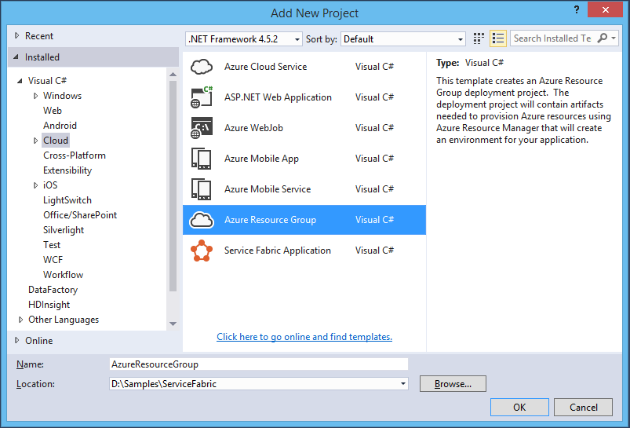

-   Select a Service Fabric Cluster template

-   Click Build -&gt; Configuration Manager in Visual Studio Menu, Expand Active Solution Platform and click &lt;Edit&gt;

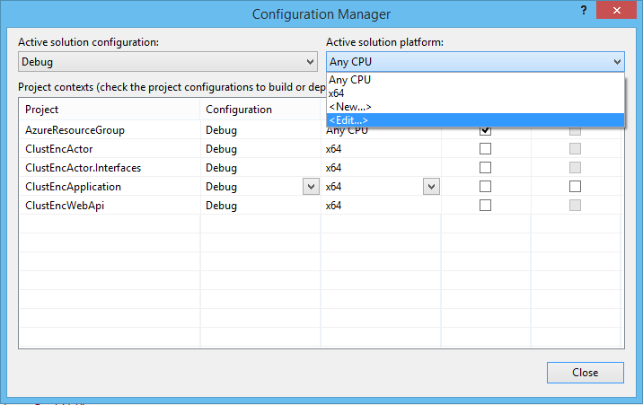

-   Remove Any CPU solution platform

-   Expand AzureResourceGroup project in the Solution Explorer

-   Open file Templates\\ServiceFabricCluster.json

-   Locate variable "loadBalancedAppPort2" and replace value 8081 with 8844

-   Copy ServiceFabricCluster.json and paste in the same folder with name ServiceFabricClusterUnsecured.json

-   Copy ServiceFabricCluster.parameters.json and paste in the same folder with name ServiceFabricClusterUnsecured.parameters.json

-   Open ServiceFabricClusterUnsecured.json and:

-   Remove pair of sections with name "certificate":

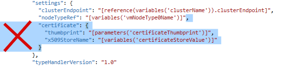
>
***and***
>
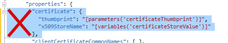

-   Remove section with name "secrets":

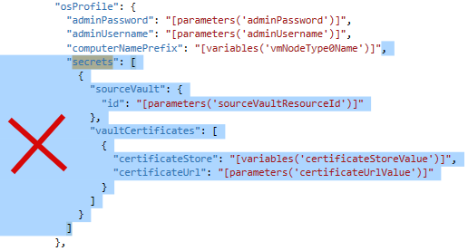

-   Remove unnecessary template parameters:

-   Remove content of "fabricSettings" array:

-   Open ServiceFabricClusterUnsecured.parameters.json and remove all of parameters:

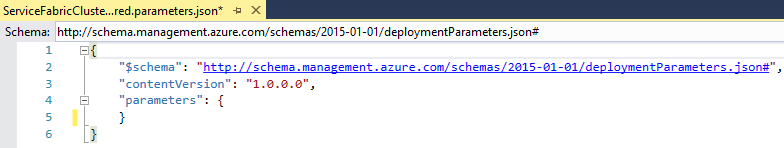

-   Right click on AzureResourceGroup project, click on Deploy -&gt; New Deployment...

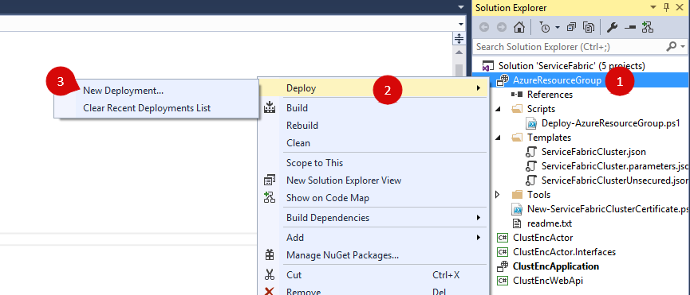

-   Ensure you are authorized in the Azure subscription.

-   Select &lt;Create new&gt; int resource group dropdown and create a new group with name for ex. ServiceFabricUnsecured in West US.

-   Select ServiceFabricClusterUnsecured.json as a deployment template for unsecured cluster (or use ServiceFabricCluster.json if you want secured cluster. Working with this one is out of scope for current document)

-   Click Edit parameters and enter an administrator user name and a strong password (please DO NOT USE admin or administrator as a user name and follow Windows Server password requirements rules [here](https://technet.microsoft.com/en-us/library/hh994562(v=ws.11).aspx)),

-   Click Save and click Deploy:

-   Be patient. Deployment can take more than 10 minutes to complete. See the progress in the Output Window and wait for "Successfully deployed template"

-   Scroll output window up and locate OutputsString, then it's parameter below named as "managementEndpoint".

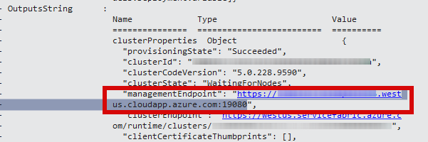

-   Copy the address and open in the browser. Service Fabric Explorer will appear:

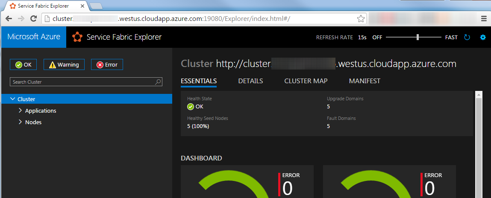

##Publish Application to cluster

For different application deployment methods, please see the following article - <https://azure.microsoft.com/en-us/documentation/articles/service-fabric-deploy-remove-applications/>. In this sample Visual Studio will be used.

-   Right click project ClustEncApplication and click Publish.

-   Select Target profile PublishProfiles\\Cloud.xml.

-   Ensure you are authorized in the Azure subscription.

-   Select connection endpoint for our cluster:

Select Application parameter file Cloud.xml and press Edit

-   Replace \_Account\_ and \_Key\_ placeholders with actual Azure Blob Storage credentials values and press Save

-   Press Publish and wait for completion.

-   Open cluster URL with port number 8844 in the browser. Site is here:

Enter Source file URL of a video you want to process, click Schedule new task and click on Refresh at the right of UserId field if needed. The default task for this sample is to make a short video cut from the source video file. The encoder skips the first 30 seconds and then takes 10 seconds only. The cut is scaled to s fixed resolution and is encoded as mp4. At the final step the resulting video file is uploaded to Azure Blob Storage container. You are able to download a resulting file as well as to delete files from the container. The generated user id also can be overridden. Reusing of the same user id allows you to open the same task list on another device or browser instance.

-   Append /api/encodertask?userId=YourUserIdHere and the API json is here:

#Auto scaling

An auto scale ability was introduced for Azure Service Fabric in Spring 2016. Please read more at [Scale a Service Fabric cluster up or down using auto-scale rules](https://azure.microsoft.com/en-us/documentation/articles/service-fabric-cluster-scale-up-down/).

##SUMMARY

We created a scalable Azure Service Fabric cluster to perform heavy computational tasks. This sample is universal and can be really helpful for startups using Azure as they grow and scalability becomes top priority. It is independent from any specific calculation algorithms and can be applied to any business areas requiring computational resources. The documents contain all necessary code to run this sample, but at the same time the full source code tree is attached for references.
