##Abstract (May 2016)

This sample covers a typical flow to perform heavy computational tasks (for example video or audio encoding, hash calculation, data encryption, etc.) and demonstrates how to make this process scalable and cost effective using Docker containers.

##INTRODUCTION

This demo scenario assumes the existence of a running service performing a heavy computational task (for example, video, audio encoding, hash calculation, or data encryption etc.). In this sample we use Azure blob storage to store input and output data. We emulate heavy calculation by using a standard method from the Linux world: dd if=/dev/zero of=/dev/null. For about 20% of the tasks we emulate error and for the remaining 80% we copy information from the source blob to the target blob. In order to make this process scalable and cost effective, the processing is encapsulated in Docker containers which are dynamically allocated if the service load grows and deallocated once resource demand goes down.

#Components

-   Worker Docker container performing heavy computational tasks

-   Node.JS based website handling requests, showing completed tasks and initiating processing

#Flow

-   The web site accepts the URL to the source blob and once the task has been completed it provides a temporary URL to download the results.

-   The interaction between different components at a high level is displayed in the following sequence diagram:

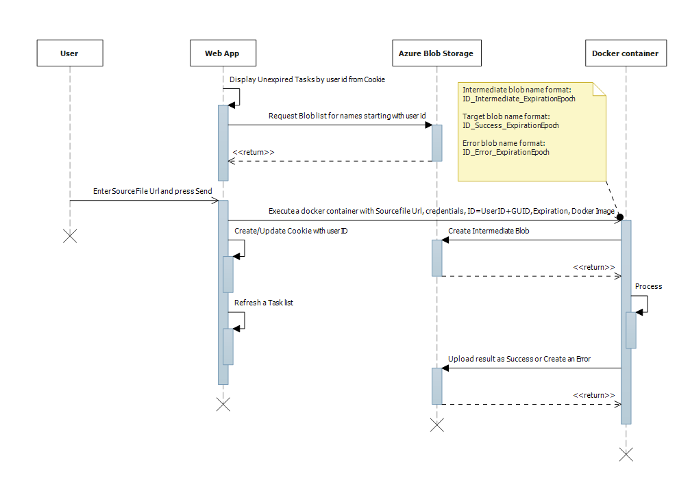

-   The web site interface is fairly simple:

> 

The interface shows the user the list of tasks, status of each task, and allows the user to download task results for completed tasks. To simplify the sample, we are not using any database backend and will be using Azure Storage Blob naming convention to save data.

##PREREQUISITES

-   An Azure subscription

-   Azure CLI (<https://azure.microsoft.com/en-us/documentation/articles/xplat-cli-install/>) or Azure Power Shell (<https://azure.microsoft.com/en-us/documentation/articles/powershell-install-configure/>) installed

-   Active DockerHub account (sign up for free here: <https://www.docker.com/products/docker-hub>)

-   Node.JS installed

-   Optional: An existing SSH RSA Key if available. If not, follow the instructions in the document to create one.

##DURATION

This tutorial / guide can typically be completed within 60-90 minutes.

##CREATING AN ENVIRONMENT

#Generate certificates

When creating container services, SSH RSA key is required for access. In order to get a quick start, pre-generated sample keys are provided in the *DockerizedEncoder/Keys* subfolder. **NOTE: Do not use these keys on a production system!**

The following articles describe in detail how to create SSH RSA Key in a specific environment:

-   Windows - <https://www.digitalocean.com/community/tutorials/how-to-create-ssh-keys-with-putty-to-connect-to-a-vps>

-   Linux - <https://help.ubuntu.com/community/SSH/OpenSSH/Keys#Generating_RSA_Keys>

-   Mac - <https://help.github.com/articles/generating-ssh-keys/#platform-mac>

For more detailed information, please visit the article: <https://github.com/Azure/azure-quickstart-templates/blob/master/101-acs-mesos/docs/SSHKeyManagement.md#ssh-key-generation>

#Deploy an Azure Container Service Cluster

We will provide steps you need to perform to deploy Azure Container service cluster. Detailed documentation is also available here: <https://azure.microsoft.com/en-us/documentation/articles/container-service-deployment>

-   NOTE. If you have never used ARM templates for deployment before, please read and follow instructions from here <https://github.com/Azure/azure-quickstart-templates/blob/master/101-acs-mesos/docs/CommonIssues.md> in order to avoid a failed deployment result.

-   Open https://github.com/Azure/azure-quickstart-templates/tree/master/101-acs-swarm

-   Press on 

-   Fill the template parameters. For agent VM size we can use any available size from Standard\_A0 and greater. Мaster count equal to 1 is enough for our purposes. Copy and paste the public key we generated earlier and press OK.

> 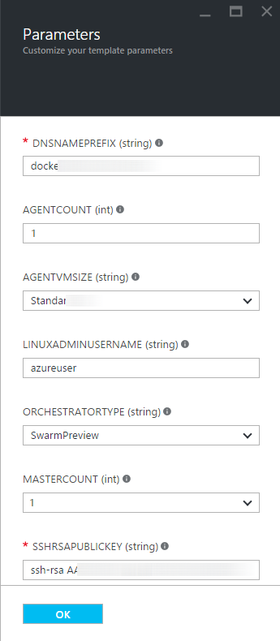

-   Fill the custom deployment parameters, create a new resource group (as a best practice), and accept legal terms.

> 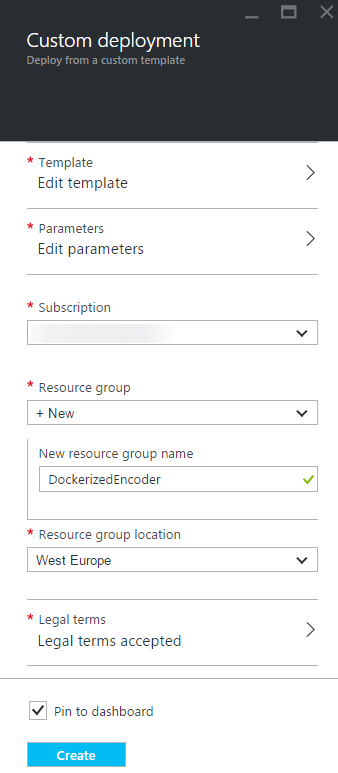

*Note: While the deployment is in progress (it can take some time), we can continue with storage.*

Setup a target storage container

-   Create a new storage account on a portal:

> 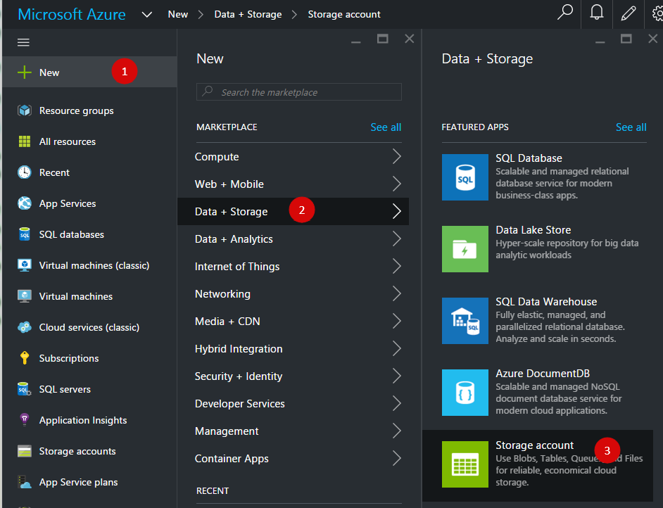

-   Select a Resource Manager Deployment model, fill storage account parameters. We propose to use the same resource group as was used during the cluster deployment in order to keep all components together. Press Create.

> 

-   Click on Access Keys and copy storage account name and key1 to some temporal place to remember. We will use this storage account name and key several times later in this document.

> 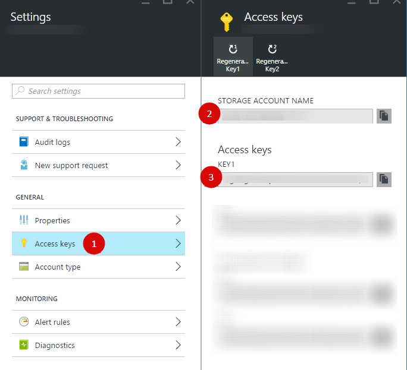

-   Create a blob container

> 

-   Name a container as ***encoderresults*** and press Create

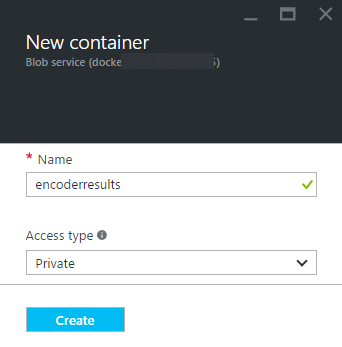

At this point we have a fully functional docker swarm which is running on a single VM instance. This topology will allow us to spin up as many docker instances as the resources of the VM can handle. Now, in order to scale beyond the limit of a single VM, we will configure auto-scaling.

#Enable Azure Container Service cluster auto scale

There are two documents publically available which describe this concept:

-   <https://azure.microsoft.com/en-us/documentation/articles/virtual-machines-vmss-walkthrough-cli/>

-   <https://github.com/Azure/azure-quickstart-templates/tree/master/201-vmss-ubuntu-autoscale>

In the sample we will use CPU load as an auto scale decision maker, and it is possible to enable an auto scale based on the CPU load of Docker swarm cluster agents. If CPU usage is high on all of available agents a new agent will be added to the cluster. If CPU loading becomes lower some agents will be removed from the cluster. The rules in the deployment need to be tuned for production use.

The Virtual Machine Scale Sets API version is 2015-06-15 and it is a preview release for evaluation and testing purposes at the moment the article is being written. It is recommended that for the preview release, you register with the feature before using VM Scale Sets. You do this by running the following Azure-Cli command:

*azure feature register Microsoft.Compute vmssApiPreviewV2Access*

or Azure PowerShell command:

*Register-AzureRmProviderFeature -FeatureName vmssApiPreviewV2Access -ProviderNamespace Microsoft.Compute*

In order to enable automatic scale, we need a name for Virtual Machine Scale Set that the deployed cluster uses. We will use this name in the template deployment later. Please write the name down for future use.

-   Press Browse -&gt; Resource Explorer

> 

-   Type "vmss" in the search box, select the found virtualMachineScaleSet item located in your resource group and press Enter.

> 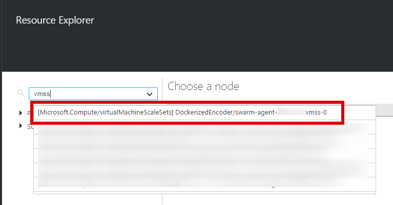

-   Copy a Virtual Machine Scale Set name on some temporal place to remember. We will use the vmss name later in the template parameter.

> 

-   There are several ways you can execute a deployment template. We will use a portal UI: Press +New and enter a "template deployment" in the search box.

> 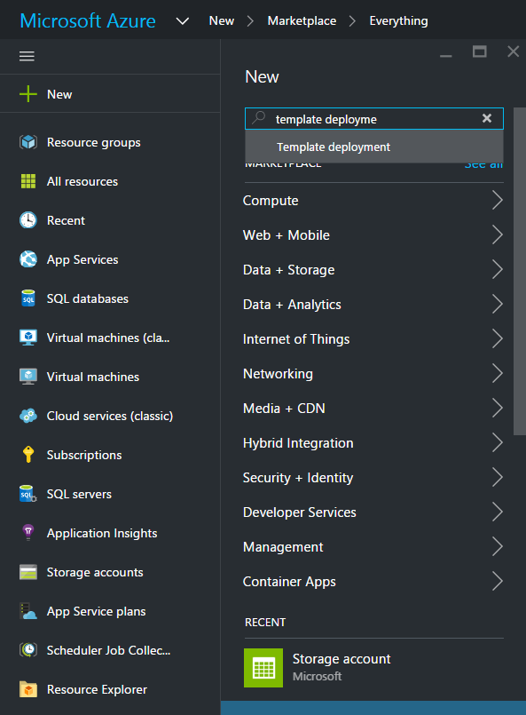

-   Select Template Deployment

> 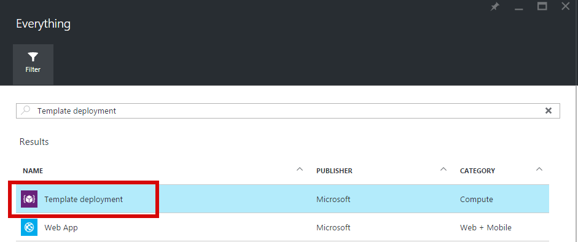

-   Press Create

> 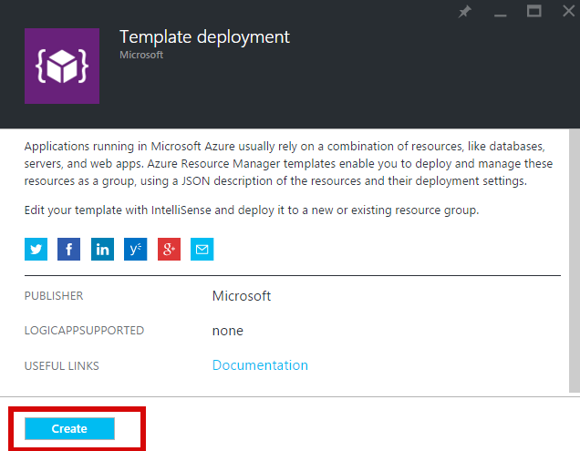

-   Press on Edit Template and paste the template content:

> *{*
>
> *"$schema": "https://schema.management.azure.com/schemas/2015-01-01/deploymentTemplate.json\#",*
>
> *"contentVersion": "1.0.0.0",*
>
> *"parameters": {*
>
> *"vmssName": {*
>
> *"type": "string",*
>
> *"metadata": {*
>
> *"description": "Name of existing VM Scale Set"*
>
> *}*
>
> *},*
>
> *"storageAccountName": {*
>
> *"type": "string",*
>
> *"metadata": {*
>
> *"description": "Diagnostics storage account name"*
>
> *}*
>
> *}*
>
> *},*
>
> *"variables": {*
>
> *"apiVersion": "2015-06-15",*
>
> *"diagnosticsStorageAccountName": "\[parameters('storageAccountName')\]",*
>
> *"diagnosticsStorageAccountResourceGroup": "\[resourceGroup().name\]",*
>
> *"accountid": "\[concat('/subscriptions/',subscription().subscriptionId,'/resourceGroups/',variables('diagnosticsStorageAccountResourceGroup'),'/providers/','Microsoft.Storage/storageAccounts/', variables('diagnosticsStorageAccountName'))\]",*
>
> *"wadlogs": "&lt;WadCfg&gt;&lt;DiagnosticMonitorConfiguration&gt;",*
>
> *"wadperfcounters1": "&lt;PerformanceCounters scheduledTransferPeriod=\\"PT1M\\"&gt;&lt;PerformanceCounterConfiguration counterSpecifier=\\"\\\\Memory\\\\AvailableMemory\\" sampleRate=\\"PT15S\\" unit=\\"Bytes\\"&gt;&lt;annotation displayName=\\"Memory available\\" locale=\\"en-us\\"/&gt;&lt;/PerformanceCounterConfiguration&gt;&lt;PerformanceCounterConfiguration counterSpecifier=\\"\\\\Memory\\\\PercentAvailableMemory\\" sampleRate=\\"PT15S\\" unit=\\"Percent\\"&gt;&lt;annotation displayName=\\"Mem. percent available\\" locale=\\"en-us\\"/&gt;&lt;/PerformanceCounterConfiguration&gt;&lt;PerformanceCounterConfiguration counterSpecifier=\\"\\\\Memory\\\\UsedMemory\\" sampleRate=\\"PT15S\\" unit=\\"Bytes\\"&gt;&lt;annotation displayName=\\"Memory used\\" locale=\\"en-us\\"/&gt;&lt;/PerformanceCounterConfiguration&gt;&lt;PerformanceCounterConfiguration counterSpecifier=\\"\\\\Memory\\\\PercentUsedMemory\\" sampleRate=\\"PT15S\\" unit=\\"Percent\\"&gt;&lt;annotation displayName=\\"Memory percentage\\" locale=\\"en-us\\"/&gt;&lt;/PerformanceCounterConfiguration&gt;&lt;PerformanceCounterConfiguration counterSpecifier=\\"\\\\Memory\\\\PercentUsedByCache\\" sampleRate=\\"PT15S\\" unit=\\"Percent\\"&gt;&lt;annotation displayName=\\"Mem. used by cache\\" locale=\\"en-us\\"/&gt;&lt;/PerformanceCounterConfiguration&gt;&lt;PerformanceCounterConfiguration counterSpecifier=\\"\\\\Processor\\\\PercentIdleTime\\" sampleRate=\\"PT15S\\" unit=\\"Percent\\"&gt;&lt;annotation displayName=\\"CPU idle time\\" locale=\\"en-us\\"/&gt;&lt;/PerformanceCounterConfiguration&gt;&lt;PerformanceCounterConfiguration counterSpecifier=\\"\\\\Processor\\\\PercentUserTime\\" sampleRate=\\"PT15S\\" unit=\\"Percent\\"&gt;&lt;annotation displayName=\\"CPU user time\\" locale=\\"en-us\\"/&gt;&lt;/PerformanceCounterConfiguration&gt;&lt;PerformanceCounterConfiguration counterSpecifier=\\"\\\\Processor\\\\PercentProcessorTime\\" sampleRate=\\"PT15S\\" unit=\\"Percent\\"&gt;&lt;annotation displayName=\\"CPU percentage guest OS\\" locale=\\"en-us\\"/&gt;&lt;/PerformanceCounterConfiguration&gt;&lt;PerformanceCounterConfiguration counterSpecifier=\\"\\\\Processor\\\\PercentIOWaitTime\\" sampleRate=\\"PT15S\\" unit=\\"Percent\\"&gt;&lt;annotation displayName=\\"CPU IO wait time\\" locale=\\"en-us\\"/&gt;&lt;/PerformanceCounterConfiguration&gt;",*
>
> *"wadperfcounters2": "&lt;PerformanceCounterConfiguration counterSpecifier=\\"\\\\PhysicalDisk\\\\BytesPerSecond\\" sampleRate=\\"PT15S\\" unit=\\"BytesPerSecond\\"&gt;&lt;annotation displayName=\\"Disk total bytes\\" locale=\\"en-us\\"/&gt;&lt;/PerformanceCounterConfiguration&gt;&lt;PerformanceCounterConfiguration counterSpecifier=\\"\\\\PhysicalDisk\\\\ReadBytesPerSecond\\" sampleRate=\\"PT15S\\" unit=\\"BytesPerSecond\\"&gt;&lt;annotation displayName=\\"Disk read guest OS\\" locale=\\"en-us\\"/&gt;&lt;/PerformanceCounterConfiguration&gt;&lt;PerformanceCounterConfiguration counterSpecifier=\\"\\\\PhysicalDisk\\\\WriteBytesPerSecond\\" sampleRate=\\"PT15S\\" unit=\\"BytesPerSecond\\"&gt;&lt;annotation displayName=\\"Disk write guest OS\\" locale=\\"en-us\\"/&gt;&lt;/PerformanceCounterConfiguration&gt;&lt;PerformanceCounterConfiguration counterSpecifier=\\"\\\\PhysicalDisk\\\\TransfersPerSecond\\" sampleRate=\\"PT15S\\" unit=\\"CountPerSecond\\"&gt;&lt;annotation displayName=\\"Disk transfers\\" locale=\\"en-us\\"/&gt;&lt;/PerformanceCounterConfiguration&gt;&lt;PerformanceCounterConfiguration counterSpecifier=\\"\\\\PhysicalDisk\\\\ReadsPerSecond\\" sampleRate=\\"PT15S\\" unit=\\"CountPerSecond\\"&gt;&lt;annotation displayName=\\"Disk reads\\" locale=\\"en-us\\"/&gt;&lt;/PerformanceCounterConfiguration&gt;&lt;PerformanceCounterConfiguration counterSpecifier=\\"\\\\PhysicalDisk\\\\WritesPerSecond\\" sampleRate=\\"PT15S\\" unit=\\"CountPerSecond\\"&gt;&lt;annotation displayName=\\"Disk writes\\" locale=\\"en-us\\"/&gt;&lt;/PerformanceCounterConfiguration&gt;&lt;PerformanceCounterConfiguration counterSpecifier=\\"\\\\PhysicalDisk\\\\AverageReadTime\\" sampleRate=\\"PT15S\\" unit=\\"Seconds\\"&gt;&lt;annotation displayName=\\"Disk read time\\" locale=\\"en-us\\"/&gt;&lt;/PerformanceCounterConfiguration&gt;&lt;PerformanceCounterConfiguration counterSpecifier=\\"\\\\PhysicalDisk\\\\AverageWriteTime\\" sampleRate=\\"PT15S\\" unit=\\"Seconds\\"&gt;&lt;annotation displayName=\\"Disk write time\\" locale=\\"en-us\\"/&gt;&lt;/PerformanceCounterConfiguration&gt;&lt;PerformanceCounterConfiguration counterSpecifier=\\"\\\\PhysicalDisk\\\\AverageTransferTime\\" sampleRate=\\"PT15S\\" unit=\\"Seconds\\"&gt;&lt;annotation displayName=\\"Disk transfer time\\" locale=\\"en-us\\"/&gt;&lt;/PerformanceCounterConfiguration&gt;&lt;PerformanceCounterConfiguration counterSpecifier=\\"\\\\PhysicalDisk\\\\AverageDiskQueueLength\\" sampleRate=\\"PT15S\\" unit=\\"Count\\"&gt;&lt;annotation displayName=\\"Disk queue length\\" locale=\\"en-us\\"/&gt;&lt;/PerformanceCounterConfiguration&gt;&lt;/PerformanceCounters&gt;",*
>
> *"wadcfgxstart": "\[concat(variables('wadlogs'),variables('wadperfcounters1'),variables('wadperfcounters2'),'&lt;Metrics resourceId=\\"')\]",*
>
> *"wadmetricsresourceid": "\[concat('/subscriptions/',subscription().subscriptionId,'/resourceGroups/',resourceGroup().name ,'/providers/','Microsoft.Compute/virtualMachineScaleSets/',parameters('vmssName'))\]",*
>
> *"wadcfgxend": "\[concat('\\"&gt;&lt;MetricAggregation scheduledTransferPeriod=\\"PT1H\\"/&gt;&lt;MetricAggregation scheduledTransferPeriod=\\"PT1M\\"/&gt;&lt;/Metrics&gt;&lt;/DiagnosticMonitorConfiguration&gt;&lt;/WadCfg&gt;')\]"*
>
> *},*
>
> *"resources": \[*
>
> *{*
>
> *"type": "Microsoft.Compute/virtualMachineScaleSets",*
>
> *"apiVersion": "\[variables('apiVersion')\]",*
>
> *"name": "\[parameters('vmssName')\]",*
>
> *"location": "\[resourceGroup().location\]",*
>
> *"properties": {*
>
> *"upgradePolicy": {*
>
> *"mode": "Automatic"*
>
> *},*
>
> *"virtualMachineProfile": {*
>
> *"extensionProfile": {*
>
> *"extensions": \[*
>
> *{*
>
> *"name": "LinuxDiagnostic",*
>
> *"properties": {*
>
> *"publisher": "Microsoft.OSTCExtensions",*
>
> *"type": "LinuxDiagnostic",*
>
> *"typeHandlerVersion": "2.2",*
>
> *"autoUpgradeMinorVersion": true,*
>
> *"settings": {*
>
> *"xmlCfg": "\[base64(concat(variables('wadcfgxstart'),variables('wadmetricsresourceid'),variables('wadcfgxend')))\]",*
>
> *"storageAccount": "\[variables('diagnosticsStorageAccountName')\]"*
>
> *},*
>
> *"protectedSettings": {*
>
> *"storageAccountName": "\[variables('diagnosticsStorageAccountName')\]",*
>
> *"storageAccountKey": "\[listkeys(variables('accountid'), variables('apiVersion')).key1\]",*
>
> *"storageAccountEndPoint": "https://core.windows.net"*
>
> *}*
>
> *}*
>
> *}*
>
> *\]*
>
> *}*
>
> *}*
>
> *}*
>
> *},*
>
> *{*
>
> *"type": "Microsoft.Insights/autoscaleSettings",*
>
> *"apiVersion": "2015-04-01",*
>
> *"name": "\[concat(parameters('vmssName'),'autoscale')\]",*
>
> *"location": "\[resourceGroup().location\]",*
>
> *"dependsOn": \[*
>
> *"\[concat('Microsoft.Compute/virtualMachineScaleSets/', parameters('vmssName'))\]"*
>
> *\],*
>
> *"properties": {*
>
> *"name": "\[concat(parameters('vmssName'),'autoscale')\]",*
>
> *"targetResourceUri": "\[concat('/subscriptions/',subscription().subscriptionId, '/resourceGroups/', resourceGroup().name, '/providers/Microsoft.Compute/virtualMachineScaleSets/', parameters('vmSSName'))\]",*
>
> *"enabled": true,*
>
> *"profiles": \[*
>
> *{*
>
> *"name": "Profile1",*
>
> *"capacity": {*
>
> *"minimum": "1",*
>
> *"maximum": "10",*
>
> *"default": "1"*
>
> *},*
>
> *"rules": \[*
>
> *{*
>
> *"metricTrigger": {*
>
> *"metricName": "\\\\Processor\\\\PercentProcessorTime",*
>
> *"metricNamespace": "",*
>
> *"metricResourceUri": "\[concat('/subscriptions/',subscription().subscriptionId, '/resourceGroups/', resourceGroup().name, '/providers/Microsoft.Compute/virtualMachineScaleSets/', parameters('vmSSName'))\]",*
>
> *"timeGrain": "PT1M",*
>
> *"statistic": "Average",*
>
> *"timeWindow": "PT5M",*
>
> *"timeAggregation": "Average",*
>
> *"operator": "GreaterThan",*
>
> *"threshold": 60.0*
>
> *},*
>
> *"scaleAction": {*
>
> *"direction": "Increase",*
>
> *"type": "ChangeCount",*
>
> *"value": "1",*
>
> *"cooldown": "PT10M"*
>
> *}*
>
> *},*
>
> *{*
>
> *"metricTrigger": {*
>
> *"metricName": "\\\\Processor\\\\PercentProcessorTime",*
>
> *"metricNamespace": "",*
>
> *"metricResourceUri": "\[concat('/subscriptions/',subscription().subscriptionId, '/resourceGroups/', resourceGroup().name, '/providers/Microsoft.Compute/virtualMachineScaleSets/', parameters('vmSSName'))\]",*
>
> *"timeGrain": "PT1M",*
>
> *"statistic": "Average",*
>
> *"timeWindow": "PT5M",*
>
> *"timeAggregation": "Average",*
>
> *"operator": "LessThan",*
>
> *"threshold": 40.0*
>
> *},*
>
> *"scaleAction": {*
>
> *"direction": "Decrease",*
>
> *"type": "ChangeCount",*
>
> *"value": "1",*
>
> *"cooldown": "PT10M"*
>
> *}*
>
> *}*
>
> *\]*
>
> *}*
>
> *\]*
>
> *}*
>
> *}*
>
> *\],*
>
> *"outputs": {*
>
> *}*
>
> *}
> *

-   Press on Save

> 

-   Press on Edit parameters and enter the Virtual Machine Scale Set name we copied earlier and the storage name we created earlier. Press OK

> 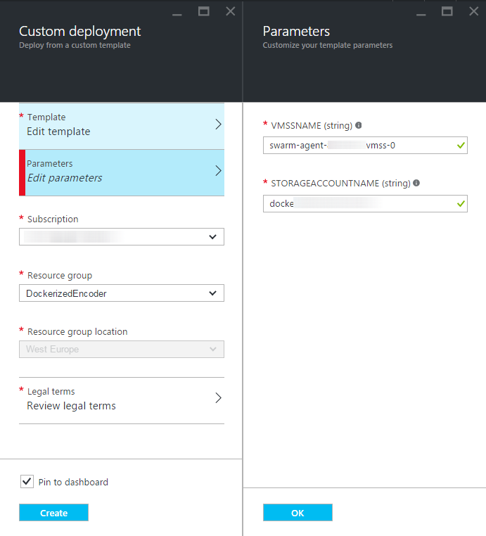

-   Select resource group, accept legal terms and press Create

-   When deployment has been finished open the Resource Explorer and enter "autoscale" in the search box. Ensure you see an item in your resource group like this:

> 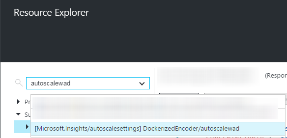

-   Open storage account settings and ensure metrics tables are there. If there are no tables found, please wait approximately a minute and click Refresh:

> 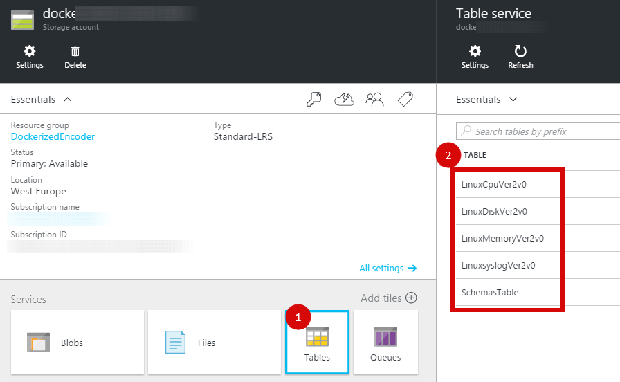

#Connect to cluster master VM

Based on *<https://azure.microsoft.com/en-us/documentation/articles/container-service-connect/> *

The ssh endpoint of cluster master VM is \[USERNAME\]@\[DNSPREFIX\]mgmt.\[REGION\].cloudapp.azure.com and port 2200. Certificate based authentication is used. Please use the private key file (id\_rsa.ppk or id\_rsa.pem) we generated earlier. If you forget an address, you can find this in your resource group resources by typing "master-ip"

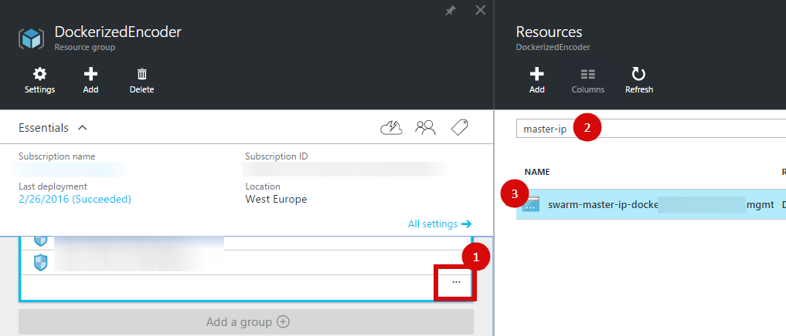

-   Select found row and copy a cluster master DNS name on some temporal place. We will use this address as a SwarmClusterMasterAddress in the Node.js site configuration later.

> 

-   Initiate a console ssh session to master VM.

-   Type commands and ensure all are done without errors:

> *docker info*
>
> *docker -H tcp://0.0.0.0:2375 info*
>
> *docker run -i microsoft/azure-cli /bin/echo 'Hello world'*
>
> *docker -H tcp://0.0.0.0:2375 run -i microsoft/azure-cli /bin/echo 'Hello world'*

#Create a new docker image

We will create an image for our dockerized encoder from scratch. This image will be a dummy encoder. It downloads a file, makes a high CPU load for 1 processor core for 120 seconds and then copies the file to storage or creates an error (tuned to be in 20% of runs). Also the script removes expired results. This is not a production script sample. Be sure you have an active account on the docker hub. Read more details and signup here: <https://www.docker.com/products/docker-hub>. In order to avoid local docker installation I propose to use the master virtual machine of cluster just created.

-   Initiate a console ssh session to cluster master VM.

-   Type commands:

> *cd*
>
> *mkdir dockerizedencoder*
>
> *cd dockerizedencoder*
>
> *vi Dockerfile*

-   Press Insert and paste the following content:

> *FROM microsoft/azure-cli*
>
> *RUN apt-get update && apt-get install -y \\*
>
> *uuid \\*
>
> *wget \\*
>
> *&& rm -rf /var/lib/apt/lists/\**
>
> *COPY ./docker-entrypoint.sh /*
>
> *RUN chmod +x /docker-entrypoint.sh*
>
> *ENTRYPOINT \["/docker-entrypoint.sh"\]*

-   Save file, press Esc, Shift + ‘:’, type wq and press Enter)

-   Type a command:

> *vi docker-entrypoint.sh*

-   Press Insert and paste a content:

> *\#!/bin/bash*
>
> *if \[ "$5" = '' \]; then*
>
> *echo "Usage:"*
>
> *echo " $0 SourceUrl StorageAccount StorageKey ContainerName TargetGUID ExpirationEpoch"*
>
> *echo " SourceUrl: URI from the source file will be downloaded"*
>
> *echo " StorageAccount: storage account name to store a results"*
>
> *echo " StorageKey: storage account access key"*
>
> *echo " ContainerName: blob container name"*
>
> *echo " TargetGUID: alphanumeric unique id of target"*
>
> *echo " ExpirationEpoch: result file expiration at given seconds since epoch UTC"*
>
> *exit 1*
>
> *fi*
>
> *SourceUrl=$1*
>
> *export AZURE\_STORAGE\_ACCOUNT=$2*
>
> *export AZURE\_STORAGE\_ACCESS\_KEY=$3*
>
> *export ContainerName=$4*
>
> *TargetGUID=$5*
>
> *Expiration=$6*
>
> *IntermediateName=${TargetGUID}\_Intermediate\_${Expiration}*
>
> *TargetName=${TargetGUID}\_Success\_${Expiration}*
>
> *ErrorName=${TargetGUID}\_Error\_${Expiration}*
>
> *SourceFile=/tmp/\`basename $SourceUrl\`*
>
> *Zero=/tmp/zero*
>
> *&gt;$Zero*
>
> *function cecho()*
>
> *{*
>
> *echo -e "\\x1B\[32m$@\\x1B\[0m"*
>
> *}*
>
> *function result()*
>
> *{*
>
> *if \[ $1 \]; then*
>
> *cecho Uloading an Error file ...*
>
> *azure storage blob upload $Zero "$ContainerName" "$ErrorName"*
>
> *else*
>
> *cecho Uploading a Success file ...*
>
> *azure storage blob upload "$SourceFile" "$ContainerName" "$TargetName"*
>
> *fi*
>
> *cecho Deleting intermediate state marker file...*
>
> *azure storage blob delete "$ContainerName" "$IntermediateName"*
>
> *cecho Finished*
>
> *exit 0*
>
> *}*
>
> *cecho Writing intermediate state marker file...*
>
> *azure storage blob upload $Zero "$ContainerName" "$IntermediateName"*
>
> *if \[ $? -ne 0 \]; then*
>
> *echo -e "\\x1B\[31mContainer access error. Terminated.\\x1B\[0m"*
>
> *exit 1*
>
> *fi*
>
> *cecho Removing expired files...*
>
> *export Now=\`date +%s\`*
>
> *azure storage blob list "$ContainerName" --json | awk ' /'name'/ {print $2}' | sed -e "s/\[\\",\]//g" | awk -F "\_" ' { if ($3 &lt; ENVIRON\["Now"\]) { print "azure storage blob delete " ENVIRON\["ContainerName"\] " " $0 } } ' &gt; /tmp/deleteExpired.sh*
>
> *bash /tmp/deleteExpired.sh*
>
> *cecho Downloading source file...*
>
> *rm $SourceFile &&gt; /dev/null*
>
> *wget $SourceUrl -O $SourceFile*
>
> *if \[ $? -ne 0 \]; then*
>
> *echo -e "\\x1B\[31mSource file download error\\x1B\[0m"*
>
> *result 1*
>
> *fi*
>
> *cecho Dummy encoding with heavy CPU load for 120+ seconds...*
>
> *End=$((SECONDS+120))*
>
> *while \[ $SECONDS -lt $End \]; do*
>
> *dd if=/dev/zero of=/dev/null bs=1K count=10M &&gt; /dev/null*
>
> *done*
>
> *cecho This is as designed: 20% of runs will produce an error result*
>
> *result "$(((RANDOM % 100)+1)) -lt 20"*

-   Save file

-   Type command:

> *docker login*

-   Enter your credentials for docker hub

-   In order to publish a new image in the docker hub we need a unique name for image. Let us use a YourDockerHubLogin/dockerizedencoder as the name. Do not forget to replace YourDockerHubLogin with your docker hub login for this and subsequent commands. Type command:

> *docker build -t* *YourDockerHubLogin/dockerizedencoder ./*

Push docker image

-   Type command:

> *docker push YourDockerHubLogin/dockerizedencoder*

Test run of docker image

Let us run an image we just created.

-   Pull the latest version for the start:

> *docker -H tcp://0.0.0.0:2375 pull YourDockerHubLogin/dockerizedencoder*

We need to provide a set of parameters for the image run.

-   Run an image without parameters to see usage:

> *docker -H tcp://0.0.0.0:2375 run -i YourDockerHubLogin/dockerizedencoder*
>
> 

-   Run with required parameters. We used an Azure Sign up video URL actual, at the time this article was written, so feel free to use some other resource. Replace YourStorageAccount and YourStorageKey with the storage account name and key that we copied after storage account creation later

> docker -H tcp://0.0.0.0:2375 run -i YourDockerHubLogin/dockerizedencoder <https://sec.ch9.ms/ch9/2286/4c62ace4-29b9-487d-8a2f-8cedb1902286/SignUpForMicrosoftAzure_mid.mp4> YourStorageAccount YourStorageKey encoderresults MANUALRUN \`date +%s --date='next day'\`

If you try several times you will get both success and error results. The running docker script is designed to produce approximately 20% of runs with an error result. Please ensure you see result file(s) in the encoderresults container like this:

Configure Node.JS site

-   Create an Express JS template project. You can use command line and exec the follow command:

> *express &lt;app name&gt;*
>
> Alternatively, you can use the Visual Studio and Node.js Tools for Visual Studio (<https://www.visualstudio.com/features/node-js-vs.aspx>). In the list of projects select *Other Languages -&gt; JavaScript -&gt; Node.js and create Basic Node.js Express 4 Application*.

-   To connect to the azure storage service, install azure-storage module. You can use the command line and execute the follow command:

*npm install azure-storage --save*

Or in the Visual Studio you can use the Node.js Interactive Window and execute:

*.npm \[&lt;app name&gt;\] install azure-storage –save*

-   The Docker is running on the Linux machine and ssh connection is required to connect and run the process. So ssh2 module needs to be installed as well. You can use the following command:

*npm install ssh2 --save*

or in the Visual Studio you can use the Node.js Interactive Window and execute:

*.npm \[&lt;app name&gt;\] install ssh2 –save*

-   To identify users its id is stored in cookies. The sample uses node-uuid module for its generation. You can use the following command:

*npm install node-uuid --save*

or in the Visual Studio you can use the Node.js Interactive Window and execute:

*.npm \[&lt;app name&gt;\] install node-uuid –save*

-   All config are stored in the JSON file. Create config.json and add the following configs:

> *{*
>
> *"storage": {*
>
> *"accountName": "&lt;account name&gt;",*
>
> *"secret": "&lt;secret&gt;",*
>
> *"containerName": "&lt;container name&gt;",*
>
> *"filePathTemplate": "https://%s.blob.core.windows.net/%s/%s"*
>
> *},*
>
> *"docker": {*
>
> *"port":* 2375*,*
>
> *"imageName": "&lt;DockerImageName&gt;" ,*
>
> *"ssh": {*
>
> *"host": "&lt;SwarmClusterMasterAddress&gt;",*
>
> *"username": "azureuser",*
>
> *"port": 2200 *
>
> *"pathToPrivateKey": "&lt;local path to private key file id\_rsa.ppk&gt;"*
>
> *},*
>
> *"executeCommadTemplate": "docker -H tcp://0.0.0.0:%d run -t %s %s %s %s %s %s \`date +%s --date='next day'\`"*
>
> *}*
>
> *}*

-   For accountName and secret please use the storage account name and key we copied earlier after the storage account creation. In the Docker configuration section use the name of the published docker image we created for an imageName parameter. Ssh connection configuration is based on the cluster master address and the private key we used to connect to the cluster master earlier in the document.

-   All modules and configuration file need to be included in app.js. Add the following code to the top of file:

> *var uuid = require('node-uuid');*
>
> *var file = require('fs');*
>
> *var Client = require('ssh2').Client;*
>
> *var azure = require('azure-storage');
> *

and the following code after creation app:

> *config = require('./config.json');*
>
> *util = require('util');*
>
> *Your file should be as:*
>
> *&lt;some modules&gt;*
>
> *var uuid = require('node-uuid');*
>
> *var file = require('fs');*
>
> *var Client = require('ssh2').Client;*
>
> *var azure = require('azure-storage');*
>
> *var app = express();*
>
> *config = require('./config.json');*
>
> *util = require('util');*
>
> *&lt;code&gt;*

*
*

-   Add the following code to the app.js after the creation app to work Azure Storage:

> *storageBlobService = azure.createBlobService(config.storage.accountName, config.storage.secret);*

-   Also you should connect to the Docker machine via ssh. Add the following code after the creation app:

> *startDocker = function(){*
>
> *throw new Error();*
>
> *};*
>
> *var conn = new Client();*
>
> *conn.on('ready', function() {*
>
> *console.log('Client :: ready');*
>
> *startDocker = function(fileUrl, processId) {*
>
> *var command = util.format(config.docker.executeCommadTemplate, config.docker.port, config.docker.imageName, fileUrl, config.storage.accountName, config.storage.secret, config.storage.containerName, processId);*
>
> *console.log(command);*
>
> *conn.exec(command, function(err, stream) {*
>
> *if (err) throw err;*
>
> *stream.on('data', function(data) {*
>
> *console.log('STDOUT: ' + data);*
>
> *}).stderr.on('data', function(data) {*
>
> *console.log('STDERR: ' + data);*
>
> *});*
>
> *});*
>
> *}*
>
> *}).connect({*
>
> *host: config.docker.ssh.host,*
>
> *port: config.docker.ssh.port,*
>
> *username: config.docker.ssh.username,*
>
> *privateKey: file.readFileSync(config.docker.ssh.pathToPrivateKey)*
>
> *});*
>
> startDocker is a function which takes original file Uri and the process ID. This function is used to start the Docker process*.*

-   All methods will be in the index.js in the routes folder. Two methods are implemented:

1.  The GET method returns the view where the user can view list of tasks and text box to provide Uri and send it to the server.

2.  The POST method should get the file Uri, run the Docker, and return the view to the user. The way of getting data to send to the user is the same in the both methods. It should identify the user by get list of blobs from the Azure storage.

> The methods can be as following:
>
> *function getIndexPage(req, res) {*
>
> *// get user Id*
>
> *var userId = req.cookies.id;*
>
> *if (!userId) {*
>
> *// if user doesn't have id then generate Id*
>
> *userId = guidGenerator.v4().replace(/-/g, '');*
>
> *res.cookie("id", userId);*
>
> *}*
>
> *storageBlobService.listBlobsSegmentedWithPrefix(config.storage.containerName, userId, null, function(error, result, response) {*
>
> *if (!error) {*
>
> *//getting all tasks*
>
> *var allTasks = result.entries.map(function (blob) {*
>
> *// build uri to download*
>
> *var task = {blobSource: util.format(config.storage.filePathTemplate, config.storage.accountName, config.storage.containerName, blob.name)};*
>
> *var firstPos = blob.name.indexOf('\_');*
>
> *var secondPos = blob.name.indexOf('\_', firstPos + 1);*
>
> *// getting task status*
>
> *task.status = blob.name.substr(firstPos + 1, secondPos - firstPos - 1);*
>
> *return task;*
>
> *});*
>
> *res.render('index', { title: 'Express' , processes: allTasks});*
>
> *} else {*
>
> *// if error then return empty page*
>
> *console.log(error);*
>
> *res.render('index', { title: 'Express' , processes: \[\] });*
>
> *}*
>
> *});*
>
> *}*

-   Add the following route to handle GET request:

> *router.get('/', function (req, res, next) {*
>
> *getIndexPage(req, res);*
>
> *});*

-   The POST action should generate Docker process ID and start Docker. Its code is the following:

> *router.post('/', function (req, res, next) {*
>
> *// getting process Id*
>
> *var processId = req.cookies.id + guidGenerator.v4().replace(/-/g, '');*
>
> *// encode url*
>
> *var fileUrl = encodeURI(req.body.fileUrl);*
>
> *// execute sending command to docker via ssh*
>
> *startDocker(fileUrl, processId);*
>
> *getIndexPage(req, res);*
>
> *});*

-   The view should contain the textbox and the list of tasks. Add the following code to the index.jade in the views directory:

> *extends layout*
>
> *block content*

*h1= title*

*p Welcome to \#{title}*

*form(role='form'*

*method='post')*

*input(type='text'*

*placeholder='Paste file URL'*

*name='fileUrl')*

*input(type='submit'*

*value='Send')*

*- each process in processes*

*li*

*div*

*p*

*span Task: *

*if process.status == 'Success'*

*a(href='\#{process.blobSource}') Download*

*else*

*span \#{process.status}*

-   You can run web site (exact steps are specific for your environment and tools, for example you can open command line and start web site locally using the following commands to start Node.js server locally: *npm install* and *npm start* ). When brows address <http://localhost:3000>, select a file on the internet (we used Azure video tutorial as a sample) and send it for processing:

> 

#Deploy Node.JS as Azure Web App

1.  Create a Wep App in Azure. Go to <https://portal.azure.com/>, click on "+New", select "Web + Mobile" and then "Web App":

> 

1.  Enter application name, select Subscription, Resource Group and select or create app Service Plan/Location. Click Create.

> 

1.  To deploy your Node.JS app to the Azure Web App we can use a Local Git deployment model. Open the Web App you just created, click on the "All Settings" and select Deployment Source.

> 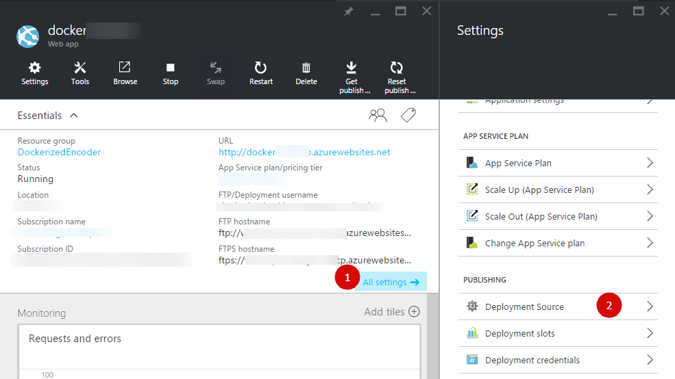

1.  In the Deployment Source blade, click Choose Source, click Local Git Repository, and then click OK.

> 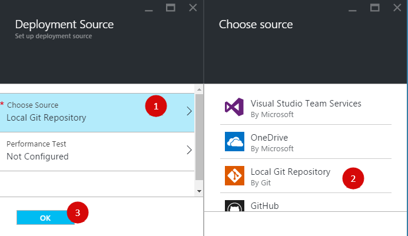
>
> 5. Set up deployment credentials if you haven't already done so. Open Web app blade, click All Settings, click Deployment credentials, fill a user name and password and then click Save.
>
> 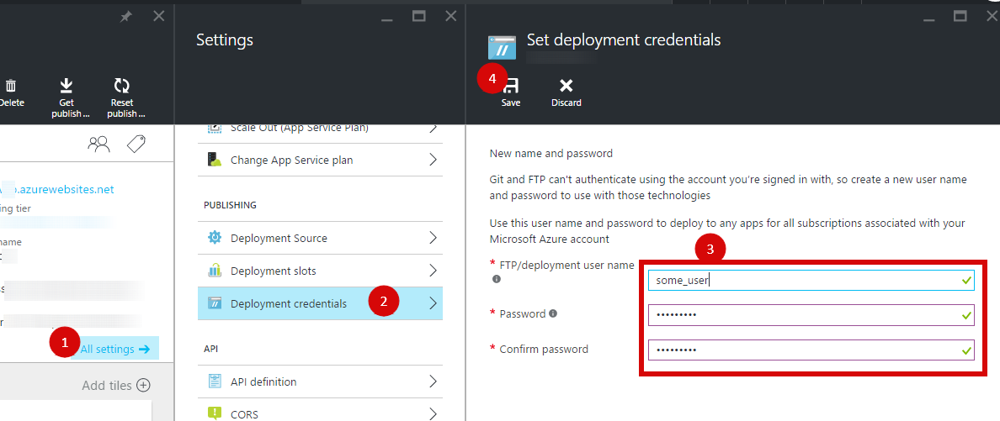

1.  In the Web app blade, click Settings, and then click Properties. To publish, you'll push to a remote Git repository. The URL for the repository is listed under GIT URL. You'll use this URL later.

> 
>
> 7. To publish your project you should install Git.
>
> 8. From the command line, change directories to the project directory and enter the following command to initialize a local Git repository.
>
> *git init*
>
> 9. Use the following commands to add files to the repository:
>
> *git add .*
>
> *git commit -m "initial commit"*
>
> 10. Add a Git remote for pushing updates to the web app that you created previously, by using the following command:
>
> *git remote add azure \[URL for remote repository\]*
>
> 11. Push your changes to Azure by using the following command:
>
> *git push azure master*
>
> You are prompted for the password that you created earlier.
>
> 12. To view your app, click the Browse button on the Web App part in the Azure portal.
>
> 

##SUMMARY

We created auto scalable containers cluster to perform heavy computational tasks in an Azure cloud environment. This sample is universal and can be by leveraged by startups using Azure as they grow and scalability becomes a top priority. It is independent from any specific calculation and can be applied to any business area’s required computational resources. Also we demonstrated instantiation of tasks, and communication with docker containers from the Node.js web site. The documents contain all the necessary code to run this sample, but at the same time, a full source code tree is also attached for reference.
