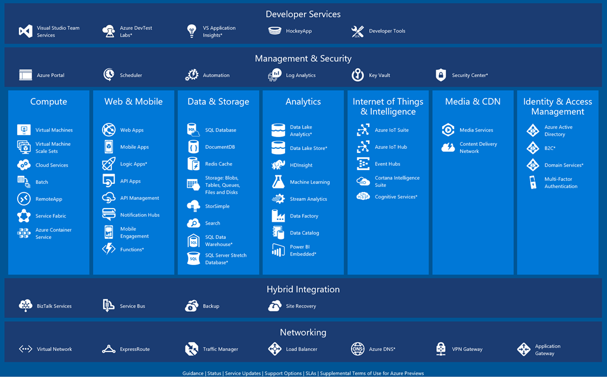
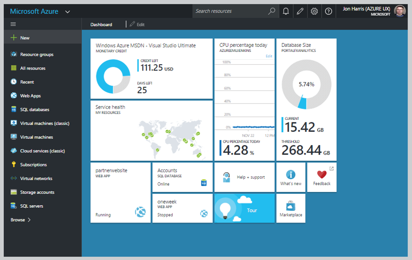

 The purpose of this GitHub repository is to help **startups** quickly engage and get up and running on Azure services.  You'll find links to key documentation, tutorials and code packets.  If you have feedback on the content please submit an **[issue](https://github.com/Azure-for-Startups/Content/issues)**.

  

## Table of Contents

<table class="table table-bordered table-striped table-hover border-0px">

<td valign="top" width="50%"><a href="./README.md#getting-started-on-azure"><b>- Getting started on Azure</b></a>&nbsp;&nbsp;Learning paths, tutorials, videos, and all you need to know to get ramped up on Azure  <a href="./README.md#migrating-to-azure"><b>- Migrating to Azure</b></a>&nbsp;&nbsp;Tools &amp; services, tutorials, and official information on how to move your existing solution to Azure.  <a href="./README.md#additional-useful-tools--links"><b>- Tools and links</b></a>&nbsp;&nbsp;Azure price calculator, Azure Trust Center, and other useful additions to help your success on Azure.  </td>  
<td valign="top" width="50%"><a href="./README.md#infrastructure-services-iaas"><b>- Infrastructure Services</b></a> &nbsp;&nbsp;&nbsp;Compute, Networking, Storage  <a href="./README.md#platform-services-paas"><b>- Platform Services</b></a> &nbsp;&nbsp;&nbsp;Web &amp; Mobile, Data,  &nbsp;&nbsp;&nbsp;Intelligence &amp; Analytics, IoT  <a href=""><b></b></a><a href="./README.md#cloud-architecture"><b>- Cloud Architecure</b></a>&nbsp;&nbsp;patterns, practices, and architecture blueprints.   <a href="./README.md#azure-resource-manager-arm"><b>- Azure Resource Manager</b></a>&nbsp;&nbsp;overview and availability chart  <a href="./README.md#feature-highlights"><b>- Feature highlights</b></a>&nbsp;&nbsp;Get beyond the basics. Helpful features in Azure for Start-ups  </td>
</tr>
</table>  

## Getting Started on Azure  
- **[Get started on Azure](https://azure.microsoft.com/en-us/get-started/)** – Link to Azure.com Getting Started page.
- **[Interactive Azure Map](https://aka.ms/azmap)** - Interactive overview of services available on Azure. Click on a service to learn about it.
- **[Azure Learning Paths](https://azure.microsoft.com/en-us/documentation/learning-paths/)** - Get started with these learning paths for different Azure Services.
- **[Azure on Microsoft Virtual Academy](https://mva.microsoft.com/training-topics/cloud-app-development)** - Virtual courses on cloud development.
- **[Azure on Channel9](https://channel9.msdn.com/AzurAdditione)** - Video tutorials about Azure services.
- **[Startup Offers](https://azure.microsoft.com/en-us/pricing/member-offers/bizspark-startups/)** - Get free cloud credits and offers through Microsoft’s BizSpark program.
- **[Microsoft Azure for Amazon AWS Cloud professionals: Getting Started](https://channel9.msdn.com/Shows/TechNet+Radio/TNR1667)** - Showcase and demo of Microsoft Azure features and comparison to Amazon Web Services to see how they match up.

   <table class="table table-bordered table-striped table-hover">
<tr>
          <td valign="top">
  <h3><i> Getting started on Azure video series</i></h3>
    -    <a href="https://channel9.msdn.com/Series/BizSpark-StartUp-Stories/Getting-Started-on-Azure-Overview-of-the-Azure-portal"><b>Getting Started on Azure:  *Overview of the Azure portal*</b></a>- An introduction to the Azure portal, covering navigation and key elements of the portal including the Azure dashboard, marketplace, and resources. 
    -    <a href="https://channel9.msdn.com/Series/BizSpark-StartUp-Stories/Getting-Started-on-Azure-Resource-Groups"><b>Getting Started on Azure:  *Resource Groups*</b></a> - Learn what to consider and how to create and manage a resource group on the Azure portal. 
    -    <a href="https://channel9.msdn.com/Series/BizSpark-StartUp-Stories/Getting-Started-on-Azure-Storage-Accounts"><b>Getting Started on Azure:  *Storage Accounts*</b></a> - Learn how to create and manage a storage account on the Azure portal and select the storage option that is right for you. 
    -    <a href="https://channel9.msdn.com/Series/BizSpark-StartUp-Stories/Getting-Started-on-Azure-Virtual-Networks"><b>Getting Started on Azure:  *Virtual Networks*</b></a> - Learn how to set up a virtual network including IP address blocks, DNS settings, security policies, and routing tables on the Azure portal. 
    -    <a href="https://channel9.msdn.com/Series/BizSpark-StartUp-Stories/Getting-Started-on-Azure-Virtual-Machines"><b>Getting Started on Azure:   *Virtual Machines*</b></a> - Learn how to set up and configure an Ubuntu virtual machine on the Azure portal. 
    -    <a href="https://azure.microsoft.com/en-us/get-started/"><b>Additional Getting Started on Azure videos</b></a> - View additional Getting Started on Azure videos such as Windows Server Virtual Machines, Web Apps, SQL Database on Azure and more. 
	   </td>
</tr>
    </table> 

 
  

 
  
  
## Feature highlights

### Azure Cosmos DB
[**Create a globally distributed database with new multi-model APIs from Azure Cosmos DB**](https://azure.microsoft.com/en-in/blog/pre-announcing-the-general-availability-of-azure-cosmosdb-gremlin-graph-api/) Microsoft Azure Cosmos DB provides the perfect platform which enables you to focus on building and scaling your application with a globally distributed, multi-model database service rather than spending time on management. And Microsoft continues to improve the Azure Cosmos DB service: the company recently announced of general availability of Azure Cosmos DB Gremlin API and [**Azure Cosmos DB Table API**](https://azure.microsoft.com/en-in/blog/announcing-the-general-availability-of-azure-cosmosdb-table-api/) By using the Cosmos DB multi-model and multi-API capabilities to access and query data, your developers can easily build powerful, scalable apps. Azure Cosmos DB Gremlin API can deliver critical improvements to the performance of graph operations, improved import and backup scenarios through new tooling, and enhanced support for open-source frameworks recommended by Apache TinkerPop, including Python client support. The Azure Cosmos DB Table API enables your applications written for Azure Table storage to take advantage of premium capabilities of Azure Cosmos DB, like turnkey global distribution, low latency reads/writes, automatic secondary indexing, dedicated throughput, and more.

### Azure Time Series Insights
[**Harness the power of IoT with Azure-based Time Series Data Repositories and analytics**](https://azure.microsoft.com/en-in/blog/microsoft-announces-the-general-availability-of-azure-time-series-insights/) Microsoft recently announced the general availability of Azure Time Series Insights, which gives you a global view of data that’s being sent in near real time, allowing you to drill deeper and letting you to quickly validate your IoT solution, see data that devices are sending to your Azure IoT Hub, or to Azure Event Hubs. It’s a scalable, commercial-grade solution for storing and analyzing data without the headaches and expense of tedious resource management. It enables you to easily explore and analyze time series data streams without having to write a single line of code. And it avoids costly downtime to mission-critical devices by helping you discover hidden trends, spot anomalies, and conduct root-cause analyses in near real time. 

### Azure MariaDB language
[**Build great apps rapidly and easily with your favorite MariaDB language**](https://azure.microsoft.com/en-us/blog/mariadb-postgresql-and-mysql-more-choices-on-microsoft-azure/) As a part of its continued efforts to provide a first-class experience to developers using open source technologies on Azure, Microsoft is adding MariaDB to the list of open source relational database platforms it will bring to Azure. MariaDB will join MySQL and PostgreSQL, whose additions were announced earlier this year, in Azure to provide more choices to developers. In addition to this, Microsoft has joined the MariaDB Foundation as a Platinum sponsor. MariaDB will be a fully managed service on Azure. You’ll be able to provision a new instance in minutes and quickly scale the compute power you need up and down online. These services come with built-in high availability and security and a 99.99% SLA at general availability. And Azure lets you easily add new modern experiences to your apps through cognitive service APIs and the Bot Framework.  All this allows you to focus on your apps instead of on managing a database or your Infrastructure.

### Azure Building Blocks
[**Simplify and speed up your Azure resource deployment with Azure Building Blocks**](https://azure.microsoft.com/en-us/blog/azurebuildingblocks/?v=17.42n) You’ve created an elegant solution to meet the needs of your customers by using a cloud architecture that’s the envy of competing startups—but deploying updates from dev to staging to production can be challenging, even with Microsoft Azure Resource Manager templates. To solve this problem, Microsoft has announced the release of Azure Building Blocks an open-source command-line tool and set of Azure Resource Manager templates designed to simplify deployment of Azure resources. With Azure Building Blocks, you don't need to author any templates. You only need to specify the parameter settings for the resources you want to deploy. These parameter settings are then merged with best practice defaults and deployed with the command-line tool. Azure resources currently supported in Azure Building Blocks include virtual networks, security groups, user-defined routes, Windows and Linux VMs, VM extensions, load balancers, and Application Gateway. This enables you to use infrastructure as code in Azure without worrying about the complexity of Azure Resource Manager resources.

### Azure Fv2 VM 
[**Accelerate artificial intelligence and high-performance computing with the new Azure NVIDIA GPUs**](https://azure.microsoft.com/en-us/blog/new-gpus-coming-to-azure-accelerate-hpc-and-ai-workloads/) User experience is critical to an app’s success. Bring smarter experiences to your customers by using AI, machine learning, and high-performance computing to deliver power and pull meaningful insights from your data. To democratize these technologies, NVIDIA has partnered with Microsoft to offer GPU deep learning in the cloud. Microsoft is already providing VM sizes with NVIDIA’s K80s, M60s, P40s, and P100s. A new VM size—NCv3—will further support your GPU workloads. The NCv3 will offer the new NVIDIA Tesla V100 GPU. Two other VM sizes—the NCv2, offering NVIDIA P100s, and the ND-series, offering NVIDIA P40s—have entered general availability. Azure Batch AI and Data Science Virtual Machine images can also take advantage of these GPU VMs. Azure Batch AI can use all the new types of Azure GPU VMs, giving you ready access to great AI hardware coupled with simple AI job execution.  Data Science Virtual Machine images on Azure are being updated to take advantage of the new GPUs and can be used for data analytics, machine learning, and AI training. Azure is the only cloud with dedicated InfiniBand interconnects to enable accelerated multi-VM computations with the new VM sizes.

### Azure Databricks
[**Fast, easy, and collaborative Apache Spark-based analytics platform optimized for Azure**](https://azure.microsoft.com/en-us/blog/a-technical-overview-of-azure-databricks/) Apache Spark is the platform of choice for building cloud-scale applications because it enables you to run powerful analytics algorithms at scale and in real time to drive business insights. Microsoft recently announced the preview of Azure Databricks, designed collaboratively with the founders of Apache Spark, to provide a Spark-based analytics platform on Azure. It’s integrated with Azure to provide one-click setup, streamlined workflows, and an interactive workspace that enables collaboration between data scientists, data engineers, and business analysts. It curates and processes massive amounts of data and manages the whole workflow process throughout a project. And it has built-in integration with Azure Blog storage, Azure Data Lake storage, Azure SQL Data Warehouse, Cosmos DB, Azure Event Hubs, Apache Kafka for HDInsight, Power BI, and Azure Active Directory. Let Databricks help you simplify the creation of modern data warehouses and enable you to provide self-service analytics and machine learning over all your data—with enterprise-grade performance and governance.

### Azure Container Service (AKS)
[**Gain all the benefits of Kubernetes without the complexity and operational overhead by using Azure Container Service (AKS)**](https://azure.microsoft.com/en-us/services/container-registry/) Kubernetes, an open-source container management system, has surged in popularity in the past several years. You might be considering—or already using—Kubernetes for managing and orchestrating your containerized applications. But ongoing operations and maintenance is challenging, and you don’t want to dedicate precious time and resources to it. To solve with this problem, Microsoft announced the preview of AKS (Azure Container Service) to make it quick and easy to deploy and manage containerized applications without container orchestration expertise and without sacrificing portability. You can quickly provision clusters to be up and running in no time, and simplify your monitoring and cluster management. The new service features an Azure-hosted control pane, automated upgrades, self-healing, easy scaling, and a simple user experience for developers and cluster operators. To provide scale across the global footprint of Azure, Microsoft also announced the preview of geo-replication in Azure Container Registry. By clicking on a map, you can now manage a single registry replicated across any number of regions. Azure Container Registry geo-replication enables you to manage your global deployments as one entity.

### Azure Functions
[**Extend and accelerate your development with support for Java to Azure Functions**](https://azure.microsoft.com/en-in/blog/announcing-the-preview-of-java-support-for-azure-functions/) You need to harness the power of serverless computing with Azure Functions, but you use OSS tools and languages that once blocked you from doing that. Microsoft rearchitected the Azure Functions runtime to allow support for various programming languages, and Java is the first language that Microsoft is introducing in a new preview.The new Java runtime will share all the features provided by Azure Functions, such as the wide range of triggering options and data bindings, the serverless execution model with autoscaling, and pay-per-execution pricing. As a Java developer, you don’t need to use any new tools to develop with Azure Functions. You can use popular IDEs and editors like Eclipse, IntelliJ, and Visual Studio Code to develop and debug Azure Functions locally. In fact, with the newly released Maven plug-in from Microsoft, you can create, build, and deploy Azure Functions from your existing Maven-enabled projects. The new Azure Functions Core Tools will enable you to run and debug your Java Functions code locally on any platform.

### Azure App Service
[**Proactively monitor application health and resolve issues faster with Azure App Service diagnostics**](https://azure.microsoft.com/en-us/blog/announcing-the-general-availability-of-azure-app-service-diagnostics/) App Service diagnostics lets you diagnose and troubleshoot problems with your apps. It provides an intelligent and interactive experience, analyzing what’s wrong with your web apps and quickly guiding you to information that will help you troubleshoot and resolve issues faster. You can run proactive health checkups against common web app metrics and tap into a pool of built-in knowledge that will help you troubleshoot efficiently. App Service diagnostics detects issues in four main areas that are common problem areas for web applications: requests and errors, performance, CPU usage, and memory usage. If you’ve had issues with your web app within the past 24 hours, diagnostic graphs will be available for you to analyze, together with additional troubleshooting tools and links to helpful documentation and forums. 

### Azure Data Factory
[**Grow fast and go far—build hybrid data integration at scale with Microsoft Azure Data Factory**](https://azure.microsoft.com/en-us/blog/azure-data-factory-announcing-new-capabilities-in-public-preview/) Data is no longer something to be stored and ignored—it’s one of your biggest business assets. If you want to kickstart growth and beat the competition, you need a system to refine enormous stores of raw data into actionable business insights. But you’re also focused on the bottom line, so that solution has to be cost effective, flexible, and scalable. Azure Data Factory is a cloud-based data integration service that allows you to create data-driven workflows in the cloud for orchestrating and automating data movement and data transformation. Microsoft has announced expanded capabilities in a new public preview of in Data Factory. You can now create, schedule, and orchestrate your extract-transform-load (ETL), extract-load-transform (ELT), and data integration projects at scale, whether your data lives in the cloud or on a self-hosted network. With the addition of SQL Server Integration Services (SSIS), you can easily lift your SSIS packages into the cloud by using new managed SSIS hosting capabilities in Data Factory. By spinning up an SSIS package with a new feature called Integration Runtime (IR) in Data Factory, you’ll be able to execute, manage, monitor, and deploy SSIS packages in the cloud.

### Azure IoT Suite
[**Get ahead—and stay ahead—with the next generation of Remote Monitoring in Azure IoT Suite**](https://azure.microsoft.com/en-us/blog/the-next-generation-of-azure-iot-suite-accelerates-iot-solutions/) Technology is advancing fast, and devices are getting smarter day by day. To meet this market reality and accelerate the development of your IoT apps, you can work with preconfigured solutions from the Azure IoT Suite. IoT Suite preconfigured solutions combine multiple Azure IoT services. You can deploy them in minutes to get started quickly, and you can customize them to meet your needs. Microsoft has announced a new version of the IoT Suite Remote Monitoring preconfigured solution. It provides two deployment options to match your needs: a Basic version to get started at a low cost, and a Standard version for production-ready IoT solutions. The new version of Remote Monitoring includes a new scalable Microservices architecture that’s available in both .NET and Java toachieve scale and flexibility without compromising development speed. You can also configure rules and alarms over live IoT device telemetry, and troubleshoot and remediate issues within your IoT device groups. The user interface is completely redesigned to visualize the capabilities of a production-ready solution and provide a rich dashboard for deep insights and solution status. 

### Azure Machine Learning
[**Turn users into loyal fans with new innovations in the Microsoft AI-driven digital transformation**](https://azure.microsoft.com/en-us/blog/tools-for-the-ai-driven-digital-transformation/) User experience is critical to an app’s success. One way to boost your UX game is with the new capabilities in Azure Machine Learning. Microsoft recently shared some exciting innovations in AI development platforms. These announcements span Azure Machine Learning, new Visual Studio tools for AI, Cognitive Services, and new enterprise AI solutions. The next generation of Machine Learning includes powerful new capabilities that enable developers to exploit big data, GPUs, data wrangling, and container-based model deployment.  Microsoft also released Visual Studio Code Tools for AI to provide a rich set of capabilities for easily building models with deep learning frameworks, including Microsoft Cognitive Toolkit (CNTK), Google TensorFlow, and more. And Microsoft Cognitive Services has two new cloud-hosted APIs that enable developers to easily add AI capabilities—such as emotion and sentiment detection, vision, and speech recognition—into applications. 

### Azure Service Fabric
[**Hyperscale to new heights with the general availability of Service Fabric on Linux**](https://azure.microsoft.com/en-us/blog/announcing-the-general-availability-of-service-fabric-on-linux/) You’d rather focus on building great apps than re-architect your infrastructure to keep up with growth. With Azure Service Fabric, you can do what you do best and let Azure solve the hard distributed systems problems: reliability, scalability, management, and latency. Microsoft has announced the general availability of Service Fabric on Linux for container orchestration in all regions, including national clouds. With this release, which includes runtime 6.0 and SDK 2.8, you can now run containerized applications on Service Fabric for both Windows Server and Linux. You can also take advantage of orchestration features on Linux. Use Service Fabric to launch and manage container images, govern resources, complete service discovery with DNS, and gain insights from using OMS integration. With volume driver integration, you can truly focus on building applications and not assembling or building a platform across both Windows Server and Linux. 

### Azure Stream Analytics
[**Azure Stream Analytics provides on-demand, real-time analytics to power intelligent action**](https://azure.microsoft.com/en-us/blog/new-in-stream-analytics-output-to-azure-functions-built-in-anomaly-detection-etc/) To make your big ideas a reality, you need IT agility and flexibility. Your IT resources have to be able to scale up and out at a moment’s notice. With Azure Stream Analytics, you can instantly scale out the processing power from one streaming unit to hundreds of them for any job, and you pay only for the processing used for the job. Stream Analytics is an on-demand, real-time analytics service that you can use to power intelligent action. Microsoft has announced the preview of several new capabilities in Azure Stream Analytics, including built-in inline machine learning–based anomaly detection, egress to Azure functions, support for compressed data formats, JavaScript user-defined aggregates, and support for CI/CD in Microsoft Visual Studio tooling. A machine learning–based operator in Stream Analytics helps you monitor data from applications or devices in real time and easily detect events or observations that don’t conform to an expected pattern. Microsoft also announced an output adapter to Azure Functions from Azure Stream Analytics. This allows you to connect Stream Analytics to Azure Functions and run a script or piece of code to trigger downstream workflows and accelerate responses to key events. New Visual Studio tooling allows you to perform automated builds and test and deploy scripts with Stream Analytics Visual Studio projects.

### IoT Hub 
[**Automate the provisioning of devices to Azure IoT Hub**](https://azure.microsoft.com/en-us/blog/azure-iot-hub-device-provisioning-service-preview-automates-device-connection-configuration/) Provisioning is an important part of the lifecycle management of an IoT device. Microsoft has announced the preview of Azure IoT Hub Device Provisioning Service to remove the tedium of manually configuring IoT devices. This automated service can be used to provision millions of devices. The IoT Hub Device Provisioning Service is a helper service for your IoT hub that enables zero-touch, just-in-time provisioning to the right IoT hub without human intervention, enabling you to provision IoT devices in a secure and scalable manner. The Device Provisioning Service is the only cloud service that provides complete automated provisioning, including registration of the device to the cloud as well as configuration of the device.

### Azure Log Analytics
[**Get deep insights into containers with the newly announced Container Monitoring Solution on Azure Log Analytics**](https://azure.microsoft.com/en-in/blog/azure-la-container-monitoring/) Docker containers is a growing technology for running modern applications. It helps developers and DevOps with easy provisioning and continuous delivery in modern infrastructures. To simplify Docker container monitoring and management, Microsoft has announced the general availability of the Container Monitoring Solution on Azure Log Analytics, available on Azure Marketplace. It provides deep insights into containers supporting Kubernetes, Docker Swarm, Mesos DC/OS, and Service Fabric container orchestrators on multiple OS platforms. It helps you know which containers are running, what image they're running, and where they're running. You can view detailed audit information that shows commands used with containers. And you can troubleshoot containers by viewing and searching centralized logs without having to remotely view Docker or Windows hosts.
 
 
### Azure Event Grid
[**Microsoft announces Azure Event Grid, a unique and intelligent event service for modern applications**](https://azure.microsoft.com/en-us/services/event-grid/) Modern applications—including Internet of Things (IoT), mobile apps, business process applications, and more—are built around events. This drives the need for event-based programming. To support this need, Microsoft recently announced the first-of-its-kind Azure Event Grid, a fully managed, intelligent event-routing service that allows for uniform event consumption using a publish-subscribe model. You can build event-based, serverless applications with a higher level of abstraction, so you don’t need to worry about infrastructure, provisioning, or scaling. You can use Event Grid to react to relevant events across Azure and non-Azure services in near-real time. And you can create richer app scenarios by connecting serverless logic to events from multiple sources. 

### Azure Web Apps
[**Deploy your Java app to Azure by using a new Maven Plugin**](https://azure.microsoft.com/en-us/blog/maven-deploy-java-web-apps-to-azure/) With the release of a new Maven Plugin for Azure Web Apps, developers can now deploy or redeploy Java-based web applications over Linux Azure App Service or Windows App Service in a couple easy steps. The Azure App Service provides a managed web app environment to enable your Java application to run smoothly on Azure. The only thing the developer needs to worry about is the code of the Java app. App Service handles the provisioning, load balancing, auto-scaling, and app health monitoring. You can also customize the settings and create a custom layout for your application. 

### Azure Batch Rendering 
[**New Azure Batch Rendering to run large-scale rendering workloads seamlessly on Azure**](https://azure.microsoft.com/en-us/blog/announcing-public-preview-of-azure-batch-rendering/) Rendering visual effects is one of the most complex aspects of a cinematic production. Major challenges in rendering include finding the right infrastructure, setting up and managing a render farm made up of high-performance computing clusters, and managing associated workflows. To overcome these challenges, Microsoft has announced the public preview of Azure Batch Rendering service, which offers cloud-scale rendering capabilities on a pay-per-use basis. The Batch Rendering service handles job scheduling and queueing, managing failures and retries, and auto-scaling for your rendering jobs. You can submit rendering jobs via client applications like Autodesk Maya, 3ds Max, and Arnold and get easy scaling, monitoring, and asset management. A flexible programming model and an SDK that’s available in various languages allow your developers to integrate their own pipelines and workflows into the solution. Batch Rendering accelerates large-scale rendering jobs to deliver results to your customers faster.

### Hyper scale compute  
[**Microsoft brings container orchestration for Windows Server Containers to Azure Service Fabric**](https://azure.microsoft.com/en-us/blog/announcing-windows-server-container-orchestration-with-azure-service-fabric/)  Running a traditional application inside containers is an easy first step to gain some of the benefits of a microservices architecture, such as improved density and easier application lifecycle management. Azure Service Fabric is the Microsoft microservices platform, and Microsoft has announced the release of Service Fabric 5.6 runtime and 2.6 SDK, which support the orchestration of Windows Server Containers. This release includes many new features targeted at container orchestration, including a DNS service, resource governance, Microsoft Operations Management Suite integration, and more. It also contains support for Docker Compose for deploying containerized apps to Service Fabric with Microsoft Visual Studio 2017 tooling integration.  
  

### Azure Video Services  
[**Video Indexer—a cloud service that lets you easily extract insights from your videos** ](https://vi.microsoft.com/)  When video and audio content lacks human-understandable, time-stamped metadata, it can be difficult to find. Generating such metadata for video and audio is expensive and next to impossible when you have a high volume of this type of content. Microsoft has announced the public preview of a cloud service called Video Indexer as part of Microsoft Cognitive Services. Video Indexer enables organizations with digital video and audio content to automatically extract metadata and use it to build intelligent, innovative applications. It builds upon media AI technologies to make it easier for you to extract insights from video and audio. You can use Video Indexer to power new forms of content discovery, like searching for spoken words, faces, characters, and emotions, and to enrich your apps with embedded video insights to drive user engagement.  
  
  
### Azure  
[**Massive-scale cloud rendering with Autodesk on Azure** ](https://azure.microsoft.com/en-us/blog/massive-scale-cloud-rendering-with-autodesk-on-azure/)  When implementing a rendering project, it’s hard to find the right infrastructure, set up a render farm made up of high-performance compute clusters, and then manage the render farm. Even small projects can take anywhere from days to weeks to complete. The cloud is perfectly suited for variable-length and long-running rendering projects. Microsoft has announced the preview of Azure Batch Rendering and its integration with Autodesk.  When used together with Autodesk, Azure opens doors for artists, engineers, designers, and developers. Built on top of Azure Batch, a mature production service, this new rendering platform will allow you to seamlessly submit rendering jobs by using Autodesk’s suite of products—including Autodesk Maya, 3ds Max, and Arnold—together with the agility, flexibility, and scalability of Azure compute.  
  
  
### Cosmos DB  
[**Build fast, scalable, globally distributed applications by using Azure Cosmos DB**](https://azure.microsoft.com/en-us/blog/azure-cosmos-db-microsofts-globally-distributed-multi-model-database-service/)  Microsoft has announced the general availability of Azure Cosmos DB, a globally distributed multimodel database. Azure Cosmos DB is the first globally-distributed data service that lets you elastically scale throughput and storage across any number of geographical regions while guaranteeing low latency, high availability, and consistency—and it’s backed by the most comprehensive SLAs in the industry. Azure Cosmos DB is the right solution for your globally distributed mission-critical applications—including web, mobile, gaming, and IoT applications—when predictable throughput, high availability, low latency, and a schema-free data model are key requirements.  
  

### Azure compute  
[**Your Microsoft-managed admin machine in Azure, for Azure**](https://azure.microsoft.com/en-us/blog/public-preview-of-azure-cloud-shell/)  Cloud Shell provides an interactive, browser-accessible, pre-configured shell experience for managing Azure resources without the overhead of installing, versioning, and maintaining a machine yourself. The authenticated shell experience is hosted in the cloud and accessible from virtually anywhere. It enables you to use common tools and programming languages in a shell that’s updated and maintained by Microsoft. You can also persist your files across sessions by using attached Azure File storage.

### Visual Studio  
[**Gain powerful info about your web app by using new tools in Microsoft Azure Application Insights**](https://azure.microsoft.com/en-us/blog/new-tools-for-understanding-user-behavior-with-application-insights/)  Which features of your web app are most popular and most frequently used? Do your users achieve their goals with your app? Microsoft has released new tools in Application Insights to help you understand user behavior and empower your development team to better understand how customers use your web apps.  Every time you update your app, you can assess how well it works for users. You can get rich performance monitoring, powerful alerting, and easy-to-consume dashboards to help ensure your applications are available and performing as you expect.  
  
  
### Storage  
[**Storage Service Encryption (SSE) for Azure File Storage**](https://docs.microsoft.com/en-us/azure/storage/storage-service-encryption). When enabled, SSE automatically encrypts data at rest using a 256-bit encryption key—helping organizations meet organizational security and industry compliance requirements.  
  
 
### Azure Resource Manager (ARM)  
[**Simplify VM deployment using custom templates in Azure Resource Manager (ARM)**](https://docs.microsoft.com/en-us/azure/templates/)Custom Azure Resource Manager (ARM) templates are a great way to make deploying virtual machines and resources a repeatable, easy-to-automate process. The template reference documentation explains the available resource types you can use to create custom templates for various Azure resources—including what values to use in your template.   

## Working with Azure
- **[Azure Portal](https://portal.azure.com/)** - The best way to get started is with the Azure portal, a web based interface for managing Azure.
- **[Azure SDKs & Tools](https://azure.microsoft.com/en-us/downloads/)** - SDKs for many common languages such as .NET, Java, Node.js, Python, Ruby and other tools.

- **[Azure PowerShell](https://msdn.microsoft.com/en-us/library/jj156055.aspx)** - Work with PowerShell cmdlets to perform Azure operations.
- **[Azure CLI](https://azure.microsoft.com/en-us/documentation/articles/xplat-cli-install/)** – Create/manage Azure resources using a set of open-source shell-based commands.
- **[Azure API Reference](https://msdn.microsoft.com/en-us/library/azure/mt420159.aspx)** - Reference for Azure REST and .NET APIs.
- **[Azure Solutions](https://azure.microsoft.com/en-us/solutions/?v=3)** - A listing of top Azure solutions and their brief descriptions
- **[Azure Products and services](https://azure.microsoft.com/en-us/services/)** – A searchable list of all Azure products and services

## Migrating to Azure 
-	**[AWS to Azure mapping](https://azure.microsoft.com/en-us/campaigns/azure-vs-aws/mapping/)** - Map between Azure and AWS services
-	**[AWS to Azure migration](https://azure.microsoft.com/en-in/documentation/articles/site-recovery-migrate-aws-to-azure/)** - Migrate virtual machines in Amazon Web Services (AWS) to Azure with Azure Site Recovery
-	**[MongoDB to Azure Migration resources](./Content/MongoDB%20Azure%20Migration.md)**  

  <h3><i> Tutorials and Sample code</i></h3>
     <table class="table table-bordered table-striped table-hover">
	<tr>
	  <td valign="top"><a href="Content/AWS VM to Azure VM Migration.md"><b>AWS VM to Azure VM migration</b></a></td>
	  <td valign="top"><a href="Content/AWS RDS to Azure SQL migration.md"><b>AWS CDN to Azure CDN Migration</b></a></td>
	  <td valign="top"><a href="https://github.com/Azure-for-Startups/Amazon-S3-to-Azure-Storage-demo"><b>AWS S3 to Azure Blob Storage migration</b></a></td>
	  <td valign="top"><a href="Content/Amazon CDN to Azure CDN migration.md"><b>AWS CDN to Azure CDN Migration</b></a></td>
	  <td valign="top"><a href="Content/ASP.NET Web App migration from AWS to Azure.md"><b>ASP.NET Web App migration from AWS to Azure</b></a></td>
	 </tr>
     </table>

   ### *Tools & Services*
   - **[AWCopy](https://github.com/cicorias/AWCopy)** - Azure service that provides parallelized copies of S3 files in Amazon Web Services to Azure blobs.
   - **[CloudBerry Cloud Migrator](http://www.cloudberrylab.com/cloud-migrator.aspx)** - service to transfer files from one cloud storage to another (Amazon S3 & Glacier, Windows Azure Blob Storage, Rackspace Cloud Files and FTP servers).
   - **[Azure Import/Export Service](https://azure.microsoft.com/en-us/documentation/articles/storage-import-export-service/)** - Transfer Data to Blob Storage.

# Infrastructure Services (IaaS)
Infrastructure as a service (IaaS) refers to the compute, networking and storage building blocks which allow you to build any kind of cloud solution. IaaS allows you to have maximum control on how you manage virtual machines, network configuration but requires you to invest in attaining robustness, availability and scalability in the cloud.  

## Compute 
-	**[Learning Path for Azure VMs](https://azure.microsoft.com/en-us/documentation/learning-paths/virtual-machines/)** - Learn how to deploy and manage VMs. 
-	**[Linux VM](https://azure.microsoft.com/en-us/documentation/articles/virtual-machines-linux-quick-create-portal/)** – Get started creating a Linux VM on the Azure Portal and utilize [proven practices](https://azure.microsoft.com/en-us/documentation/articles/guidance-compute-single-vm-linux/) to run the Linux VM.
-	**[Windows VM](https://azure.microsoft.com/en-us/documentation/articles/virtual-machines-windows-hero-tutorial/)** – Get started creating a Windows VM on the Azure Portal
-	**[VM Extensions](https://azure.microsoft.com/en-us/documentation/articles/virtual-machines-windows-extensions-features/)** - Gain an overview of extensions to virtual machines such as the Chef, Docker or custom script extensions.  Direct link to [Docker VM Extension](https://docs.microsoft.com/en-us/azure/virtual-machines/virtual-machines-linux-dockerextension?toc=%2fazure%2fvirtual-machines%2flinux%2ftoc.json)
-	**[VM Scale Sets Overview](https://azure.microsoft.com/en-us/documentation/articles/virtual-machine-scale-sets-overview/)** - Learn about deploying and managing VM scale sets.
-	**[Service Fabric Overview](https://azure.microsoft.com/en-us/documentation/services/service-fabric/)** – a distributed systems platform that makes it easy to package, deploy, and manage scalable, reliable microservices.
-	**[Choose between App Services, Service Fabric and VMs](https://azure.microsoft.com/en-us/documentation/articles/choose-web-site-cloud-service-vm/)** - including scenarios and recommendations.
-	**[Docker Documentation](https://docs.docker.com/)** - Starting point for documentation on Dockers including Docker for MAC, Windows, Linux, etc.
-	**[Docker VM Extension](https://docs.microsoft.com/en-us/azure/virtual-machines/virtual-machines-linux-dockerextension?toc=%2fazure%2fvirtual-machines%2flinux%2ftoc.json)** - Create a Docker environment in Azure using the Docker VM extension.

  <h3><i> Tutorials and Sample code</i></h3>
     <table class="table table-bordered table-striped table-hover">
	<tr>
	  <td valign="top"><a href="https://github.com/Azure-for-Startups/Containers-on-Azure-demo"><b>Containers on Azure</b></a> - Perform heavy computational tasks (for example video or audio encoding, hash calculation, data encryption, etc.) and make the process scalable and cost effective using Docker containers.</td>
	  <td valign="top"><a href="https://azure.microsoft.com/en-us/documentation/articles/virtual-machines-linux-dockerextension/"><b>Deploy to Azure using the Docker VM Extension</b></a> - use Resource Manager templates to deploy the Docker VM Extension in a custom, production-ready environment that you define</td>
	  <td valign="top"><a href="https://github.com/Azure-for-Startups/Amazon-S3-to-Azure-Storage-demo"><b>AWS S3 to Azure Blob Storage migration</b></a></td>
	  <td valign="top"><a href="https://azure.microsoft.com/en-us/documentation/articles/virtual-machines-linux-classic-ruby-rails-web-app/"><b>Ruby on Rails web app on Azure VM</b></a></td>
	 </tr>
     </table>

## Networking
-	**[Virtual Networks (Vnets) Overview](https://azure.microsoft.com/en-us/documentation/articles/virtual-networks-overview/)** – Learn about Azure Virtual Networks and how to create them.
-	**[Network Security Groups](https://azure.microsoft.com/en-us/documentation/articles/virtual-networks-nsg/)** – Learn about Network Security Groups (NSGs) and how to configure them.
-	**[Load-Balancers](https://azure.microsoft.com/en-us/documentation/articles/load-balancer-overview/)** – Learn about Azure Load Balancer and to configure one.

## Storage

- **[Introduction to Azure Storage](https://azure.microsoft.com/en-us/documentation/articles/storage-introduction/)** – Learn the basics of Azure Storage including Blob, Table, Queue, and File storage.
- **[Azure Backup](https://azure.microsoft.com/en-us/services/site-recovery/)** – Learn about and how to implement Azure Backup to back up (or protect) and restore your data in the Microsoft cloud.
- **[Azure Site Recovery](https://azure.microsoft.com/en-us/services/site-recovery/)** – Orchestrate your disaster recovery plan.
- **[Create a storage account](https://azure.microsoft.com/en-us/documentation/articles/storage-create-storage-account/)** – Learn how to create a general purpose or blob storage account with links to getting started on Blob, Table, Queue, and file storage accounts.

# Platform Services (PaaS)
Platform as a Service (PaaS) resources are Azure services which are built for most cases and allow you to enjoy high availability, scalability and robustness out of the box. Instead of managing VMs directly, let Azure manage the underlying infrastructure and focus on building your applications and solutions. 

## Web & Mobile
- **[Azure App Service overview](https://azure.microsoft.com/en-us/documentation/services/app-service/)** – Learn about Web Apps, Mobile Apps, API apps.
- **[Azure Web Apps](https://azure.microsoft.com/en-us/services/app-service/web/)** – Create and deploy mission-critical web apps that scale with your business.
- **[Azure Mobile Apps](https://docs.microsoft.com/en-us/azure/app-service-mobile/app-service-mobile-value-prop)** – Build engaging iOS, Android, and Windows apps.
- **[Getting Started with Xamarin](https://azure.microsoft.com/en-us/features/xamarin/)** - Create cloud-powered mobile apps faster across iOS, Android, and Windows.  Overview of Xamarin and how to use it.
- **[Notification Hub overview](https://azure.microsoft.com/en-us/documentation/services/notification-hubs/)** - An easy-to-use, multiplatform, scaled-out push infrastructure.
- **[Azure Search](https://azure.microsoft.com/en-us/documentation/articles/search-what-is-azure-search/)** - Ready-to-use service that you can populate with your data and then use to add search to your web or mobile apps.
- **[Azure Mobile Services REST API Reference MSDN](https://msdn.microsoft.com/en-US/library/azure/jj710108.aspx)** – Documentation on Mobile Services REST API and the available operations.
- **[Azure Deployment Using Git](./Content/Azure-Deployment-using-Git.md)** – Learn the basics and understand available resources to support publishing web applications on Azure using Git workflows.
- **[Azure Media Services (AMS) Overview](https://azure.microsoft.com/en-us/documentation/articles/media-services-overview/)** – Learn about Azure Media Services and how to build scalable media management and delivery apps.

  <h3><i> Tutorials and Sample code</i></h3><table class="table table-bordered table-striped table-hover">
        <tr>
          <td valign="top"><a href="https://github.com/Azure-for-Startups/Notification-Hub-demo"><b>Notification Hub demo</b></a> - Deliver push notification messages to mobile applications on iOS, Android and Windows Phone platforms using Azure Notification Hub</td>
          <td valign="top"><a href="./Content/Deploy%20Node.js%20PHP%20and%20Python%20Web-apps-on-Azure.md"><b>PHP, Node.js, and Python</b></a> - Deploy PHP, Node.js and Python web apps on Azure and learn how to configure Azure App service</td>
         </tr>
     </table>
## Data 
- **[Azure SQL Overview](https://azure.microsoft.com/en-us/documentation/articles/sql-database-technical-overview/)** – Gain an overview on SQL and how to create a SQL DB on Azure.
- **[Azure SQL (PaaS) vs. SQL Server on Azure VMs (IaaS)](https://azure.microsoft.com/en-us/documentation/articles/sql-database-paas-vs-sql-server-iaas/)** - Learn what scenarios are better for an IaaS vs. PaaS SQL solution.
- **[DocumentDB](https://azure.microsoft.com/en-us/documentation/services/documentdb/)** – Learn about this fully managed NoSQL database service and how to build and manage DocumentDB applications.
- **[MongoDB on Azure](https://docs.mongodb.com/ecosystem/platforms/windows-azure/)** – Learn about MongoDB on Azure and deployment recommendations.

  <h3><i> Tutorials and Sample code</i></h3>
     <table class="table table-bordered table-striped table-hover">
        <tr>
          <td valign="top"><a href="https://azure.microsoft.com/en-us/documentation/articles/documentdb-import-data/"><b>Import data to DocumentDB with the Database Migration tool</b></a> – Learn how to use the open source DocumentDB data migration tool to import data to Azure DocumentDB</td>
          <td valign="top"><a href="https://azure.microsoft.com/en-us/documentation/articles/virtual-machines-windows-classic-install-mongodb/"><b>Install MongoDB on a Windows VM</b></a> - Learn how to install MongoDB on a Linux VM in Azure.</td>	  
          <td valign="top"><a href="https://docs.mongodb.com/v3.0/administration/install-on-linux/"><b>Install MongoDB on Linux</b></a> - Learn how to install MongoDB on a Linux VM in Azure.</td>
          <td valign="top"><a href="https://azure.microsoft.com/en-us/documentation/articles/web-sites-dotnet-store-data-mongodb-vm/"><b>Create a web app that connects to MongoDB</b></a> – Learn how to create a web page in Azure that connects to MongoDB running on a VM.</td>
	  </tr>
     <tr>
          <td colspan="4" valign="top" align="left"><b>[SQL DB and Elastic pool feature tutorials](https://docs.microsoft.com/en-us/azure/sql-database/sql-database-explore-tutorials)</b> – simple step-by-start tutorial for different SQL feature areas</td>
     <tr>	
</table>
     
## Intelligence & Analytics *(incl. Machine learning and Cognitive services)*
- **[Azure HDInsight](https://azure.microsoft.com/en-us/services/hdinsight/)** - An introduction to Hadoop on Azure HDInsight, its ecosystem, and big data. Learn about the Hadoop components, common terminology, and scenarios for big data analysis.
- **[Stream Analytics](http://azure.microsoft.com/en-us/services/stream-analytics/)** - Overview of Azure stream analytics, low-cost solutions to gain real-time insights from devices, sensors, infrastructure, and applications 
- **[Additional Intelligence and Analytics services](https://azure.microsoft.com/en-us/services/?sort=popular&filter=intelligence-analytics)** – HDInsight, Machine Learning, Data Factory, Log Analytics, Data Catalog, Power BI Embedded, Data Lake store and much more.
- **[Machine Learning Overview](https://azure.microsoft.com/en-us/documentation/articles/machine-learning-what-is-machine-learning/)** - Overview and tutorial on Machine Learning.  Or explore further [Machine Learning](https://azure.microsoft.com/en-us/services/machine-learning/)
- **[Azure Machine Learning Studio](https://azure.microsoft.com/en-us/documentation/articles/machine-learning-what-is-ml-studio/)** - A collaborative, drag-and-drop tool you can use to build, test, and deploy predictive analytics solutions.
- **[Get started with Microsoft Cognitive Services](https://channel9.msdn.com/Events/Connect/2016/102)** – Learn how to easily add powerful artificial intelligence capabilities to your applications with Microsoft Cognitive Services.  See [Cognitive Services](http://www.microsoft.com/cognitive) for more information.
- **[Cognitive Services: Making AI Easy](https://channel9.msdn.com/Events/Machine-Learning-and-Data-Sciences-Conference/Data-Science-Summit-2016/MSDSS08)** – The rise of machine learning has produced an explosion of APIs to make your applications more intelligent.  Learn about more than 20 Cognitive Services APIs.  You'll see powerful demos, experience the simplicity of calling this code, and get ideas for adding this functionality to your own applications.

  <h3><i> Tutorials and Sample code</i></h3>
    <table class="table table-bordered table-striped table-hover">
        <tr>
	  <td valign="top"><b>[Data Science and Machine Learning](https://github.com/MSFTImagine/computerscience/tree/master/Complimentary%20Course%20Content/Module5)</b> – Microsoft Imagine course content - learn fundamental concepts of machine learning and use Spark to predict the trend and patterns of massive data sets</td>
	</tr>
     </table>

## Internet of Things
- **[Azure IoT suite documentation](https://azure.microsoft.com/en-us/documentation/suites/iot-suite/)** - Starting point to learning and using the Azure IoT suite.

  <h3><i> Tutorials and Sample code</i></h3>
    <table class="table table-bordered table-striped table-hover">
        <tr>
	  <td valign="top"><b>[IoT Microsoft Imagine course content](https://github.com/MSFTImagine/computerscience/tree/master/Complimentary%20Course%20Content/Module6)</b> – learn how to collect streaming data from IoT devices and analyze the streaming data</td>
	  <td valign="top"><b>[MyDriving App IoT sample](https://azure.microsoft.com/en-us/campaigns/mydriving/)</b> – MyDriving app uses a wide range of Azure services to process and analyze car telemetry data for both real-time insights and long-term patterns and trends</td>
</tr>
     </table>

# Cloud Architecture
-	**[Cloud Patterns & Practices](https://aka.ms/mspnp)** - Best practices for building cloud solutions. Including checklists and design patterns. 
-	**[Architecture Blueprints](https://msdn.microsoft.com/architects-blueprints-msdn)** - Architectures for an array of different cloud scenarios.

# Additional Useful Tools & Links
-	**[Azure Price Calculator](https://aka.ms/azurecalc)** - Easily calculate pricing of Azure Services. 
-	**[Azure Trust Center](https://azure.microsoft.com/en-us/support/trust-center/)** - Learn about Azure security, compliance, privacy and transparency.
-	**[Azure Subscription Service Limits](https://azure.microsoft.com/en-us/documentation/articles/azure-subscription-service-limits/)** - Learn about Azure subscription and service limits, quotas, and constraints.
-	**[Azure Resource Explorer](http://resources.azure.com/)** - A very useful web application to explore the Azure REST API.
-	**[Azure Storage Explorer](http://storageexplorer.com/)** - A client application for Linux, Mac or Windows to easily work with storage accounts on Azure.

# Azure Resource Manager (ARM)
The Azure Resource Manager is at the core of the Azure platform and is used to deploy and manage Azure services. Every resource in Azure managed under ARM can be described and managed in a consistent way. It's very helpful to understand the Azure Resource Manager and how to work with Resource Groups.
-	**[ARM Overview](https://azure.microsoft.com/en-us/documentation/articles/resource-group-overview/)** - Get an overview of the Azure Resource Manager.
-	**[ARM vs. Classic](https://azure.microsoft.com/en-us/documentation/articles/resource-manager-deployment-model/)** - Understand the difference between ARM and the Classic (ASM) deployment model.
-	**[Azure portal availability chart](https://azure.microsoft.com/en-us/features/azure-portal/availability/)** – use the availability chart to determine what services are supported by ARM and the Azure portal

## ARM Templates
ARM templates are JSON descriptions of ARM deployments which can be used for "Infrastructure as Code".
-	**[Deploying ARM Templates](https://azure.microsoft.com/en-us/documentation/articles/resource-group-template-deploy/)** – Learn how to deploy ARM templates using PowerShell, Azure CLI or REST API.
-	**[Quick Start Templates](https://github.com/Azure/azure-quickstart-templates)** - A Github maintained, vast collection of templates for common use cases to help you get started authoring your own templates or deploying simple solutions.
-	**[Template Authoring](https://azure.microsoft.com/en-us/documentation/articles/resource-group-authoring-templates/)** - How to author custom templates.
